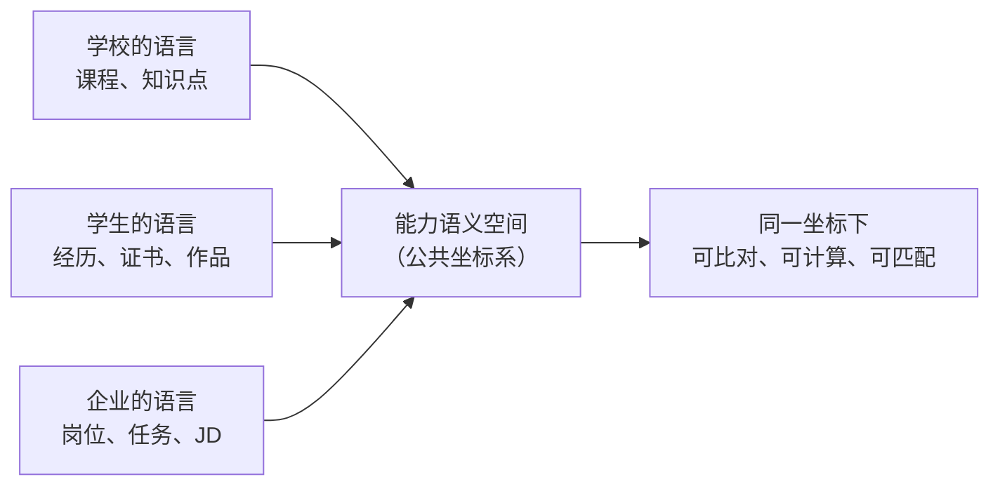
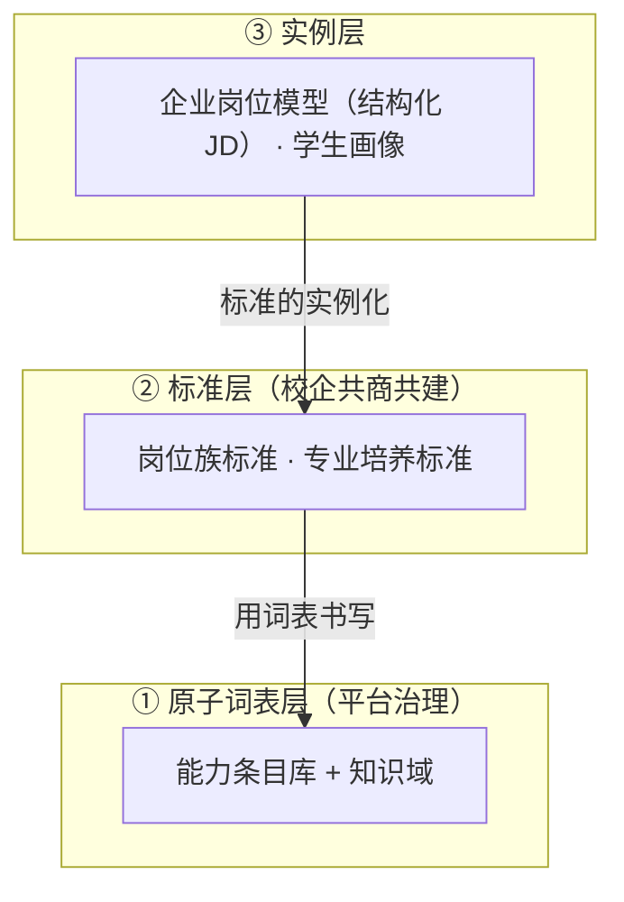
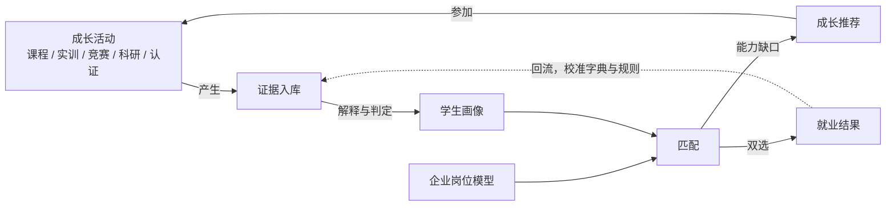

# 知行工坊：总纲与价值主张

**文档体系 v1.0 · 本文档是全体系的入口 · 读者：全体团队成员、校企合作方**

---

## 1. 知行工坊是什么

知行工坊（Zhixing Hub）是一个以**能力**为公共语言、连接高校培养、学生成长与企业用人的产教融合平台。

平台的内核是一套**能力语义空间**：把学校的课程知识、学生的经历证据、企业的岗位要求翻译到同一坐标系中，使培养、认证、匹配成为可计算、可审计的过程。平台的外层是围绕这套坐标系运转的四个业务闭环：项目、成长、教学、就业。

## 2. 要解决的问题

高校、企业、学生各自使用不同的话语体系：

- **学校**谈课程与学分，培养目标写在文件里，无法与岗位需求对齐；
- **学生**的经历种类繁杂、含金量不一，无法度量与比较，简历自述的信噪比低；
- **企业**谈岗位与任务，招聘靠简历初筛加单轮面试，近似赌博；想提前介入培养又缺乏抓手。

招聘与培养互不校准，三方都在为"翻译损耗"持续支付成本。

## 3. 解决方案：能力语义空间

三条总体思路：

1. **能力是唯一的公共语言。** 学校用知识点表达，企业用任务表达，双方不直接互译，各自翻译到能力枢轴层；
2. **同一套词表书写所有文档。** 培养方案、岗位族标准、企业 JD、学生画像共用同一原子词表，因此天然可比对；
3. **结论由证据裁决。** 画像上的每个等级都可展开为证据链：哪些证据、什么规则、哪个版本。

语义空间由三层资产构成，下层是上层的词汇：

三层的详细定义见[《01 能力语义空间规范》](01-能力语义空间规范.md)；学生画像上每个等级如何由证据产生，见[《02 证据与等级判定规范》](02-证据与等级判定规范.md)。

## 4. 平台如何运转：四大业务闭环

| 闭环 | 路径 | 启动节奏 |
|------|------|---------|
| 项目闭环 | 企业发布活动 → 平台合规预审 → 学院审批 / 公开池 → 学生报名 → 过程管理（任务级评价）→ 结项总评 → 证书发放、证据入库 | 年度内运转 |
| 成长闭环 | 多源数据汇聚 → 成长档案 → 能力画像 → 基于缺口与偏好的推荐 → 参加新活动 | 年度内运转 |
| 教学闭环 | 实践与就业数据 → 课程 / 条目映射分析 → 就业质量报告、教改支持报告 → 反哺培养方案 | 首学年末交付第一份报告 |
| 就业闭环 | 画像 ↔ 岗位模型双向匹配 → 双选 → 就业结果回流 → 校准字典与规则 | 随首届学生求职季启动 |

四环的合并视图：

竞赛与科研具有双重身份——既是画像的输入（证据），也是平台的输出（推荐）；就业结果回流是全系统的校准信号。

## 5. 三方价值主张

### 5.1 学生：经历变成可验证的资产

- 每一段经历沉淀为可追溯的证据，聚合成能力画像；对照目标岗位得到**缺口清单与下一步建议**，而不是空泛的"提升自己"；
- 通用能力（协作、交付、抗压等）几乎只能由平台原生活动与结构化评价支撑——这是画像区别于电子简历之处，也是深度参与平台的回报；
- 同侪参照与相似前辈路径：看见"同目标的人在做什么、当年的关键动作、如今的去向"；
- 一键生成自带证据链接的简历，在外部求职场景自带背书。

### 5.2 学校：培养质量第一次可测量

- 学生发展全景与干预抓手（班级看板与求职过程查询；自动预警首版不做，《06》第 3 节），辅导员从事后统计转向事前介入；
- **就业质量报告**：毕业去向与能力达成的关联分析，短板定位到条目粒度；
- **教改支持报告**：各课程对能力目标的实际贡献度，短板条目反查课程链；
- 专业设置与招生参考：岗位需求趋势与本校培养供给的缺口。

### 5.3 企业：人才供应链的成本重构

平台对企业不只是招聘渠道：

1. **预熟化人才，入职成本断崖式下降**——大三大四深度参与过本企业项目的学生，熟悉业务规范、流程与工具链，能力有平台证据可查；"先用后招"，招聘从赌博变成验收；
2. **企业人才库与提前锁定**——参与过本企业活动的学生（经本人授权）进入企业专属人才池，提前 1–2 年建立雇主认知，校招点对点转化；
3. **招聘与筛选成本直降**——结构化匹配 + 可展开的证据链替代简历初筛的大量人工，误聘风险同步下降；
4. **实训项目本身有产出**——探索性、工具性、边缘性任务以极低成本获得交付，同时完成雇主品牌进校园；
5. **培养前置**——本企业技术栈与规范经教学闭环注入培养端，获得定制化供给而不必自建培训体系；
6. **岗位模型资产化**——用人反馈回流持续校准岗位模型，招聘标准从口口相传沉淀为可复用的结构化资产；
7. **决策数据**——人才供给行情与用人标准基准，招聘计划与薪酬策略有据可依。

预熟化价值成立的前提是企业发布**真实业务性质的任务**（脱敏后的真实小项目优于命题作业）——项目越真实，学生越预熟化，企业收益越大。这是引导企业供给质量的内生杠杆。

### 5.4 行业与政府

岗位族需求趋势、区域人才供需研判与人才白皮书；经多年校准的词表、标准与字典即成为事实标准。

## 6. 设计纪律（五条，全体系遵守）

| # | 纪律 | 防范的风险 |
|---|------|-----------|
| 1 | **内核冻结**：接入新岗位族不修改元模型，个性内容进标准层 | 元模型膨胀，不可维护 |
| 2 | **证据不可变，解释可重算**：原始证据永不修改，结论随规则版本全量重算 | 数据资产锁死在早期认知中 |
| 3 | **大模型做翻译与抽取，不做裁决**：等级结论必须出自显式规则 | 结论无法向企业交代 |
| 4 | **输出克制**：不输出无清单支撑的合成分数；条目级"成长星值"为 R13 设立的唯一例外（版本化规则派生、点开可展开星点构成，《02》第 14 节）；无证据条目留白；任何百分数必须能展开为条目清单 | 假精确与黑盒结论损害公信力 |
| 5 | **学生拥有档案**：采集与披露基于学生授权 | 合规风险、冷启动激励缺失 |

任何设计与实现决策若与五条纪律冲突，以纪律为准；修改纪律本身需经平台框架委员会（见[《05 治理与合规章程》](05-治理与合规章程.md)）。

## 7. 文档地图

| 文档 | 定位 | 主要读者 |
|------|------|---------|
| 00 总纲与价值主张（本文档） | 全体系入口：问题、方案、价值、纪律 | 所有人 |
| [01 能力语义空间规范](01-能力语义空间规范.md) | 内核规范：三层资产、词表、内核 18 条、分级模板、边界判定 | 全体团队、标准编制者 |
| [02 证据与等级判定规范](02-证据与等级判定规范.md) | 计量规范：证据、字典、门槛判定、计算规则、重算版本化 | 算法与数据团队、审核人员 |
| [03 标准编制指南](03-标准编制指南.md) | 操作指南：岗位族标准、企业岗位模型、培养标准映射 | 标准编制者、企业接入、教务 |
| [04 平台产品需求](04-平台产品需求.md) | 产品文档：角色权限、业务流程、功能模块、交互规范 | 产品与研发团队 |
| [05 治理与合规章程](05-治理与合规章程.md) | 治理规则：资产权属、版本迁移、数据合规 | 平台运营、委员会 |
| [06 试点实施计划](06-试点实施计划.md) | 落地路线：五阶段、交付物、校准计划 | 项目管理、全体团队 |
| [07 组织与账户](07-组织与账户.md) | 组织基座：五端用户、角色权限、学生生命周期、账户规则 | 产品与研发、平台运营 |
| [08 课程与项目](08-课程与项目.md) | 培养过程运营：三形态、状态机、引入与报名录取、过程域 | 产品与研发、平台运营、企业接入 |
| [09 网站地图与页面功能清单](09-网站地图与页面功能清单.md) | 信息架构：七分区站点地图、导航、页面与角色可见性（不定义规则） | 产品与研发团队 |
| [10 界面设计规范](10-界面设计规范.md) | 视觉与交互层：设计令牌、布局原型、组件、响应式与文案（不新增功能点） | 产品与研发团队、UI 设计 |
| [11 技术架构](11-技术架构.md) | 技术实现层：前后端、数据、异步任务、部署、安全与测试（不改写业务规则） | 研发团队、技术负责人 |

建议阅读顺序：全员先读 00 → 01；按角色再读对应专项文档；02 是所有"为什么结论是这样"问题的最终依据；产品与研发以 04 为总览、07 / 08 为细则、09 为信息架构、10 为界面规范、11 为技术实现。

四层边界：**00–08 定业务规则与设计纪律** → **09 定信息架构** → **10 定视觉与交互形态** → **11 定技术实现**。09–11 均不得改写 00–08；冲突时以被引业务条款为准。
