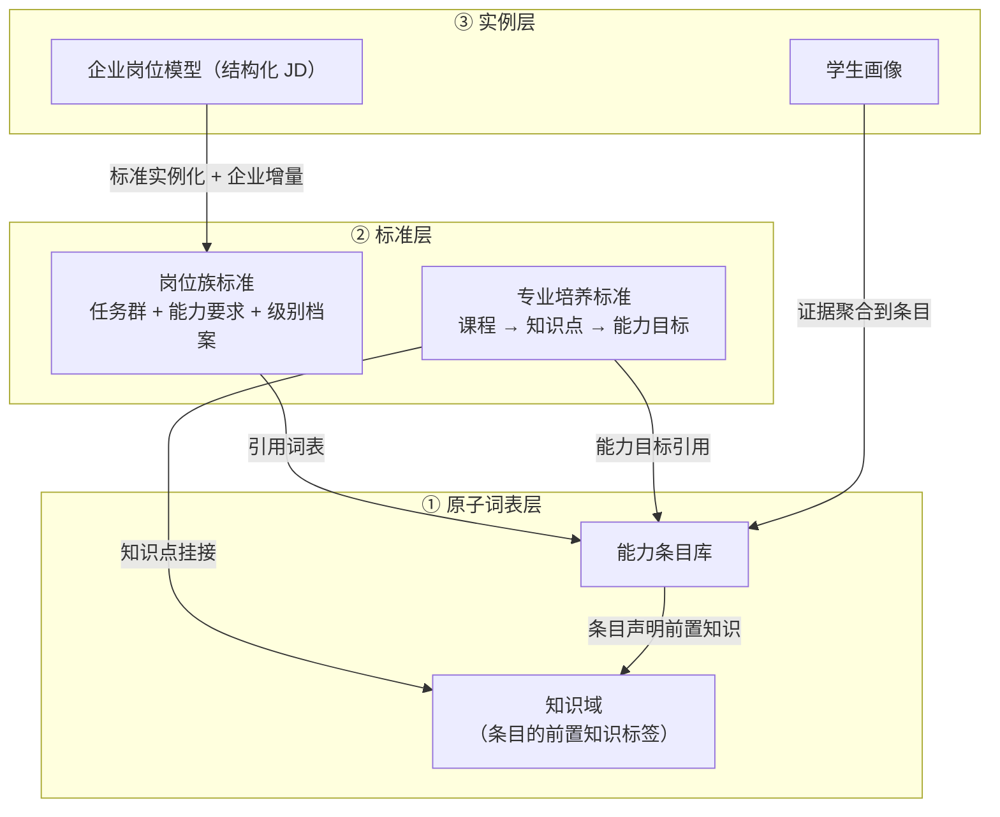
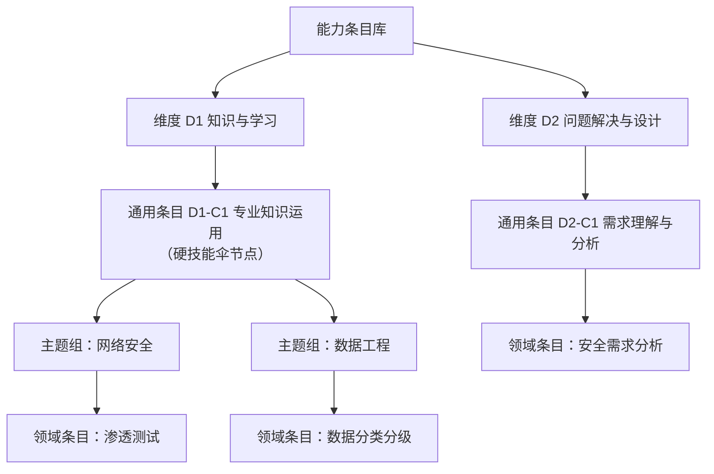

# 01 能力语义空间规范

**文档体系 v1.0 · 内核规范（冻结资产） · 读者：全体团队、标准编制者**

本文档定义能力语义空间的结构：三层资产、节点类型、关系集、能力条目库与分级模板。此处定义的内容属于**内核**，接入任何新岗位族、新学校、新企业均不得修改；变更须走年度窗口的委员会流程（见[《05 治理与合规章程》](05-治理与合规章程.md)）。

---

## 1. 总体结构

### 1.1 三层资产



- **原子词表层**：全系统唯一的公共词汇，由平台治理；
- **标准层**：用词表写成的行业标准与教学标准，校企共商共建（编制方法见[《03 标准编制指南》](03-标准编制指南.md)）；
- **实例层**：一个具体岗位、一个具体学生，均为标准与词表的实例。

### 1.2 节点类型

| 类型 | 前缀 | 归属 | 说明 |
|------|------|------|------|
| 知识点 | K | 学校 | 学科图谱原生语言（如：图论、密码学原语），细粒度，挂接到知识域 |
| 知识域 | KA | 平台 | 粗粒度知识分类（如：机器学习基础）。作为领域条目的前置知识属性存在，随条目准入同轨治理，**不是独立词表** |
| 能力条目 | C | 平台 | 行为锚定的"能做什么事"，全局唯一，树形组织（见第 2 节） |
| 任务 | T | 企业 / 行业 | 岗位的工作分解单元（如：排查线上召回率下降）；与《08》第 6.4 节的项目任务（过程域工作分解单元）同名不同物，数据模型须分别建模（如 job_task 与 project_task） |
| 岗位模型 | P | 企业 | 结构化 JD：岗位族标准的实例化 + 企业增量 + 非能力字段 |
| 活动 | — | 平台 | 产生证据的场合：课程、实训项目、竞赛、科研、实习等 |
| 证据 | — | 平台 | 一次可追溯的能力声明记录（格式见[《02 证据与等级判定规范》](02-证据与等级判定规范.md)第 2 节） |

### 1.3 关系最小集（冻结）

```
活动     --覆盖-->     知识点        （本课程讲授哪些知识）
知识点   --支撑-->     能力          （该知识支撑哪些能力形成）
活动     --训练-->     能力          （本活动涉及哪些条目，发布时不预标等级）
证据     --验证-->     能力@等级     （附强度档；等级由评价环节映射产生）
任务     --要求-->     能力@等级     （完成该任务需要哪些能力）
岗位模型 --实例化-->   岗位族标准    （引用标准 + 企业增量）
领域条目 --前置-->     知识域        （条目声明前置知识；岗位知识要求由此派生）
知识点   --挂接-->     知识域        （学校知识点 → 平台知识域，一次性映射）
领域条目 --下位挂靠--> 通用条目      （树形，单一主挂靠；用于分类与上卷，不传播等级）
```

**v1 决策：能力条目之间不建前置、包含、推理关系。** 推理链（"A 达 L3 可推断 B 至少 L2"）会使结论不可审计；宁可让学生补充新证据（参加新项目、考认证、打竞赛），不让画像出现推理产物。

## 2. 能力条目库

### 2.1 树形结构



结构为四级：**维度（5 个）→ 通用条目（18 条，内核）→ 主题组（仅 D1-C1 之下，纯组织节点，不挂证据、不参与匹配）→ 领域条目（单一主挂靠）**。

挂靠规则：

- 专业硬技能条目挂 D1-C1 下的对应主题组；
- 特化型条目（如"安全需求分析"）挂对应通用条目之下；
- 每个领域条目只有一个主挂靠位置；挂靠只影响展示分类与上卷，不影响证据、等级与匹配（后二者直接引用条目本身）；
- 主题组的新增与重组随词表同轨治理（《05》第 2 节）；重组会改变 D1-C1 上卷结果，视同影响结论的变更——须版本化发布（计入词表版本号）并触发全量重算（《02》第 12 节）。

### 2.2 通用内核（5 维 18 条，冻结）

维度划分：**D1 知识与学习、D2 问题解决与设计、D3 执行与交付、D4 沟通与协作、D5 职业素养**。

| 编码 | 能力项 | 定义 |
|------|--------|------|
| D1-C1 | 专业知识运用 | 聚合项与硬技能伞节点：不单独接收证据，其值由下位领域条目按主题组上卷（上卷公式见《02》第 9 节） |
| D1-C2 | 跨界知识整合 | 跨越本专业边界，整合其他学科或业务领域知识解决复合问题 |
| D1-C3 | 自主学习与技术更新 | 主动学习新知识、新工具并转化为工作能力；能根据评审反馈快速迭代改进 |
| D2-C1 | 需求理解与问题分析 | 面对模糊的实际问题，识别关键要素、澄清约束、分解子问题 |
| D2-C2 | 方案设计与决策 | 设计多种可行方案，基于约束做出合理取舍 |
| D2-C3 | 工具与AI协作运用 | 选择并使用专业工具、平台、框架完成任务；与 AI 工具高效协作，能验证与批判 AI 产出 |
| D2-C4 | 探索与创新 | 面向未知问题开展调研、研究设计、实验验证，提出新思路或新方法 |
| D3-C1 | 任务执行与可靠性 | 对承诺的任务可靠推进直至完成，进度透明 |
| D3-C2 | 系统实现与集成 | 将设计落地为可运行、可交付的系统或模块，处理接口、环境、依赖与集成问题 |
| D3-C3 | 质量意识与验证 | 对成果质量有标准意识，主动测试、验证与改进 |
| D3-C4 | 成果交付与文档 | 将成果整理为规范、完整、可复用的交付物与文档 |
| D4-C1 | 表达与呈现 | 以书面与口头形式清晰传达观点，汇报、答辩、演示有效 |
| D4-C2 | 团队协作 | 在多样化团队中有效配合、共同推进目标 |
| D4-C3 | 组织协调与项目推进 | 组织活动、协调资源、管理进度与风险 |
| D5-C1 | 责任心与主动性 | 对结果负责，主动发现并承担必要的工作 |
| D5-C2 | 职业伦理与规范 | 诚信合规，遵守职业道德、保密与行业规范 |
| D5-C3 | 抗压与适应 | 面对变化与压力保持稳定输出并调整策略 |
| D5-C4 | 业务与价值意识 | 理解业务目标、成本约束与用户价值，在技术决策中体现投入产出权衡 |

说明：原"职业规划与岗位准备"不进入测量空间，转为平台服务功能（缺口分析与路径推荐，见[《04 平台产品需求》](04-平台产品需求.md)）。

### 2.3 条目准入

新领域条目入库须通过准入审查，四项全过：

| 审查项 | 要求 |
|--------|------|
| 命名规范 | 动宾式"能做什么事"，不用学科名、工具名充当条目名 |
| 行为锚定 | 各等级可写出可观察的行为描述，不能只靠考试验证 |
| 挂靠位置 | 明确唯一主挂靠（主题组或通用条目） |
| 查重 | 与既有条目查重，**相似即合并，不允许近义条目并存** |

入库时须同时声明两项属性：

- **前置知识域**：如"渗透测试"前置"网络协议、Web 技术栈"——岗位知识要求与推荐可行性由此派生；
- **时效特征**（封闭三类）：

| 时效类型 | 典型 | 机制 |
|---------|------|------|
| 快变 | AI 工具链 | 声明强度档随时间降档（见《02》第 7 节） |
| 稳定 | 网络协议 | 不降档 |
| 累积增值 | 系统运维 | 不降档，且重复证据累计为"经验厚度"展示信号 |

准入节奏为随时收案、学期发布（见《05》治理矩阵）。

### 2.4 编码规则

**展示名与标识分离**：展示名可改，ID 一经发布**永不回收、不复用、不改写**；条目的合并与拆分以《05》第 3.1 节的迁移映射表表达，不通过回收旧 ID 实现。

| 对象 | 前缀 | 说明 |
|------|------|------|
| 通用条目 | `D{维度序}-C{序}` | 已冻结（2.2） |
| 主题组 | `TG-` | 仅存在于 D1-C1 之下的组织节点 |
| 领域条目 | `C-` | 全局流水，**ID 中不编码挂靠位置**（挂靠是可变属性，2.1） |
| 知识域 | `KA-` | |
| 知识点 | `K-` | 学校侧维护，校内唯一 |
| 岗位族 | `JF-` | 与岗位族目录同源（《05》第 2 节） |
| 岗位模型 | `P-` | 企业侧 |
| 任务 | `T-` | 项目内 |

流水位数、生成算法与证据信封等实例数据的标识格式属实现细节，本体系不作规定（证据信封标识的全局唯一与不可变要求见《02》第 2 节）。

## 3. 分级模板（全空间统一，行为锚定）

| 档位 | 锚定描述 | 显示 |
|------|---------|------|
| N/A | 本证据 / 活动中该条目不可观察或不适用（评价表可勾选，不产生声明） | 不显示，仅内部处理 |
| L0 | 已接触 / 尝试，未达 L1 门槛 | 不显示，计入轨迹与推荐素材，不参与匹配 |
| L1 | 在明确指导与给定框架下完成 | 公开 |
| L2 | 独立完成，能处理常规变化 | 公开 |
| L3 | 在复杂 / 模糊情境下完成，并能带动、评审他人 | 公开 |
| L4 | 能定义问题与标准，开辟做法 | 公开 |

设计要点：

- **N/A 保护数据质量**：评价人免于被迫打分；**L0 保留信息不贴标签**："参加了但未达标"计入轨迹，不对外显示；
- **标尺全平台公开**：行为化描述即白话，学生、教师、企业共用同一套语言；
- **与行业职级同构**：L0 ≈ 见习（带教下辅助）、L1 ≈ 初级（指导下完成）、L2 ≈ 中级（独立完成）、L3 / L4 ≈ 高级（主导复杂项目、带教他人）——岗位族标准的级别档案可直接沿用行业职级表述。**此为职级叙事的类比，不是计算定义**：L0 永不参与匹配与角色等级判定，级别档案各级的条目要求最低 L1（《03》第 1.1 节）；
- **活动发布时不预标等级**，只勾选涉及条目（防止选课博弈与乱标）；等级只产生于评价环节——平台实训采用任务级过程评价 + 结项总评（评价交互见《04》第 4.2 节，聚合规则见《02》第 3 节）；
- **结项证书与评价声明严格解耦**：证书完成即得，声明取决于观察记录的聚合结果。

## 4. 边界判定与争议仲裁

### 4.1 三问口诀

守门人与大模型初分类共用：

| 测试句 | 归入 | 特征 |
|--------|------|------|
| "他懂 X 吗？" | 知识域 / 知识点 | 可被"知道"，考试考得出 |
| "他能做 X 吗？" | 能力条目 | 须观察行为验证，且可迁移 |
| "这周的活是 X" | 任务 | 有起止、有交付物 |

粒度校验：一条能力若只被一个任务需要，它其实是任务；若只能靠背诵验证，它其实是知识。

### 4.2 同名三投影

同一个词在三个坐标各有合法投影——"渗透测试"= 方法论知识（知识域）+ 可观察能力（条目）+ 一次具体任务（任务）。三处各建节点、同名不冲突，**不争"它本质是什么"**。

### 4.3 争议低成本

挂靠位置只影响展示分类与上卷，不影响证据、等级与匹配。处理方式：

1. 先按三问口诀挂上使用；
2. 异议提交联合评审委员会例会裁决；
3. 裁决记入判例库，同类争议直接引用判例。

80% 清晰加 20% 约定俗成即可，坐标系的价值在共用，不在每个节点的哲学正确。

## 5. 冻结范围与变更途径

本文档中以下内容为冻结资产：**5 维 18 条通用内核、分级模板（N/A–L4）、关系最小集、时效特征三分类**。变更须经平台框架委员会年度窗口，提案须附迁移方案；领域条目、主题组、知识域为可生长部分，走准入审查即可。权属与流程详见[《05 治理与合规章程》](05-治理与合规章程.md)。
