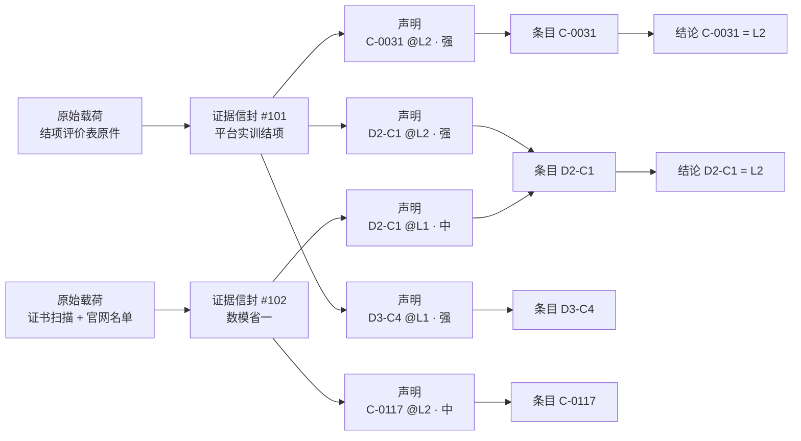
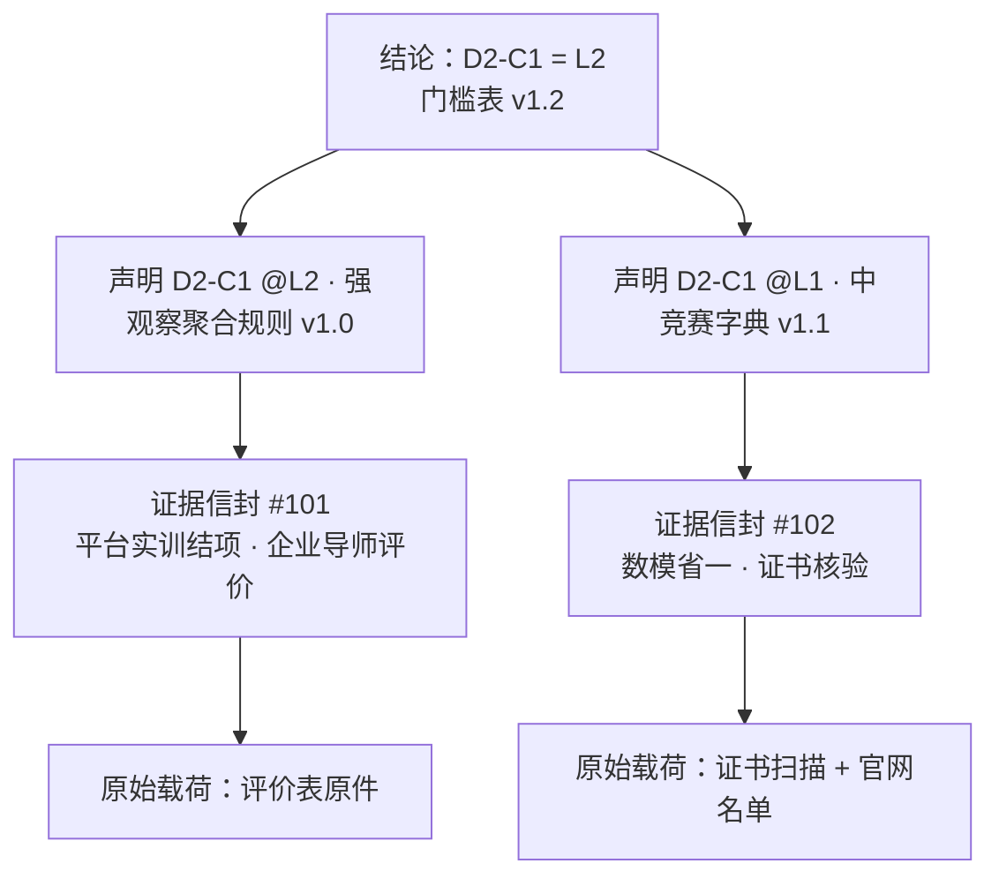

# 02 证据与等级判定规范

**文档体系 v1.0 · 计量规范 · 读者：算法与数据团队、审核人员、需要追问"结论为何如此"的所有人**

本文档定义从原始数据到画像结论的全部计量规则：采集什么、如何入库、如何定档、如何判级、如何计算、如何重算。全管道遵守两条元原则：

- **证据不可变，解释可重算**：原始证据永不修改，结论随规则版本全量重算；
- **等级是唯一进判定的测量语言，星级是成长展示语言，强度档是唯一的内部通货**：所有调制（时效、观察聚合、含金量、星点）作用于强度档与声明有效性，永远不直接加减等级数字。门槛表因此永久冻结，任何结论变化都可审计为"某声明的强度档因某规则、某版本发生变化"。R13 增设**能力星级（成长值）**为并行展示层：星点按强度档计点派生、可展开、版本化（第 14 节），不进任何判定——等级与星级双轨并行、互不推导。

---

## 1. 数据类型清单（单一封闭枚举）

平台只采集内置类型的数据：类型与子类型均为封闭清单，采集表单没有"其他"；新类型随平台版本发布，与词表同轨治理。清单分两个区。

### 1.1 档案与过程数据（不产生能力声明）

| 类型 | 内容 | 用途 |
|------|------|------|
| 学籍身份 | 姓名、学院、专业、班级、培养方案归属 | 分组比较口径、报表维度 |
| 学业总评 | GPA 与专业排名（经成绩单核验登记，《08》第 1.1 节） | 报表维度、同侪参照；不挂条目、不产生声明 |
| 发展目标与偏好 | **主目标岗位族 1 个 + 备选至多 2 个**，可选范围 = 已发布岗位族标准清单（岗位族目录与标准发布同步，《05》第 2 节）；缺口清单与成长推荐按主目标计算（见第 9 节）；**备选目标仅用于画像取景快捷切换与机构报告的需求信号统计，不参与缺口与推荐计算**；画像取景可切换任意已发布岗位族（《04》第 4.3 节）；另有行业偏好与地域偏好（**均为多选、上限 3，空 = 不限**；行业取企业行业分类字典，《07》第 2.3 节，地域取行政区划字典，《05》第 2 节；行业偏好只过滤推荐、订阅与岗位广场筛选项，**不进岗位候选硬过滤**，见第 9 节）、发展选择（受控字典：升学 / 就业 / 创业 / 未定，仅作报表维度不进计量），以及求职状态与期望薪资（仅展示与企业筛选，不进计量与排序，《04》第 4.4.5 节） | 匹配与推荐的个性化输入 |
| 活动参与记录 | 参加了什么活动、承担什么分工（以"一段参与"为最小单元，不做行为日志级采集） | 轨迹指标、经历展示、同侪参照 |
| 求职过程记录 | 报名、投递 | 就业闭环分析、辅导员查询（自动预警首版不做，《06》第 3 节） |
| 去向记录 | 学生当前实际去向，**至多 1 条有效**，封闭枚举：就业·合作企业 / 就业·平台外 / 升学 / 创业 / 未就业 / 未登记；变更留档案史。写入优先级、采集入口及其与申请单的关系见《04》第 4.4.6 节 | 就业闭环校准信号（第 13 节）、就业质量报告（《04》第 4.6 节）；不挂条目、不产生声明 |
| 项目反馈与满意度 | 学生每日反馈（1–5 分 + 可选文本）、结项满意度总评（《08》第 6.8 节、第 2 节） | 结项满意度总评以项目级匿名均值反馈企业端（《08》第 2 节）；每日反馈仅作项目健康监测与负责老师查看；均不产生能力声明 |

### 1.2 证据数据（七类，唯一产生能力声明）

拆分规则：一段经历拆开记录——"参加 A 公司实训"入活动参与记录，"结项评价"入证据。

| 类别 | 典型证据 | 核验方式 | 含金量维度 | 领域层挂载（第一挂载点） | 通用层挂载（第二挂载点） |
|------|---------|---------|-----------|------------------------|------------------------|
| A 课程学业 | 课程成绩（含课设 / 毕设及答辩成绩，一律经成绩单） | 成绩单上传 + 双路核验（教务批量导入可选，《08》第 1.1 节） | 课程性质 × 成绩段（定档见 4.2） | 知识点覆盖 + 对应领域条目（L1 上限） | 无。"教师结构化评价"子类**不启用**（院内课程无过程域、无任课教师账户，无产生入口；重启须委员会评估）；GPA 与排名入档案区（1.1），不产生声明 |
| B 竞赛 | 学科竞赛、CTF、黑客松、数模 | 证书原件 / 官网名单 | 赛事字典等级 × 奖项级别 × 团队位次 | 赛事字典直接关联的条目 | D2-C1 / C2（仅综合性赛事）；不得挂 D4 / D5 |
| C 学术成果 | 论文、专利、软著 | DOI / 专利号检索 | 载体分级 × 作者位次 | 主题对应的领域条目（大模型在相关主题组内选择） | D2-C4；不得挂 D3 |
| D 项目实践 | 平台实训结项、实验室项目、开源与作品集、个人项目 | 结项评价 / 导师签字 / 仓库可查性 | 平台原生为基准；导师背书居中；自报按可查程度 | 平台实训：观察记录覆盖条目（无上限）；其余：项目主题对应条目 | 平台实训：观察记录覆盖的通用条目；导师背书项目：D2 / D3 相关条目 |
| E 职业经历评价 | 实习 / 兼职的结构化评价、录用后用人单位反馈 | 企业证明 / 背调 | 时长 × 岗位相关性（基准中档，4.3） | 按评价内容挂领域条目 | 按评价内容挂通用条目；无评价的实习归入活动参与记录，不进证据区 |
| F 证书资质 | 职业认证、语言证书 | 证书编号核验 | 认证字典 | 认证字典关联的条目（上限视是否含实操）；部分认证同时是岗位族标准的资质门槛，匹配中作过滤器 | 无 |
| G 荣誉角色 | 奖学金、荣誉称号、学生干部、志愿服务 | 校方记录 | 级别（校 / 省 / 国） | 无 | 逐子类：学生干部 → D4-C3、志愿服务 → D5-C1，弱声明 L1 上限（弱证据依门槛表最高立 L1）；**奖学金与荣誉称号不挂条目**——过审后作为可核验荣誉进入经历展示与轨迹，不产生声明（输出克制） |

E 类实习 / 兼职评价**永久走学生自报**（实习证明 + 企业出具的评价材料上传）经审核闸入库（第 11 节）；平台不建企业在线出具实习评价的通道，也不提供统一评价表模板（定案）。评价材料中的条目与档位由大模型抽取、审核人确认后生成声明（第 8 节分工）。

同伴互评不作为证据类型。**平台不提供产生声明的测评服务（定案）**——平台自己出题、自己判定、自己立声明是信源与裁判两兼，且与"平台实训是校准锚"的角色冲突；报名摸底测评（《08》第 4.4 节）与行业题库自测（《04》第 4.5 节）均不进证据区。等级恢复与留白补齐一律走补充新证据的路（新项目、认证、竞赛）。

## 2. 证据信封（统一格式，异构数据同构入库）

| 字段 | 说明 |
|------|------|
| evidence_id | 全局唯一，不可变 |
| subject | 学生标识 |
| source | 信源（机构 / 评审人；自报材料过审后计入审核人） |
| source_type | 平台内评审 / 校内记录 / 第三方权威 / 自述 |
| activity_ref | 关联活动 |
| artifact | 原始载荷引用（成绩单、评价表、代码库、证书、论文、评价评语文本等） |
| issued_at | 产生时间（时效调制的时钟起点），按封闭取时表填定：A 课程 = 成绩所属学期末（学期末日期按平台学期日历，《06》第 3 节）；B / C / F 竞赛、论文、认证 = 证书 / 发表 / 获证日；D 平台实训 = 项目结束日；D 自报项目 = 主要完成日（材料佐证）；E 实习评价 = 实习结束日（信封须同时登记实习开始日，时长按自然日计，供定档降档判断，4.3）；G 荣誉 = 授予日。**缺相应日期的材料不得过审** |
| verifiability | 可核验原件 / 可旁证 / 仅自述（自报材料由审核结论填定） |
| observations[] | 过程观察记录（平台实训适用）：{任务, 条目编码, 档位, 评价人, 时间}，来自日评 / 任务评 / 结项总评的原始勾选 |
| claims[] | 能力声明列表：{条目编码, 等级, 强度档, 抽取方式（人工 / 模型 / 观察聚合）} |
| status | 原始记录永不修改，作废用追加冲销记录表达 |

- 采集层只管入库；claims 由解释层生成（模型初翻 + 人工抽检），可随规则版本重新生成；
- **证据粒度 = 活动整体**：一个活动结项生成一条证据信封，内含多条声明；
- 评价中的自由文本评语（见《04》第 4.2 节）作为原始载荷的一部分入 artifact，供画像摘要与简历生成使用，**不参与等级判定**。

## 3. 观察聚合规则 v1.0（平台实训专用）

实训项目下分任务（tasks），任务是项目的工作分解单元——有目标名单、有截止、有个人提交与批阅，是行为可观察的自然舞台。三种评价是同一双眼睛在三个时间尺度上的记录，差异只在**即时具体 ↔ 总结概括**：日评是现场快照（即时、具体、碎片），任务评是任务收口小结（对着交付物打档），结项总评是全程回望的概括（定性、终局）。聚合方向随之自明：**越即时具体越作事实基础，越总结概括越作确认闸门**。全部勾选落为信封内的观察记录，claims 由以下规则生成（版本化，随"解释可重算"纪律全量重算）：

1. **任务观察等级**：每任务 × 每条目至多一个档位，**按评价人回退、再跨评价人聚合**——每位评价人先得出个人终值：该评价人对该任务 × 条目有任务评终值则用任务评，否则用其日评众数（平票取低）；再对各评价人的个人终值取众数、平票取低——防单人高频点选压过他人（日评是行为快照，宁低勿高）。**N/A 不入众数**：某评价人对该任务 × 条目全为 N/A 或未填的，该评价人不进入该格聚合；所有评价人皆空则该任务对该条目无观察。写入粒度：日评 = **评价人 × 任务 × 条目 × 自然日至多一条，当日可覆盖写、当日 24:00 冻结，冻结后禁止补写昨日及更早**；任务评 = **评价人 × 任务 × 条目一份终值**，任务对学生生效后即可写、项目结束日前该评价人可覆盖写；总评定稿即冻结；
2. **聚合基准**：有 ≥2 个任务观察时，L\* = 使"任务观察等级 ≥ L 的任务数 ≥ 2"成立的最大 L（单次观察不直接跳级）；仅 1 个任务有观察时，聚合基准 = 该任务观察等级；无任务观察时无聚合基准；
3. **观察点上限（统一梯度）**：每条目的独立观察点数 = 有观察的任务数 +（结项总评对该条目定稿打档计 1 点）；**N/A 不产生观察、不占观察点；L0 占观察点但不进门槛判定**（第 6 节）；上限 = **1 点 → L1、2 点 → L2、≥3 点 → 不设额外上限**；此外，总评未定稿（企业未在项目结束日前定稿，《04》第 4.2 节）时全体条目一律再封顶 L2——总评是终局确认闸；
4. **声明等级 = min(聚合基准（若有）, 总评档位（若有）, 观察点上限)**——缺省项不参与 min（无聚合基准、无总评时只在存在的项与观察点上限之间取最小）；聚合结果为 L0 的**同样写入 claims**（L0 声明仅学生本人与审核队列可见，企业与简历分享视图过滤，《04》第 4.3 节）。总评做闸门不做泵：总评高于聚合基准时不抬升，差异仅记日志，不触发任何自动机制；仅总评勾选、无任何任务观察的条目（常见于未挂任务的贯穿性通用条目）由此自然封顶 L1——要立更高等级，过程中必须有任务观察，倒逼协作、责任心等通用条目被挂进任务观察而非结项拍脑袋；
5. **中止项目与被清退学生**：已落库观察记录保留（证据不可变）但不聚合为声明，仅计入轨迹与档案事件（《08》第 2、7 节）。信封处置（封闭）：项目**中止**获批时刻对在项且未清退、未中途退出的学生做观察表快照，建证据信封、**claims 为空**（轨迹可查、不产生声明，不发证）；**流标**项目（未进行）不建信封；**清退与中途退出**学生不建信封，其观察仅留过程观察表只读，档案事件流记录一笔。

任务有分工，观察落到个人——团队项目的个体归因由任务级观察天然解决。梯度自检：单任务无总评 = 1 点 → L1；单任务 + 总评 = 2 点 → L2；≥2 任务无总评 → 封顶 L2；≥2 任务 + 总评 = ≥3 点 → 按聚合基准与闸门全额输出。

**两段模型（过程观察 → 结项信封）**：过程观察记录（日评 / 任务评 / 总评勾选）在项目进行期间存于过程观察表，按上述各自节奏冻结；**项目结束日 24:00 对过程观察表做快照，写入该项目唯一的证据信封**（第 2 节粒度），此后过程表整体只读；评价期异议成立的，**只对信封追加冲销记录并增量重算，不改快照**（证据不可变纪律）。

## 4. 含金量字典

### 4.1 原则与三部字典

社会已有权威分级的直接引用，平台不自建任何分级：

| 字典 | 来源 | 平台工作 |
|------|------|---------|
| 竞赛字典 | 教育部竞赛排行榜 + 学会认可目录 | 引用 + 本地补充 + 标注直接关联的条目 ID |
| 论文字典 | CCF 目录、中科院分区 | 引用；补 CCF 外载体档位（EI / 一般会议 / 普刊） |
| 认证字典 | 软考、主流厂商认证体系 | 引用 + 补充 + 标注直接关联的条目 ID |

### 4.2 字典的三个输出参数

每条字典行输出：**证据强度档**（强 / 中 / 弱，校企工程师可凭专业判断共商的粒度）、**可证等级上限**、**默认声明等级**（字典类证据入库时按此生成声明，通常等于可证上限）。

竞赛与认证字典行另可选登记**报名截止日**与**举办 / 考试日**——字典即推荐货架（《04》第 4.5 节），这两个字段是契合度排序键 ④ 的输入；运营可不填，皆空时该机会在键 ④ 视为最远（第 9 节）。

示例定档（v1 初值，首轮校准复核）：

| 证据 | 强度档 | 可证等级上限 | 默认声明等级 |
|------|--------|-------------|-------------|
| 竞赛国一 | 强 | L3 | L3 |
| 竞赛省一 | 中 | L2 | L2 |
| 竞赛省二 | 弱 | L1 | L1 |
| CCF-A 一作 | 强 | L3 | L3 |
| CCF-C 二作 | 中 | L2 | L2 |
| 普刊三作 | 弱 | L1 | L1 |
| 专业课成绩 90+（或等级"优"） | 中 | L1 | L1 |
| 其余过审课程成绩（60–89 段 / 专业相关公共基础课，课程性质命名同《08》第 1.1 节课程目录） | 弱 | L1 | L1 |
| 平台实训结项评价 | 强（基准信源） | 按观察记录聚合 | —（由聚合产生） |
| 实习 / 兼职结构化评价（过审） | 中 | 按评价内容 | —（由评价内容产生） |
| 学生干部 / 志愿 | 弱 | L1 | L1 |

**定档自洽约束**：可证等级上限不得超过该强度档在门槛表（第 6 节）下能立起的最高等级——弱最高 L1、中最高 L2、强最高 L4；超出即死条款（永远够不着），字典编制与大模型起草时按此校验。

**A 类成绩制式换算（v1）**：百分制按上表分段；五级制"优"= 90+ 段，"良 / 中 / 及格"= 60–89 段；两级制"通过"= 60–89 段（弱、L1）。**不及格 / 不通过的科目一律不予过审、不建声明**（与"缺日期不得过审"同款硬线，第 2 节）；核验通道见《08》第 1.1 节。

**D 类子类定档（v1 初值，首轮校准复核）**：平台实训结项 = 强（基准信源）；校内导师背书（辅导员通道过审）= 中；自报项目按 verifiability 定档——可核验原件 = 中、可旁证 = 弱、**仅自述不得过审**（与"缺日期不得过审"同款硬线）。可证上限仍受定档自洽约束。

完整白名单（首批竞赛、认证、期刊逐条定档）不属于本规范，作为试点期滚动交付物按季度版本化发布（见[《06 试点实施计划》](06-试点实施计划.md)）。

### 4.3 E 类评价证据定档（v1 初值）

**平台不设企业分级名录与战略合作档（定案）**：企业分层合作（战略协议、保底供给、重点合作等）属平台运营方的战略决策，一律线下处理；平台不为企业建立任何档位、评级与升降机制，含金量字典不含企业名录（4.1），企业性质标签仅为展示信息（《07》第 2.3 节）。

E 类定档不依赖企业身份，只看证据本身：

- **基准强度 = 中**：任何经审核闸过审（第 11 节）的实习 / 兼职结构化评价与录用后用人单位反馈；
- **降一档至弱**：实习时长不足 90 个自然日（按信封登记的实习开始日至结束日计，第 2 节），或实习岗位与所挂条目明显不相关（大模型初判、审核人确认）；
- 中 → 弱是唯一降档路径，**不存在降档下溢**。

推论：E 类证据可证等级上限 ≤ L2（定档自洽约束，4.2）；L3 以上结论只能来自平台实训（基准信源）与字典内的强档外部证据（竞赛、论文、认证）——与"平台原生证据作校准锚"的定位一致（第 13 节）。

### 4.4 大模型辅助字典编制（起草不裁决、不绕过字典）

- **长尾起草**：榜单与目录之外的赛事 / 认证 / 期刊数量巨大且鱼龙混杂，由大模型调研主办方、历史届数、认可度、参赛规模，起草档位建议与条目关联建议，校企共商确认后入库；
- **实体对齐**：证书上的名称五花八门，大模型做名称归一与消歧（对齐到字典行），并标记疑似山寨 / 付费水赛转人工审查；
- **初版引导**：试点期竞赛与认证白名单由大模型批量起草、委员会批量过审。

硬约束：大模型的任何产出必须先落为版本化的字典行、经确认后方可影响结论；**运行时判定路径永远是查表**——否则同一证据不同时间定档不同，确定性重算（第 12 节）即破产。

## 5. 挂载机制

1. **领域优先**：专业性证据以领域条目为第一挂载点。字典类证据（竞赛、认证）由字典直接关联条目 ID；内容类证据（论文、项目）由大模型按类型模板在相关主题组的条目中选择；
2. **通用层来源受限**：通用条目的声明主要产生于含人工评价的过程性证据（实训任务评与结项总评、实习结构化评价、导师背书）；文书类证据仅有列明例外（论文 → D2-C4；综合性竞赛 → D2-C1 / C2；荣誉角色 → D4-C3 / D5-C1）。评价表按双层设计，同时覆盖领域条目与语境化的通用条目；
3. **D1-C1 不接收直接证据**，由领域条目按主题组上卷派生（第 9 节）；
4. **A 类来源唯一**：A 类课程学业的 claims 只来自课程目录的条目勾选（《08》第 1.1 节）；关系集中"知识点 --支撑--> 能力"边仅供教改支持报告与标准编制辅助消费，**不产生声明**（可行性计算仍只用条目前置知识域 × 过审课程知识点并集，第 9 节）。

硬约束：大模型不得在类型模板之外创造挂载；抽取置信度低的转人工复核（并入第 11 节审核队列）；挂载结果落为结构化字段，可抽检、可重算。

由此形成的结构性特征：**领域层可以被外部证据支撑，通用层几乎只能由平台原生证据与结构化评价支撑**——这是学生参与平台活动的内生动因，也是画像区别于电子简历之处。

## 6. 等级判定：证据强度门槛法

不加权、不求和，采用资格认证与教育测量通行的标准参照（criterion-referenced）范式：查字典（强度档 + 可证上限）→ 按门槛表判定 → 等级结论。

**门槛表（v1.0 冻结）**：

| 目标等级 | 证据强度门槛 |
|---------|-------------|
| L1 | 任意强度的合格证据 |
| L2 | 至少一条中强度及以上 |
| L3 | 至少一条强证据 |
| L4 | 至少一条强证据（与 L3 同门槛，不做特殊化处理；能否达 L4 取决于是否存在 L4 声明及其证据的可证等级上限） |

- **判定规则（精确式）**：结论等级 = max{ L：存在**有效（未失活）**声明，其声明等级 ≥ L，且其强度档满足 L 的门槛 }；声明等级不超过其可证上限。推论：弱证据无论声明何等级最多立 L1，中证据最多立 L2——字典定档须与此自洽（4.2 定档自洽约束）；
- **多证据不叠加**：数量不改变等级，只加厚证据链；弱证据堆量立不过其上限，刷量无效；
- **L0 与 N/A**：N/A 不产生声明；L0 不参与判定与匹配，仅计入轨迹与推荐素材；
- **刻意不做（定案）**：交叉验证、置信度档位、冲突降级等防作弊机制一律不建。等级通胀不在绝对刻度上对抗，由相对刻度吸收——企业端画像在等级旁展示匿名同侪分布位置（第 9 节），辅以轨迹信号。

理论谱系：本体系与教育测量的证据中心设计（ECD, Evidence-Centered Design）对应，声明 / 证据 / 任务模型即其核心三件套。

## 7. 时效调制

作用于**声明强度档**，不作用于等级：

- **快变条目**：声明自 issued_at 起每满 18 个月强度档降一档（满 18 个月强→中、36 个月中→弱、54 个月失活）；失活声明退出门槛判定，保留于证据链与轨迹；
- **稳定条目**：不降；
- **累积增值条目**：不降，且跨时间的重复证据累计为"经验厚度"展示信号（第 9 节）；
- 降档后门槛法自动重跑，结论可能自然回落，全程可审计；展示口径："L2（曾达 L3，可通过新证据恢复）"——时效回落即成长闭环的推荐触发源，快变领域的学生被持续拉回平台补证据；
- 18 个月为 v1 初值，随字典同轨校准；时钟起点为 issued_at，**满 N 个月按日历月周年计**——降档生效时点 = 自 issued_at 起满第 N 个日历月的**同号日 00:00（北京时间）**；该月无同号日的取**当月最后一日**（如 8 月 31 日 + 6 个月 = 次年 2 月 28/29 日），不按 548 天或 30 × N 天折算；**对外结论的更新时点 = 生效时点之后的第一个重算槽**（第 12 节，最迟滞后 7 天）——审计口径按生效时点解释（"为何我的 L3 变 L2"答时点与规则版本），展示口径按槽切换，两者差异属正常节奏、不构成口径冲突；
- 条目的**时效类型本身发生变更**（如某条目由快变改判为稳定）时的迁移与重算规则见《05》第 3.1 节——按新类型自 issued_at 重算强度档，结论可能回升。

## 8. 大模型与规则的分工

总原则：大模型做翻译与抽取，规则与统计做计量与裁决；**凡产生等级结论的环节不经过大模型**。

| 环节 | 承担者 |
|------|--------|
| 非结构化证据抽取（证书 / 论文 / 报告 → 结构化字段） | 大模型 |
| 成绩单 OCR 预识别（学生确认、审核终审，《08》第 1.1 节） | 大模型 |
| 实例级挂载选择（类型模板约束内） | 大模型 |
| JD → 岗位模型初翻（企业确认） | 大模型 |
| 简历 → 自报材料结构化导入（逐条走第 11 节审核闸） | 大模型 |
| 画像 + 证据链 → 简历文档生成（不改变结论） | 大模型 |
| 课程大纲 → 知识点映射（教务抽检） | 大模型 |
| 自报材料一致性质检 | 大模型 |
| 含金量字典起草（长尾调研与档位建议，委员会确认后入库） | 大模型 |
| 证据—字典实体对齐（名称归一、消歧、疑似水赛标记转人工） | 大模型 |
| 画像摘要生成（不改变结论） | 大模型 |
| 岗位族标准编制辅助（JD 聚类→任务群与能力要求草案，编制方确认，《03》第 1.5 节） | 大模型 |
| 语境化描述与评价问题库起草（编制方确认，《03》第 1.2、1.4 节） | 大模型 |
| 词表准入查重辅助（近义条目语义查重，委员会裁决，《01》第 2.3 节） | 大模型 |
| 判例库语义检索（裁决仍由委员会作出，《05》第 1 节） | 大模型 |
| 审核队列预检（字典行对齐建议、核验线索预填、疑点标注，审核人裁决，《04》第 4.8 节） | 大模型 |
| 项目条目勾选建议（企业确认，《04》第 4.1 节） | 大模型 |
| 缺口行动建议文案（不改变结论与排序，《04》第 4.5 节） | 大模型 |
| 含金量定档 | 字典查表 |
| 观察记录聚合为声明（平台实训） | 聚合规则 |
| 等级判定 | 门槛规则（唯一产生结论的环节） |
| 匹配与缺口计算 | 确定性计算 |
| 星级计算（星点与星级，第 14 节） | 确定性计算（R13） |
| 字典校准 | 统计回归 |

## 9. 跨层计算规则

总原则：**对外克制、对内连续**——展示层只有等级、分布直方图、覆盖率；排序层允许连续键做并列打破，但每个排序键必须能用一句人话解释。

- **D1-C1 派生**：按主题组分别上卷，主题组值 = max(① 组内 ≥3 个领域条目达到 L 的最大 L，② 组内最高条目等级 − 1)。深度旁路保证深窄型专才不被清零：单条 L3 → 上卷 L2；单条 L1 → 上卷 L0（不显示），不制造虚假的"专业知识运用"；跨主题组不合并；
- **角色等级（按标准配置输出）**：仅当岗位族标准配置了级别档案时输出。先过该级**资质门槛**（二值：持有对应认证字典行的**过审 F 类证据**即满足，不看其声明等级）；**角色等级路径不消费任何偏好过滤**——地域 / 行业 / 身份属岗位匹配口径，岗位族标准无此字段；级别档案中的**经验门槛为标准文档的展示字段，v1 不进算法**（无可核验工龄数据源，启用须先有数据源，《03》第 1.1 节）。角色等级 R 达成 = 级别档案中 R 级**核心条目全部满足 + 一般条目满足 ≥ 2/3**（条数按 2/3 × 总数**向上取整**：4 条须满 3、5 条须满 4），**各级独立判定、取满足的最高级**（不要求先满足低级再判高级）——避免缺一条冷门条目卡死达级；级别档案允许某级条目表为空（该级即永不达成），不允许跳级编号。岗位匹配硬过滤的资质集合与角色等级的资质门槛各自收口：前者只用岗位模型确认时钉定的资质集合（《03》第 2 节），后者只用该级档案上列出的资质，两者判据同为"持有对应认证字典行的过审 F 类证据"。级别档案固定四级、各级条目**要求等级最低 L1**（L0 不参与判定，《01》第 3 节）、D1-C1 与主题组不得列入（《03》第 1.3 节）；核心 / 一般为标准编制时的配置字段（见《03》第 1.3 节）；**未配置级别档案（或未完成核心 / 一般标注）的标准不输出角色等级，只输出逐条目匹配清单**；
- **匹配度（可分解覆盖率）**：单条目"满足"严格二值（结论等级 ≥ 要求等级），不做差一级折半——半分制会让百分数重新变成假精确。精确口径：资质门槛、硬性条目、身份与地域作二值硬过滤（身份 = 岗位发布"面向身份"字段 × 学生身份标记，地域 = 工作城市 × 学生地域偏好，《04》第 4.4 节；**地域偏好为空 = 不限、不过滤**——属学生主动不填，不按"未启用闸门"提示；**行业偏好不进岗位候选硬过滤**——企业检索的是"谁能做这岗"，行业只过滤推荐与订阅，见契合度段），不进百分比、单列展示；**匹配度 = 软性条目中满足的条数 / 软性条目总数**（硬性 / 软性 / 加分为岗位模型逐条必标的三选一标注，默认软性，《03》第 2 节；"核心 / 一般"仅用于级别档案的角色等级判定，两套标注不得复用）；软性条目为 0 时匹配度展示为"—"并跳过百分比排序；加分条目不进分母，仅作并列排序键 ①。点开即条目清单与缺口明细；缺口分三类展示：**差 1 级**（推荐引擎的黄金目标）、**差多级**（有证据但差 2 级以上）与**无证据**（留白）。禁止黑盒相似度；任何百分数必须能展开为条目清单；
- **契合度（推荐排序，字典序）**：不做乘积复合分——复合分无法一句话解释。推荐场景的缺口 = 结论等级低于**主目标岗位族标准能力要求基准等级**的条目（主目标见 1.1；级别档案不参与缺口计算，仅用于角色等级输出）。候选机会先过偏好过滤（行业 / 地域，二值；机会无该属性时不过滤），再按四个可解释排序键依次比较：① 差 1 级缺口覆盖数（机会条目标注 ∩ 缺口中差 1 级条目）；② 缺口总覆盖数（覆盖数为 0 的机会出列）；③ **可行性**——机会所涉条目的前置知识域被学生知识点覆盖的比例（按知识域计：域内有任一学生知识点即算覆盖该域；覆盖低说明推了也做不了；复用现成结构，不新增采集；**标准编制时增补的知识要求不进本计算**，《03》第 1.1 节），前置集为空计满，学生无课程知识点数据时本键跳过并界面明示（《04》第 4.4 节诚实原则同款）；④ 时间窗截止近者优先，**无截止日期的机会视为最远**（排在有截止者之后；竞赛 / 认证类机会的时间窗字段见 4.2）。学生知识点集合口径 = 其过审课程成绩证据所绑定课程的知识点映射并集（《03》第 3 节）；
- **排序精度（操作化）**：匹配度与可行性一律以**整数对**参与比较——匹配度 = (软性条目满足数, 软性条目总数)、可行性 = (被覆盖前置域数, 前置域总数)，先交叉相乘比较、不引入浮点，避免不同实现的舍入分叉；分母为 0 时按各自规则展示"—"并跳过该键；
- **并列排序**：匹配度并列时（三档刻度下大量并列是常态），按字典序依次比较——① 加分项命中数（岗位模型增量中标记的加分条目，命中 = 结论等级 ≥ 要求等级、无证据计 0，与软性满足同口径；仅岗位匹配场景有此键）；② 同侪分布档位 = **本岗位软性条目中，学生所在档高于可比群体众数档的条目数**（众数平票时取**较低档**，与观察聚合平票取低同构）；③ 证据强度构成 = **本岗位能力要求（硬性 ∪ 软性 ∪ 加分）所涉条目的有效声明中强证据条数**，并列再比其中平台原生证据信封数；④ 近期性（最近一条中强度以上证据距今时长）。每个键可一句话解释（"并列组内该生强证据 3 条居首"）；证据数量仅在此影响排序，不影响等级与匹配度，"刷量无效"纪律在结论层完好；
- **同侪分布展示**：条目等级旁给可比群体（**按当前班级所属专业 + 入学年级**计，转班当日即切换、不做双轨；毕业生沿用毕业时的专业与届别）的**档位直方图**并高亮学生所在档（如"留白 55% / L1 30% / L2 12% / L3 3%，该生在 L2 档"），不输出精确百分位（三档刻度算百分位即假精确）——等级通胀的相对刻度吸收机制（第 6 节），匹配度并列排序的前置依赖；一律匿名聚合；可比群体不足 **20 人**（v1 初值）不展示分布、并列排序键 ② 跳过；平台学员无同质可比群体（公开学院不设专业），同样不展示、排序键 ② 跳过；
- **轨迹信号（v1 定三个）**：活跃度（近 12 个月**claims 非空**的证据信封数——中止项目的空 claims 信封只进轨迹事件，不计活跃度，第 3 节）、近期性（同并列排序键 ④）、强度构成（强 / 中 / 弱占比）；累积增值条目加显**经验厚度**（同条目证据的时间跨度与次数）。全部只进展示与排序，不进等级与匹配度；"斜率"（成长速度）可刷且难解释，推迟 v2 评估；
- **画像展示**：底层一份数据，按岗位族标准取景；学生切换目标岗位族即切换视图，证据不因目标变更而作废。

## 10. 证据的图结构与审计链

存储是图，"链"是查询视图。证据与条目之间是多对多二部图，claims 即边；声明实体化后，存储结构为五层：

审计链是对某一个结论的反向遍历切片，每一步携带规则与字典版本号，结论可完整复现：

开发约束：**不得把证据链实现为线性存储结构**。存储按图组织（信封 + claims 边表），链由查询即时生成；同一证据出现在多条审计链中是正常现象。节点标识按《01》第 2.4 节编码规则，展示名与 ID 分离。

**一条链、按角色裁剪视图**：底层只有一条链（观察记录与 claims 含 L0），对外视图分两档——学生本人与审核队列见完整链，授权企业与简历分享视图见过滤掉 L0 与 N/A 的链（只呈现进入门槛判定的声明）。可见性口径的唯一定义处为《04》第 4.3 节。

## 11. 审核闸：自报材料前置审核

学生自报材料先过审核、再进算法管道；未过审的材料不产生声明。不另建仲裁机构与复杂流程。

### 11.1 双通道路由

路由原则：**核验依据在校内系统的走辅导员，核验依据在外部公开渠道的走平台管理，两边都能查的任一通过即可。** 类型路由表（v1.0）：

| 材料类型 | 通道 | 核验依据 |
|---------|------|---------|
| A 课程成绩（成绩单上传，绑定课程目录后提交） | 双通道任一 | 成绩单原件 + 教务记录 |
| G 荣誉角色（奖学金、称号、学生干部、志愿） | 辅导员 | 校方记录 |
| 校级竞赛奖项 | 双通道任一 | 教务名单 / 主办方公示 |
| B 省级以上竞赛证书 | 平台管理 | 官网获奖名单 + 竞赛字典 |
| C 论文 / 专利 / 软著 | 平台管理 | DOI / 专利号检索 |
| F 职业认证 | 平台管理 | 证书编号官方核验 |
| E 校外实习证明与评价 | 平台管理 | 企业证明材料 |
| D 自报项目 / 作品集 | 平台管理 | 仓库可查性 |
| D 校内导师背书项目（实验室项目、大创成果等） | 辅导员 | 指导教师签字 / 校方立项记录 |

D 平台实训为系统直采，不经自报通道；A 课程学业经成绩单上传通道（上表）入库，教务批量导入时视同校内已核实。路由表随数据类型清单（封闭枚举）逐类型配置、同轨治理。

**身份适配**：毕业活跃态学生的辅导员通道由原班级辅导员继续受理（管理归属不变，《07》第 4.2 节），在校期间的旧材料可补报；平台学员无校内核验依据——仅辅导员通道的类型（G 荣誉角色、校级竞赛、校内导师背书项目）**不受理**，A 类课程学业亦不受理（无学院课程目录可绑定，《08》第 1.1 节），双通道类型一律走平台管理；纯只读态不再受理自报材料。

### 11.2 审核规则

- **过审即成证据**：审核人计入证据信封 source，verifiability 由审核结论填定，随后进入正常算法管道；
- **未过审不算**：暂存为"待核材料"，不进证据区、不产生声明（与"不建置信度档位"的定案保持一致），学生可补充材料重新提交；
- **审核队列统一承载全部人工环节**：自报材料前置审核、大模型低置信度抽取复核（第 5 节）、学生异议处理（《05》第 5 节）走同一队列、同一双通道，不设独立仲裁通道。人工事项类型总表与队列工作台的产品形态见《04》第 4.8 节；
- **去重**：已有平台信封的 activity_ref（如平台实训）**禁止再走自报通道**重复立证；毕设允许 A 类成绩与 D 类校内导师背书双通道并存，但审核时须在两条信封上互链"同一经历"标记（系统按学号 + 课程目录条目给出互链建议、审核人确认，不自动互链），审计链可见其同源；
- **异议冲销操作（封闭）**：异议针对**具体声明**（条目 + 信封）而非整封信封；成立 → 对该声明追加**冲销记录**（失活、退出门槛判定、仍在审计链），审核人可同时给出**替代声明**（条目、等级、强度档、理由）作为新 claims 写入同一信封，不给替代则该条目在此信封留白；不改过程观察快照与 artifact，触发该生增量重算；结项资格异议成立走补发证书（《08》第 2 节），不回溯过程评价。

## 12. 重算与版本化

- **版本向量**：每条结论记录携带七元版本号（词表, 含金量字典, 观察聚合规则, 门槛表, 时效参数, 抽取模板, 星级规则〔R13，第 14 节〕），审计链每步随附；**每元格式为 `主.次`（如 `1.0`），只增不改**，七元按上述固定顺序存储与展示；
- **三种重算触发**：任一版本发布 → 全量重算（默认随下一个重算槽生效，可加开即时槽，见下）；新证据入库 → 该生增量重算（即时执行，无窗口）；**时间推进 → 每周滚动重算**——时效降档仅依赖日期，结论在无新证据时也会变化，审计链须能回答"为何我的 L3 变 L2"（答：声明 #x 强度因时效降档，时效参数 v?）；
- **重算槽（v1 定案，不建代次双读体系）**：全量重算与每周滚动重算统一在**重算槽**内同步执行——默认槽 = 每周一 02:00（北京时间），版本发布默认随下一槽生效，发布方可**加开即时槽**（同一机制、仅时点不同）。槽内：对外结论一律只读、界面标"校准中"（《05》第 3.2 节）；采集不暂停——自报审核、评价定稿、观察快照照常入库（证据不可变纪律与业务不停摆）；槽按执行时刻的事实快照一次性重算全部结论，结束后切换版本向量；槽内新入库的证据由该生增量重算兜底、下一槽自然对齐（单执行者串行，无并队与插队问题）。试点规模下槽时长预期为分钟级；**单槽时长阈值 30 分钟（v1 初值，登记《06》第 3 节）**——实测持续超限时再升级为结果代次双读与原子代次切换（《11》第 6.3 节）；
- **确定性要求**：同输入 + 同版本向量必得同输出，全管道无随机环节。大模型抽取结果在入库时冻结为结构化字段，重算不重新过模型；仅抽取模板版本升级时触发**全量重抽 + 人工抽检**（抽检比例为 v1 初值，登记《06》第 3 节；重抽的复核走《04》第 4.8 节"低置信度抽取复核"事项类型）——重抽产出的 claims 携带新模板号，旧 claims 以冲销语义失活（第 11.2 节），不改 artifact。

## 13. 校准机制

平台的实训与实战数据是唯一端到端受控、评价标准统一的证据，作为**校准锚**：学生带外部证据进入平台项目，实际表现被完整记录；样本积累后，回归分析各类外部证据对平台表现的预测力，据此调整字典的强度档与可证上限，发布新字典版本，全体画像重算。就业结果回流后，校准链延伸至最终结果。经过多年校准的字典与标准即成为事实标准。首轮校准的复核参数清单见[《06 试点实施计划》](06-试点实施计划.md)第 3 节。

## 14. 能力星级（成长值，R13 设立）

星级回答"积累了多少"，等级回答"能不能"：**等级仍是唯一进门槛判定、匹配、角色等级与推荐计算的语言；星级是成长展示语言**——与等级并行展示、互不推导，星级不由等级换算，等级不由星级近似。

- **星点（唯一计法）**：每条**有效**（未失活、未冲销）声明按其**当前强度档**计点——强 = 10、中 = 4、弱 = 1（v1 初值，登记《06》第 3 节）；同一信封对同一条目至多一条声明计点（异议替代声明按替代后状态计）；时效降档后的声明按降档后强度档计点——强度档仍是唯一内部通货；
- **星级**：条目星级按星点查表：1★ = 10、2★ = 25、3★ = 50、4★ = 90、5★ = 150（v1 初值，递增间隔抑制刷量的边际收益）；星点不足 10 为 0★（不展示星形，仅保留星点构成入口）；
- **聚合**：维度星值 = 该维条目星点之和（D1 按主题组领域条目计，不含 D1-C1 派生层）；总星值 = 全部条目星点之和；
- **展示纪律**：任何星级 / 星值必须伴随依据触发器，点开为**星点构成清单**（声明 × 强度档 × 点值 × 规则版本）——"任何数可展开"纪律不变；**星级进度条 / 进度环**（星点距下一星）为合法形态；**"到下一等级的进度条"仍然禁止**（等级为门槛跃迁，不存在连续进度）；
- **解耦红线**：星级不进门槛判定、匹配度、契合度排序、角色等级与推荐计算，不作任何筛选条件；评价人**不得打星**——星级一律由本规则从声明派生（评价交互仍为档位勾选，《04》第 4.2 节），大模型与自由文本评语同样不参与（第 8 节分工不变）；
- **通知**：星级提升发站内信（《04》第 4.10 节）；**降星不通知**——与时效回落同款防惊吓（第 7 节），画像星级条以中性色呈现；
- **版本与重算**：星级规则为算法规则类资产（《05》第 2 节，学期节奏版本化）；**版本向量扩展为七元**（第 12 节）——星级结论随任一相关版本全量 / 增量重算，审计链每步携带；
- **可见性**：随所在视图与授权闸裁剪；"结论对外"开关关闭时，星级随等级一同隐藏（星级由声明派生，同受裁剪）；
- **校准**：首轮校准以平台表现与就业结果回归检验星值预测力，调整点表与阈值（《06》第 3 节）。
