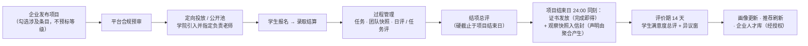
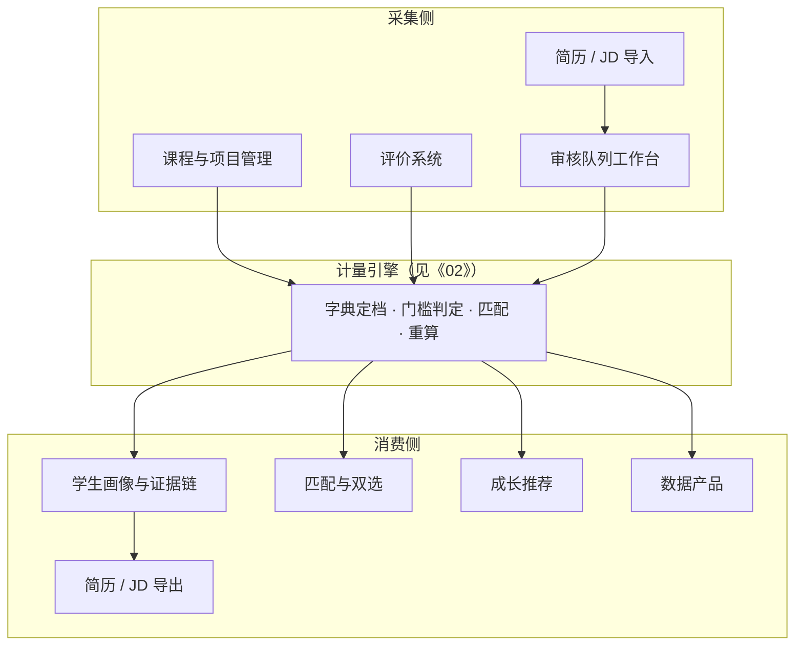

# 04 平台产品需求

**文档体系 v1.0 · 产品文档（设计与产品层，不含技术实现） · 读者：产品与研发团队**

本文档定义知行工坊平台的角色、流程与功能模块。所有计量口径（等级、匹配度、契合度、同侪分布等）的计算规则以[《02 证据与等级判定规范》](02-证据与等级判定规范.md)为准，本文档只定义其产品形态与交互；技术实现以[《11 技术架构》](11-技术架构.md)为准，技术选型不得反向改写本文及《00》—《08》的业务规则。

---

## 1. 用户角色与权限

平台共 5 端用户（平台、学员、高校、企业、政务）加公共证书验证入口；组织结构、完整角色表、学生生命周期与账户规则以[《07 组织与账户》](07-组织与账户.md)为准。产品视角的速查：

| 端 | 角色 | 产品中的主要动作 |
|----|------|-----------------|
| 学员 | 学生（高校认证学员 / 毕业生 / 平台学员） | 报名课程与项目、参与培养过程、查看画像与缺口、接收推荐、管理授权、生成简历 |
| 企业 | 企业管理员 · HR · 项目负责人 · 企业导师 · 看板 | 管理员管组织与入企邀请；HR 管岗位模型与发布、人才库；项目负责人管项目全程与结项定稿；导师做任务管理与日评 / 任务评 |
| 高校 | 校级 / 院级管理员 · 专业负责人 · 辅导员 · 看板 | 专业负责人引入审批项目、维护课程目录与培养标准映射；辅导员管学生、审自报材料、看班级看板（自动预警首版不做，《06》第 3 节） |
| 平台 | 超管 · 组织管理员 · 运营专员 · 看板 | 运营专员管合规预审、平台通道审核、字典词表日常维护、举报客服公告 |
| 政务 | 看板账户 | 区域聚合看板（4.6 数据产品） |

权限总原则：学生数据的可见性以**学生授权**为闸（设计纪律五）；未经授权的企业至多见候选汇总层（覆盖率与同侪分布概览，4.4.2），画像明细与证据链的展开一律以学生授权为闸，且看到的每个结论都可展开证据链。《05》的两个委员会是治理机构而非账户角色（《07》第 3.1 节）。

## 2. 业务流程

四大闭环的全景见[《00 总纲》](00-总纲与价值主张.md)第 4 节。产品视角下最重的流程是项目闭环（简化视图；完整状态机、引入机制、报名录取与时间规则见[《08 课程与项目》](08-课程与项目.md)）：

关键规则（均来自《01》《02》《08》，产品实现不得绕过）：

- 发布时**只勾选条目、不预标等级**；
- 结项证书与评价声明**严格解耦**：证书完成即得，声明取决于观察记录聚合；
- 一个项目结项生成**一条证据信封**，内含全部观察记录与声明；
- 企业侧评价与发证硬截止于项目结束日，结束后 14 天窗口留给学生（满意度总评与异议）。

## 3. 功能模块总览

## 4. 功能模块

### 4.1 课程与项目管理

三形态（院内课程 / 企业项目 / 共建课程）的结构、状态机、引入机制、报名录取（含收费与支付）、时间规则与过程域全部在[《08 课程与项目》](08-课程与项目.md)定义。本模块的计量约束：

- **发布勾选条目**：任何形态发布 / 录入时从词表勾选涉及条目（≥1，不预标等级）；
- **任务分解（企业项目 / 共建课程）**：项目下建章节与任务，任务发布目标为全员或某团队（团队快照制，《08》第 6.5 节）；**单任务勾选条目上限 20 条**（防滥标的合理性上界）；评价成本红线不靠该上限保障，靠"未观察默认 N/A、不要求全填"（4.2）；进行中任务可增补条目，但**项目条目全集（发布勾选 ∪ 全部任务条目）硬顶 40 条**（护住总评 3–5 分钟红线），增补自动回写活动"训练"条目标注（进推荐）并通知已报名与在项学生；大模型可按项目描述给出条目勾选建议（企业确认后生效，《02》第 8 节；**任务拆分建议不做，定案**——任务分解是企业侧专业判断，平台不代拟）；
- **参与记录**落入档案区（不产生声明）；报名摸底测评不进证据区（《08》第 4.4 节）。

### 4.2 评价系统（分层交互）

评价是平台原生证据的产生器，交互成本直接决定数据质量。三种评价按轻重分层：

| 评价 | 时机 | 评价对象 | 档位操作 | 自由文本 | 时长红线 |
|------|------|---------|---------|---------|---------|
| 日评 | 任意工作日，可选 | 先选定任务（默认当前活跃任务），对该任务条目按当天观察点档（未观察默认 N/A，不要求全填） | 直接点档 | 无要求 | **10 秒** |
| 任务评 | 任务结束 | 该任务勾选的全部条目（≤20 条，仅对实际观察到的打档、其余留 N/A） | 直接点档（N/A 可选） | **任务整体表现一句话评语必填**；逐条目评语选填 | **1 分钟** |
| 结项总评 | 项目结项 | 项目条目全集（全部任务条目并集 ∪ 发布勾选条目）；通用条目按关联标准的语境化描述展示（未关联标准时用全局定义，《08》第 1 节） | 直接打档 | **总体评语必填**；逐条目评语选填 | **3–5 分钟** |

交互设计要点：

- **评价表界面** = 条目名 + 语境化行为描述短句 + 档位按钮（N/A / L0 / L1 / L2 / L3 / L4），点选即存；档位按钮悬浮显示该档的行为锚定描述（《01》第 3 节分级模板），无默认预选；
- **评价可写窗口**：任务评自任务对学生生效起即可写（不必等任务截止），项目结束日前可覆盖写；结项总评自项目进入进行中起即可起草（定稿权与硬截止不变）；日评当日 24:00 冻结后不得补写昨日及更早（《02》第 3 节）；
- **观察以任务为挂载单元**：日评与任务评的每条勾选都落在"任务 × 条目"上（聚合规则按任务计算，《02》第 3 节），日评界面默认定位到该生当前活跃任务（= 该生任务快照内未截止且截止最近者；无则最近已截止者；再无则须手选），评价人可切换；该生**无任何任务**时日评入口禁用并提示"暂无任务"（观察必须挂任务，不设无任务日评）；
- **总评的起草与定稿**：结项总评每项目每学生一份，入项评价人均可起草与修改（草稿最后写入覆盖，界面显示最后编辑人与时间），项目负责人定稿落槌（管理动作，无需入项，《07》第 3.3 节）；**定稿不可撤回**（纠错走评价期异议）；并发定稿按乐观锁先写生效，后到者提示已定稿；定稿即冻结，**硬截止于项目结束日 24:00:00（北京时间），此前含 23:59:59 可定稿，该时刻起不可写**（同刻发证与观察快照的语义见《08》第 2 节）；未定稿的总评不计观察点且全体条目封顶 L2（《02》第 3 节）；
- **问题库引导（结项总评）**：每条目旁可展开该岗位族级别档案派生的行为判断句（"该生能否独立完成 X 类交付？"），帮评价人校准打档；只作引导参考，不做档位推导，评价人直接打档；
- **评语去向**：全部自由文本评语进证据信封原始载荷（artifact），供画像摘要与简历生成使用，**不参与等级判定**（等级只来自档位勾选，守"结论出自显式规则"纪律）；
- **批量场景**：多学生同任务时按"条目 × 学生"矩阵打点；
- **移动端优先**：企业导师多在工位与现场，日评 / 任务评以手机完成为设计基准；
- **评价对象仅入项学生**：企业侧成员之间不存在互评入口（定案）；
- **导师过程手记**：导师可随时对某学生记录私有备注（学生不可见），结项总评页与任务评页自动聚合展示——把"凭印象打档"变成"凭记录打档"的最低成本手段（《08》第 6.7 节）；
- 观察记录到声明的聚合规则（任务评优先、观察点上限梯度、总评做闸门不做泵等）见《02》第 3 节，产品端只负责把原始勾选如实落入信封；仅总评勾选、无任务观察的条目在总评界面标注"无过程观察，声明封顶 L1"。

**学生侧反馈（不产生能力声明）**：

- **每日反馈**：进行中项目每天一次，评分（1–5）强制 + 文本可选；于**日终**收集——开放时点由项目负责人 / 企业导师在项目设置中配置（默认 18:00，《06》第 3 节），开放后当天首次进入项目空间弹层，不做补交；可见性与防识别加固见《08》第 6.8 节；
- **结项满意度总评**：项目结束后 14 天评价期内完成；
- 结项满意度总评以项目级匿名均值反馈企业端（《08》第 2 节）；每日反馈仅作项目健康监测与负责老师查看（《08》第 6.8 节）；全程与能力等级无关。

### 4.3 学生画像与证据链

- **按岗位族取景**：底层一份数据，按所选目标岗位族**当前已发布版本**的标准取景展示（版本钉定；在招岗位发布按其开放时快照对照，4.4.1），默认取景为主目标，备选目标为快捷切换项（《02》第 1.1 节）；切换取景即切换视图，证据不因目标变更而作废；重算槽内界面标注"校准中"、只读旧版本向量结论（《05》第 3 节）；
- **条目视图**：等级 + 同侪档位直方图（高亮所在档，匿名聚合，不输出精确百分位）+ 时效状态（"L2，曾达 L3，可通过新证据恢复"）+ 累积增值条目的经验厚度；**无证据条目留白**，不猜测、不填充；
- **轨迹信号**：活跃度、近期性、强度构成三项，只进展示不进等级；
- **审计链查看**：任一等级点开即反向遍历视图——声明 → 证据信封 → 原始载荷，每步附规则与字典版本号（《02》第 10 节）；观察记录与声明的评价人**实名可见**（签字负责是信源公信力的一部分；匿名纪律只适用于同侪聚合场景，《05》第 5 节）；
- **一条链、按角色裁剪视图**（唯一定义处）：底层链只有一条（观察记录与 claims 含 L0，《02》第 10 节），对外呈现分两档——**学生本人与审核队列**见完整链（含 L0 观察与 L0 声明）；**授权企业与简历分享视图（4.7）**见过滤掉 L0 与 N/A 的链，只呈现进入门槛判定的声明。不因此建第二份数据，也不对企业展示"未达标签"；
- **L0 与待核材料**：L0 仅学生本人可见（轨迹与推荐素材）；未过审材料显示"待核"状态，不进画像。

### 4.4 岗位、匹配与双选

#### 4.4.1 岗位模型与岗位发布分离

- **岗位模型** = 岗位族标准的实例化 + 企业增量 + 非能力字段（《03》第 2 节），是 HR 维护的**可复用人才标准**——不发招聘它也在供货（缺口推荐、用人标准基准、人才库筛选）；
- **岗位发布** = 引用模型、挂时间窗与名额的**招聘实例**，字段：工作城市（**单选、必填**——勾选接受远程仍须填，作展示）与详细地点、**接受远程**开关（勾选后该岗位的地域硬过滤**跳过**，与"机会无该属性则不过滤"同构，《02》第 9 节；多地办公 v2 再议）、薪酬福利（可面议）、名额、时间窗与截止、面试流程说明、**面向身份**（多选、**至少选 1**：在校生 / 已毕业 / 平台学员，匹配硬过滤，《02》第 9 节）、站内申请入口；公司简介、行业分类与企业性质标签从企业主体资料自动渲染（《07》第 2.3 节），HR 不重复填写；面向身份与经验 / 学历档可能不自洽（如面向在校生 + 3 年以上），v1 **不做硬校验**，发布页给警示文案（经验 / 学历档本就仅展示，见下）；
- **JD 门面**：模型的基本信息（职位名称、岗位族、职位类型、经验档、学历档）与岗位职责（结构化条目，每条一句、建议 5–8 条）按业界惯例结构录入；任职要求三段式呈现——**硬性条件**（资质门槛 + 硬性条目，匹配硬过滤）、**软性素质**（全部非硬性能力要求 + 等级，别家写"沟通能力强"，这里是 D4-C1 ≥ L2）、**加分项**（加分标注条目，参与排序）；硬性 / 软性 / 加分为模型逐条必标的三选一（《03》第 2 节）。详情页渲染标准 JD 版式（求职者拿它当"考纲"做人岗对照），支持一键导出 JD 文本（4.7）；
- **岗位发布状态**：预审中 → 开放 / 暂停 / 关闭——**上线前经平台轻量合规预审**（防虚假职位，主流平台职位皆审；逾期仅展示、不自动通过；驳回原因为封闭枚举：信息不实 / 歧视性表述 / 与模型明显不符 / 其他，附选填说明；岗位模型本身确认即生效不预审，《03》第 2 节）；招满可随时暂停或提前关闭（岗位无占名额竞争，不适用《08》"时间只能往后改"的项目规则），已投递申请继续流转不受影响；暂停可恢复（原时间窗内；**截止已过的暂停岗位不可恢复为开放、只能关闭**；暂停期间可将截止往后延——与项目时间"只能往后"同构，延后的窗内可恢复），关闭不可逆；**两态的对外行为（封闭）**：暂停 = 岗位广场**仍可见**并标"暂停招聘"、不可新申请 / 不可新邀约；关闭 = 广场**下架**、不可新申请（学生收藏夹内保留并标状态，4.4.5）；两态下在途申请单均继续流转；**名额为展示字段、不占位**，招满给暂停软提示；**首次开放时快照所引岗位模型（含标准版本），暂停 / 恢复不重拍快照**——标准或模型后续升级不改变在招发布的对照口径（《05》第 3 节）；
- **岗位模型版本化**：模型分草稿 / 已生效 / 停用三态；已生效模型的再次编辑产生**新版本**，已开放的岗位发布仍钉其首次开放时快照的旧版本；**停用**（含举报处置连带停用，《07》第 3.6 节）后新岗位发布不可再引用、已开放发布不自动关闭（各走自己的预审与举报）；旧版本留档不可删；
- **企业主页（学生可见）**：公司简介与性质标签、在招岗位列表、进行中与历史实训项目——岗位与项目同页呈现是相对主流招聘平台的差异化（"先用后招"的入口）。**历史项目的展示口径（封闭）**：结项归档的展示；**流标的不展示**（项目未发生）；中止的展示并标"已中止"，不展示评价与证书；
- **岗位族标准未覆盖时不阻塞发布**：岗位模型必须挂接一个岗位族目录项——目录允许"未发布标准"的**草稿族**（仅企业侧可选，不进学生目标可选范围，《02》第 1.1 节口径不变）；模型条目直接从词表勾选编制，匹配按模型条目计算、不输出角色等级；平台据此积累该岗位族的标准编制素材（《03》第 1.5 节），标准发布后目录项转正、原模型自动对齐。**自动对齐口径（封闭）**：目录项转正为已发布岗位族，模型的**企业增量原样保留**；标准中模型未覆盖的条目以**软性**追加进模型，并按《05》第 3.1 节"通知企业确认增量"提醒 HR 复核标注（不设倒计时，未复核即维持软性）；标准中不存在的条目保持为企业增量、不移除；**已开放的岗位发布仍吃其开放时快照**，对齐不改变在招口径；
- **产品字典 v1 初值（冻结，登记《06》第 3 节）**：职位类型 = 实习 / 全职 / 兼职；经验档 = 不限 / 在校 / 应届 / 1–3 年 / 3 年以上，学历档 = 不限 / 大专 / 本科 / 硕士 / 博士（两档 v1 **仅展示、不进硬过滤**，界面按诚实原则明示，4.4.2）；薪酬 = 结构化月薪区间（最低 / 最高，元）+ 面议开关——面议不参与薪酬带筛选；**筛选档位（人民币月薪，受控）= 3k 以下 / 3–5k / 5–8k / 8–12k / 12–20k / 20k 以上 / 面议**，实习岗按折算月薪落档；学生期望薪资用同一套档位（取最低可接受档 + 面议开关，4.4.5）。

#### 4.4.2 匹配

计算口径全部在《02》第 9 节，产品端呈现：

- **企业侧**：岗位发布 → 候选列表。每个候选先给汇总（"软性要求覆盖 12/15 条"；配置了级别档案的标准附角色等级"达到本岗位族初级"），点开逐条目展开，等级旁附同侪档位分布，每个结论可查证据链；
- **候选可见性分层（授权闸）**：候选列表默认包含全部通过硬过滤的学生（实名），此为平台基础功能，不可退出、不可关闭，但未经授权企业仅见**汇总层**（覆盖率、角色等级、同侪分布概览）；**逐条目明细与证据链展开**需具备任一授权——① 学生开启**求职可见开关**（默认关闭，随时可关）；② 学生对该企业存在**有效**报名 / 申请（报名 / 申请即授权该企业查看画像明细与证据链，报名确认页明示）；③ 人才库授权（4.4.3）。（简历分享链接是对外展示机制而非企业授权通道，见 4.7。）**报名 / 申请授权的寿命**：项目报名 = 提交起生效，正常参与至项目归档后保留 **90 天尾窗**（企业可回看刚带过的学生，长期关系走人才库），撤回 / 被拒 / 落选 / 流标 / 清退 / 录取后开始前退出 / 中途退出等提前终态即刻关闭；**共建课程入项即授权（定案）**——无论报名制或名单导入，入项即授权该企业查看画像明细与证据链（报名制在报名确认页明示、名单导入在入项通知中明示），寿命同项目报名：正常参与至课程归档后 90 天尾窗，清退 / 中途退出 / 待开始阶段被移除即刻关闭；岗位申请 = 申请单非终态期间有效，终态后只留汇总层。求职状态为"暂不找"的学生默认从候选列表与人才搜索结果排除（人才搜索可显式勾选包含；人才库与在途申请不受影响）；
- **学生侧**：目标岗位 → **逐项对照表**（每条要求达标 / 差几级一目了然）+ 缺口清单，缺口分三类：**差 1 级**（推荐引擎黄金目标）、**差多级**与**无证据**（留白）；差距项直接挂"补齐它的课程 / 项目与学习资源"入口——**匹配结果即学习路径起点**，就业闭环与成长闭环在此咬合；
- **过滤与排序**：资质门槛、硬性条目、身份与地域作二值硬过滤（禁止跨项补偿）；匹配度并列时按《02》第 9 节的可解释排序键（加分项命中 → 同侪档位 → 强度构成 → 近期性）展开，界面对每个排序键给一句话解释；
- **人才搜索（企业主动检索）**：企业可按岗位族、身份、城市、求职状态、薪酬档与（可选）角色等级 / 覆盖率区间检索学生（对齐主流平台的企业版搜人）；**城市口径 = 人在哪而非想去哪**——在校生取其学院校区城市并集（多校区可命中多个市），毕业生与平台学员取常驻城市，不用地域偏好作搜索城市；**薪酬档过滤**（人才搜索与候选列表均可选）比较学生期望最低档与检索档位 / 本岗位薪酬档，任一为面议则不过滤（仅筛选，不进计量，4.4.5）；**角色等级 / 覆盖率区间须先选定对照物**——一个已发布岗位族标准或本企业某岗位模型；只选草稿族且未选模型时该两项禁用，仅按其余维度检索；岗位族下拉**含草稿族**（企业侧本就可选，4.4.1；学生目标与推荐侧仍不含）；**未授权集合内禁止按单条目等级过滤**——条目级过滤即条目级披露，破坏汇总层边界；条目级筛选仅在已授权集合（人才库、有效报名 / 申请）内开放；结果同样仅见汇总层、明细与证据链展开凭授权（授权闸同上）；
- **诚实原则**：经验档与学历档完整保存与展示，但学生端尚无可验证数据入口时，**不得假装已完成硬过滤**——未启用的闸门在界面明示"仅展示，未参与过滤"。

#### 4.4.3 人才库

企业维护的**需学生授权的关注列表**——比收藏夹多一道授权，比社交关系轻一个量级。**人才库为企业级一份**：请求以经办人个人名义发起、授权给企业主体，授权后本企业 HR / 项目负责人 / 企业导师均可见，学生退出对全企业整体失效（导师个人备注仍私有，《08》第 6.7 节）：

- **入库**：两个入口——项目中发现的表现好的学生（含在校生）、招聘筛选中发现的人选；企业发起请求 → 学生批准后生效；**同一企业对同一学生的请求滚动 30 天限 1 次**（不按自然月，防月末刷请求）——这是学生侧唯一的防骚扰机制（**企业黑名单机制已删除，定案**：现实骚扰成本远低于建制的屏蔽体系，30 天请求限次已足够；学生不想理会时拒绝或无视即可，请求到期自动失效）；
- **授权后企业可见**：完整档案（画像明细、证据链、经历、学生目标、去向）+ **成长动态流**（事件封闭清单：新证书、新结项、结论升级；**不含降档**与过程隐私如每日反馈；仅为人才库内信息流，不进 4.10 通知目录）；困难群体标记需学生另行开启独立开关（《07》第 4.4 节）；
- **联系方式不在授权范围**：接触学生走站内岗位邀约——人才库是望远镜，不是电话簿；
- **退出**：学生可随时单方面退出任一人才库，授权即时失效；毕业满 2 年转纯只读态时自动退出所有人才库（《07》第 4.2 节）。

#### 4.4.4 申请、沟通与双选

> 岗位发布 → 学生申请 / 企业邀约 → 申请单状态流转 → 面试 → offer 意向 → 结果登记 → 去向回流

- **交互范式对齐主流招聘平台**：岗位列表卡片、详情版式、投递与邀约、进度状态流转等交互与字段设计借鉴 BOSS 直聘、智联招聘等成熟惯例，不自创范式；平台差异化在结构化匹配与证据链，不在招聘交互本身；
- **申请单状态机（闭合定义，治"石沉大海"）**：已投递 → 已查看（企业首次打开自动标记）→ 面试中（邀面）→ offer 意向（企业发起，学生接受 / 拒绝）→ **待结果登记**（学生接受 offer 后）→ 结果登记；终态集合 = **不合适**（企业一键、送达学生、可附模板化原因；offer 意向与待结果登记阶段亦可标）、**意向未达成**（学生拒绝 offer，不并入"不合适"）、**学生撤回**（任意非终态时刻可撤）、**未处理**（停滞自动关闭，见下）、**已登记结果**（双方确认后不可改，填错走客服工单人工更正——由运营专员在工单内直接改登记值、须填理由并留审计，双方收仅站内信通知，**不重开申请单**、不进 4.8 事项总表，不设自助反悔）。**停滞关闭**：任一非终态停滞 **30 天**（= 最后一次有效动作起 30 个自然日的 24:00:00，北京时间）→ 终态"未处理"；企业或学生的**有效动作**（状态迁移、留言、发起 / 回应面试邀约、发起 offer、结果登记）重置计时，单纯打开详情不重置（"已查看"仍算停滞）。补充规则：学生改期申请每申请单**至多 2 次**（企业对改期请求未响应 48h 不视为自动接受）；结果登记取值 = 已入职 / 未入职 / 其他（多 offer 由结果登记收敛；申请单的结果只描述**该次 offer 的结局**，学生档案的当前去向另有唯一记录，见 4.4.6）；岗位关闭后在途单继续流转；学生转入纯只读态或企业成员态时在途单由系统以"学生撤回"关闭（《07》第 4.2 节）。岗位详情页展示该企业的**申请响应时效**（"7 日内回复率" = 已投递后 7 日内发生企业首个有效动作的申请单占比——与"未处理"终态解耦，学生侧停滞不计入企业口径；**分母 < 5 时展示"—"，不展示 0%**，避免小样本污名；仅展示，不进任何计量与排序）；
- **投递快照对照**：岗位申请自动附画像汇总入口 + 附言（选填 ≤200 字）；授权内企业看到的是**实时画像**，申请单头部另展示**投递当日覆盖率快照**作对照，覆盖率变化不解释为异常；
- **申请单内非实时留言**：绑定申请单生命周期的留言线程（类邮件往来，无在线状态、无实时预期），承载约面细节等事务沟通；**不做通用 IM**（与《08》第 6.11 节同款取向）；申请单进入终态后线程只读；
- **结构化面试邀约**：企业在申请单内发起面试邀请（轮次、时间、地点 / 线上方式），学生接受 / 申请改期 / 拒绝；面试安排计入申请单时间线；
- **岗位邀约**：企业对人才库学生、匹配候选或人才搜索结果发起邀约（关联某岗位发布），经通知送达；**同一企业对同一学生的岗位邀约滚动 7 天限 1 次**（与人才库请求 30 天限次同构，防邀约轰炸，登记《06》第 3 节）；学生接受即生成申请单（等同投递），联系方式在申请单内自行交换；发起方不能替对方接受；
- 平台只做**撮合与登记**，不介入 offer、薪酬谈判与合同；面试可用评价问题库作参考题（《03》第 1.4 节）；
- **结果登记**：企业或学生任一方登记、另一方确认（互相可见、可修正），确认为"已入职"的按 4.4.6 写入档案去向记录；就业结果回流是全系统校准信号（《02》第 13 节）；录用后可选"学员入企"主体转换（《07》第 6.2 节）。

#### 4.4.5 岗位广场与求职意向（学生端）

- **岗位广场**：自主浏览 + 关键词搜索 + 筛选器（城市、岗位族、薪酬带、职位类型、经验 / 学历档、行业、企业性质、面向身份）——主流平台的第一入口；列表卡片额外标注个人匹配摘要（"软性要求覆盖 9/15 条"，可展开为条目清单，守输出克制红线）；
- **收藏与订阅**：岗位收藏（岗位暂停 / 关闭后仍保留在收藏夹并标状态，不可申请，4.4.1）；新发布岗位命中主目标 + 偏好过滤时推送订阅通知（频率上限防打扰）；学生同时投递的岗位数**不设上限**；
- **求职意向**：主目标与备选、行业 / 地域偏好（《02》第 1.1 节）之外，增设**期望薪资**与**求职状态**（随时到岗 / 月内到岗 / 看机会 / 暂不找）——仅作展示与企业筛选维度，不进任何计量与排序；
- **我的投递**：全部申请单及其状态、留言与面试安排的聚合视图；
- **企业侧对应视图（ATS-lite）**：候选人漏斗（新申请 / 已查看 / 已约面 / offer / 待结果登记 / 关闭——不合适、意向未达成、撤回与未处理合并为"关闭"列按标签区分）+ 候选人私有备注，不扩张为完整 ATS。

#### 4.4.6 去向记录

去向是就业闭环的回流信号（《02》第 13 节）与就业质量报告的输入（4.6），**与申请单解耦**——申请单只记单次 offer 的结局，档案去向记学生的当前实际状态；平台外就业、升学、创业同样要能进来，否则报告无从谈起。

- **字段与枚举**：学生档案下**至多 1 条当前有效**的去向记录，枚举与档案区归属见《02》第 1.1 节（就业·合作企业 / 就业·平台外 / 升学 / 创业 / 未就业 / 未登记），变更留档案史；**不挂条目、不产生声明**；
- **写入优先级**（高者覆盖低者，同级取最新）：① 学员入企主体转换（《07》第 6.2 节，自动写"就业·合作企业"）→ ② 申请单双方确认"已入职"（自动写"就业·合作企业"）→ ③ 学生自填 → ④ 辅导员代填（就业帮扶台账场景，《07》第 4.4 节）；自动写入后学生仍可自行更正，更正留痕；
- 申请单结果登记的"未入职 / 其他"**不覆盖**档案去向；
- **入口**：学员端在求职意向页维护，辅导员在学生管理内代填（页面见《09》3.5、4.5）；纯只读态与学籍停用态不再受理新写入（《07》第 4.2 节）；
- 首期样本少不影响设计——字段必须先存在，否则回流校准无数据可累。

### 4.5 成长推荐

推荐 = 学生对主目标岗位族的缺口条目（《02》第 1.1 节）× 机会条目标注 × 偏好过滤 × 可行性，按《02》第 9 节的可解释排序键排序（差 1 级覆盖 → 总覆盖 → 可行性 → 截止近；界面对每个排序键给一句话解释）。

**在校生的推荐边界**：在校生只能报名本院已引入的项目；推荐同城公开池未引入项目时，行动入口标注为**求引入**（《08》第 3.2 节），不得呈现为可报名。

**发现入口的信息架构**：学员端的项目发现分两页，不得混为一页——**本院项目**（本院已引入的企业项目 + 本院开放报名的共建课程，可直接报名；跨城定向引入的项目只在此页出现，不进公开池的同城过滤）与**公开池**（同城未引入项目：在校生只可求引入，毕业生与平台学员直接报名）。工作台的"我的项目"只承载已报名与在项，不承担发现职能；页面清单见《09》3.8。

**空态**：未设主目标的学生不出缺口清单与推荐结果，只给岗位族选择引导（设定主目标是推荐的前置动作，不猜测、不默认）。

推荐库存由四个现成机制自动生产，无需专门运营填充（课题组招募、大创等院内科研机会不设发布载体——其成果走 D 类校内导师背书自报通道成为证据，《02》第 11 节）：

1. 平台原生活动（企业承接的实训项目与共建课程，发布时勾选条目）；
2. 字典即货架（竞赛、认证白名单自带条目关联与时间窗口）；
3. 课程（培养标准的课程—条目映射，给出选课建议）；
4. 学习资源库与行业题库（一律**不产生证据**）：
   - **学习资源库**：书籍、开源课程、文档教程的索引。策展制维护 + 校企贡献通道（教师、企业工程师推荐，审核入库），平台不自制内容；入库必填关联知识域（≥1）、可选关联条目（审核时校验），推荐时按"缺口条目的前置知识域 ∩ 资源知识域"对齐；
   - **行业题库**：按**知识域**组织，试点期即在两岗位族范围内启动。公开自测区的自测成绩仅存学生私有练习记录，不进档案区、不进审核。来源为**校企共建投稿**（教师与企业工程师出题，校企专家审核入库）与**报名测评题回流**（企业自拟题自愿共享沉淀，《08》第 4.4 节）——**不走大模型起草**（已定）。**分区（已定）**：题库分**公开自测区**与**测评供题区**——投稿时定区、审核可改判；公开自测区供学生自测目标机会的前置知识覆盖（可行性的自助入口）；测评供题区仅企业配置报名测评时可见、学生不可浏览（防止题源公开失效）；报名测评回流题默认入测评供题区。

输出分两类并明确标识、**分两路计算**：**补证据的机会**（完成后产生新声明）走《02》第 9 节四键字典序（缺口覆盖数为 0 的机会出列）；**助学习的资源**（学习资源库与题库公开自测区，仅辅助学习）不走出列规则，单独按"缺口条目的前置知识域 ∩ 资源知识域"覆盖数排序。时效降档触发的"可恢复"提示是推荐的常驻入口（快变领域学生被持续拉回平台）。

**统一机会对象口径**（四类机会的排序键输入，实现共用一套结构）：

| 类型 | 条目来源 | 知识域（可行性键 ③） | 截止（键 ④） | 地域 / 行业过滤 | 行动入口 |
|------|----------|--------------------|-------------|----------------|---------|
| 企业项目 / 共建课程 | 发布勾选 ∪ 任务条目 | 条目前置知识域 | 报名截止 | 项目所在地 / 企业行业 | 报名或求引入 |
| 竞赛 / 认证 | 字典关联条目 | 条目前置知识域 | 字典报名截止（空 = 最远） | 无该属性不过滤 | 外链 |
| 院内课程 | 目录条目勾选 | 课程知识点挂接域 | 本学期选课结束；无开课实例不出列 | 本院 | 选课建议（非报名） |
| 学习资源 / 公开自测 | 可选关联条目（可空） | 必填知识域 | 无 = 最远 | 不过滤 | 阅读 / 自测（走资源一路） |

### 4.6 数据产品

数据用途分两类：给机构的报告，给个体的参照系。

| 面向 | 产品 | 回答的问题 |
|------|------|-----------|
| 学生 | 同侪参照 | 同班 / 同院 / 同目标的人在学什么、做什么，而我没有的（差集视图） |
| 学生 | 相似前辈路径 | 画像相似的往届学生：当年的关键动作、如今的去向 |
| 高校 / 学院 | 就业质量报告 | 毕业去向 × 能力达成的关联分析，短板定位到条目粒度 |
| 高校 / 学院 | 教改支持报告 | 各课程对能力目标的实际贡献度，短板条目反查课程链 |
| 高校 / 学院 | 专业设置与招生参考 | 岗位需求趋势与本校培养供给的缺口 |
| 企业 | 人才供给行情 | 目标岗位族的候选池规模、能力分布、可到岗周期 |
| 企业 | 用人标准基准 | 本企业要求与同岗位族市场水平的对比 |
| 行业 / 政府 | 区域人才供需研判 | 岗位族需求趋势、区域人才白皮书 |

个体参照系一律匿名聚合展示；**相似前辈只呈现匿名化路径**——完整成长轨迹（当年的关键动作：参加过什么活动、拿过什么证书、等级变化）与去向类别全部可见，但**身份信息一律不展示、不提供任何可识别形态**（不设前辈侧授权开关——身份展示毫无必要，定案）。"相似前辈"的相似按显式规则计算（守"禁止黑盒相似度"红线）：候选 = **首次进入毕业活跃态当日**的主目标岗位族与该生相同的往届学生（该时点即"当年主目标"的快照口径；从未毕业过的平台学员不进入前辈候选池），按"L1 及以上条目集合与该生的重叠条数"排序取前 5（可比前辈不足 5 则全展示，初值登记《06》第 3 节）——重叠数即一句话解释。报告颗粒度随数据积累逐年提高，边际成本递减。

**试点期降级**：本节八项数据产品的指标口径尚未定义，试点期不做自动报告生成、看板只上最小计数器集，政务端可见范围以勾选高校租户实现——降级口径与恢复节奏见《06》第 3 节。

### 4.7 门面：简历与 JD 的双向翻译

原则：语义空间是内核，简历与 JD 是门面。任何人不需要先学会平台的语言才能进来，也不因使用平台而被锁在平台的语言里。

| 通道 | 方向 | 机制 |
|------|------|------|
| 简历导入 | 学生 → 平台 | 上传现有简历 / 证书 / 成绩单，大模型抽取为结构化自报材料，逐条走审核闸（4.8），过审成证据。录入摩擦最小化，冷启动主要入口之一 |
| 简历导出 | 平台 → 学生 | 由画像 + 证据链一键生成简历文档，可同步生成**简历分享链接**：链接形如 `…/r/{id}?viskey=…`，访问密钥不可枚举；**免登录、免注册**，持链即可查看该生简历全页（过滤 L0 与 N/A 的裁剪视图，4.3），每条平台经历可展开证据链裁剪视图与证书验证入口。学生可设**有效期**（7 / 30 / 90 天 / 永久，默认 30 天，登记《06》第 3 节）、可**随时撤回**、可重新生成以轮换密钥；过期或撤回后落地页仅提示"链接已失效"（证书公共验证不受影响）；访问留痕（访问时间与来源）本人可见。试点"结论对外"开关关闭时，分享页只显示经历事实与证书、不显示等级（《06》第 4 节）。对外求职自带背书——**平台学员因此仍是全平台唯一的自助注册通道，不为看简历开注册后门** |
| JD 导入 | 企业 → 平台 | JD 粘贴 → 岗位模型初翻 → 企业十分钟确认（《03》第 2 节） |
| JD 导出 | 平台 → 企业 | 岗位模型一键生成对外发布的完整 JD 文档（标准 JD 版式，同 4.4.1 详情页渲染），供企业投放外部渠道 |

简历生成与结论无关（不改变任何等级），归入大模型的"翻译"职权；导入侧产物一律按自报材料对待，审核闸与字典定档照常适用，**门面不开后门**。

### 4.8 审核队列工作台

统一承载全部人工事项，不设体系外通道。**人工事项类型总表**（唯一定义处，各册引用）：

| 事项类型 | 发起方 | 受理角色 | 时限 | 超时默认 |
|---------|--------|---------|------|---------|
| 自报材料前置审核 | 学生 | 按路由表（《02》第 11 节） | 展示逾期 | 悬挂（不自动通过） |
| 大模型低置信度抽取复核 | 系统（阈值为 v1 初值，随字典同轨校准） | 同路由表 | 展示逾期 | 悬挂 |
| 学生异议 | 学生 | 同路由表双通道复核 | 展示逾期 | 悬挂 |
| 课程 / 项目合规预审 | 企业 | 平台运营专员 | 展示逾期 | 悬挂 |
| 岗位发布合规预审 | 企业 | 平台运营专员 | 展示逾期 | 悬挂 |
| 报名拒绝审核 | 企业 | 平台运营专员 | 24h | **默认同意**（《08》第 4.3 节） |
| 清退审核（企业侧 / 共建学院侧） | 企业 / 负责老师、专业负责人 | 平台运营专员 | 24h | **默认同意**（《08》第 7 节） |
| 项目中止 / 撤项申请 | 企业 | 平台运营专员 | 展示逾期 | 悬挂 |
| 举报裁决 | 任意用户 | 平台运营专员 | 展示逾期 | 悬挂 |
| 待建课程目录申请 | 学生 | 专业负责人 | 展示逾期 | 悬挂 |
| 退款工单 | 系统（触发器封闭枚举，《08》第 4.6 节） | 平台运营专员 | 展示逾期 | 悬挂（线下打款须人工确认，不自动退） |
| 培养标准挂接复核 | 学校（专业负责人提交挂接，《03》第 3 节） | 平台运营专员 | 展示逾期 | 悬挂 |

- **双通道停等规则**：双可类型只派**一个主通道**（默认辅导员——校内核验成本低；平台学员径直平台通道），受理人可一键**转办**另一通道，不并行终审；先落的终态生效，另一件自动作废——信封 source 与 verifiability 由生效件填定；
- **状态机**：待审 → 通过（成证据，审核人计入 source）/ 驳回（退回"待核材料"，附原因，学生可补材料重提）/ 转办；
- **低置信复核的派单口径**：自报材料的抽取低置信**不另派第二单**——在该自报审核单上标红、禁止"一键通过"、须逐条确认即可；"大模型低置信度抽取复核"事项类型仅用于**非自报**的系统自动抽取（如抽取模板升级后的存量重抽，《02》第 12 节）；
- **退款工单字段**：触发器类型、支付单号、学生、项目、应退金额、学生收款信息（学生在工单内补填）；打款完成通知学生（短信 + 站内信，4.10）；
- **"统一队列"的口径**：本表承载对学生 / 企业**个案**的人工裁决；治理类事项（词表准入、字典、标准发布、算法规则、题库与资源入库）走《05》治理流程，不进本表；账户凭证类事项（手机号换绑的辅导员确认、TOTP 关闭核实）在辅导员学生管理内完成、不进本表（《07》第 5.4、5.6 节）；申请单结果更正走客服工单（4.4.4），亦不进本表；
- **"展示逾期"的口径**：非 24h 事项的逾期标注初值为 **3 个自然日**（登记《06》第 3 节），逾期仅标红提示、不自动通过；题库 / 资源审核由运营专员受理，可一次性转办给指定高校专业负责人或企业工程师的本职账户（不新增角色）；
- **逐条判定（整单受理、判定到行）**：成绩单与简历导入解析为逐条数据（一门课 / 一段经历一行），审核人逐条判定（通过 / 驳回附原因定位到行）；**整单通过**按钮仅对无低置信标红的单开放，存在标红行须逐条处理；单条驳回不阻塞同单其余条目过审（《08》第 1.1 节同款），通过行即时各自生效（成证据、发通知），驳回行退回"待核材料"、可补材料重新提交；
- 工作台提供核验依据直达（官网名单、DOI 检索、证书编号核验、教务名单）以压缩单件审核时长。

### 4.9 学生问答助手（不设，定案）

学生端不做大模型问答助手（定案）：结论解释由**审计链**（4.3，任一等级点开即来源）与**规范中心规则说明**（《09》第 8 节）承载，答疑走客服工单与 FAQ（《07》第 3.6 节）——"结论为何如此"本就要求显式可查，不应依赖对话式解释。本节编号保留以稳定引用。

### 4.10 通知中心（事件 × 通道 × 接收人 × 触发时点）

时间敏感动作不能只靠用户主动查看。通知分两个通道，**事件目录封闭**（随平台版本扩展，《05》第 2 节同轨）；只写通道不写接收人与时点，实现必分叉，故四列俱全。未列入本表的系统动作一律不发通知。

| 事件 | 通道 | 接收人 | 触发时点 |
|------|------|--------|---------|
| 支付锁定 | 短信 + 站内信 | 该生 | 进入锁定即时；剩余 5 分钟再发一次 |
| 支付结果 | 短信 + 站内信 | 该生 | 支付回调确认即时 |
| 录取与落选 | 短信 + 站内信 | 该生 | 录取结算完成即时 |
| 拒绝 / 清退 / 取消结项资格生效 | 短信 + 站内信 | 该生 | 审核生效即时 |
| 项目时间变更（推迟开始、延长报名 / 结束） | 短信 + 站内信 | 已报名与已录取学生 | 变更保存即时 |
| 项目中止 / 撤项获批 | 短信 + 站内信 | 已报名与在项学生 | 审核生效即时 |
| 面试邀约与改期 | 短信 + 站内信 | 对方（学生或经办 HR） | 发起 / 响应即时 |
| 岗位邀约 | 短信 + 站内信 | 该生 | 企业发起即时 |
| offer 意向 | 短信 + 站内信 | 该生 | 企业发起即时 |
| 合规预审结果（课程 / 项目、岗位发布） | 短信 + 站内信 | 提交方（项目负责人 / HR） | 终审即时 |
| 退款结果 | 短信 + 站内信 | 该生 | 打款确认即时 |
| 共建课程入项通知（《08》第 1.2 节） | 短信 + 站内信 | 名单内学生 | 名单导入成功即时 |
| 结项总评定稿截止提醒 | 短信 + 站内信 | 项目负责人 + 已起草未定稿的入项评价人 | 结束日前第 3 日 09:00、结束日当日 09:00 |
| 申请单停滞将关闭提醒 | 短信 + 站内信 | 当前待处理方 | 停滞第 23 日 09:00 |
| 申请单状态变更（已查看、不合适、意向未达成、未处理） | 仅站内信 | 该生 | 状态迁移即时 |
| 岗位邀约响应（接受 / 拒绝） | 仅站内信 | 经办 HR | 学生响应即时 |
| offer 接受 / 拒绝 | 仅站内信 | 经办 HR | 学生响应即时 |
| 人才库请求结果（批准 / 拒绝 / 到期失效） | 仅站内信 | 经办人 | 结果落定即时 |
| 任务打回重交 | 仅站内信 | 该生 | 打回即时 |
| 新任务发布 | 仅站内信 | 任务参与者快照内学生 | 发布即时（开始日统一开放的预建任务不群发） |
| 文件保留期导出提醒 | 仅站内信 | 项目负责人 | 项目终态后第 30 日 09:00 |
| 引入撤销 | 仅站内信 | 企业项目负责人 | 撤销生效即时 |
| 审核结果（过审 / 驳回，覆盖 4.8 全部事项类型） | 仅站内信 | 发起方与受理方 | 终态落定即时 |
| 总评与证书发放 | 仅站内信 | 该生 | 结束日 24:00 作业完成后（《08》第 2 节） |
| 评价期开启与异议窗提醒 | 仅站内信 | 该生 | 转入评价期即时 |
| 人才库请求 | 仅站内信 | 该生 | 企业发起即时 |
| 勋章获得（4.13，R13） | 仅站内信 | 该生 | 派生落库即时 |
| 星级提升（4.13，R13；降星不通知） | 仅站内信 | 该生 | 派生落库即时 |
| 引入审批结果 | 仅站内信 | 企业项目负责人 | 学院终审即时 |
| 求引入信号聚合提醒 | 仅站内信 | 该院专业负责人 | 每日 18:00 合并，当日 0 条不发 |
| 任务条目增补（4.1） | 仅站内信 | 已报名与在项学生 | 增补成功即时 |
| 词表条目变更请企业确认增量（《05》第 3.1 节） | 仅站内信 | 该企业 HR | 迁移表发布即时 |
| 文件配额耗尽 | 仅站内信 | 项目负责人 | 触达配额即时 |
| 公告转发 | 仅站内信 | 公告圈定范围 | 发布即时 |
| 订阅推送（新岗位、推荐更新） | 仅站内信 | 订阅学生 | 每日合并为至多 1 封汇总 |

- **结论回落（时效降档）不发通知**（防惊吓），仅在画像时效条与推荐"可恢复"入口呈现（4.3、4.5）；
- **短信失败不阻断业务**：站内信送达即视为通知完成；短信重试至多 3 次后记失败并留痕，不改变任何业务状态与时限计算；
- 站内信为通知中心统一收件形态（《07》第 3.6 节的公告、工单为独立通道，不混用）。

### 4.11 公共门户：介绍首页与入驻申请

- **介绍首页**（无需登录）：静态产品介绍（问题、方案、三方价值，内容取自《00》），不展示任何平台业务数据；页内搜索只检索本页静态内容与公开帮助，不接业务对象；游客可用的业务功能范围以《07》第 3.5 节定案为准（证书验证 + 持有效访问密钥直达单份简历分享落地页，后者无浏览与检索入口；永不做游客业务橱窗）；
- **入驻申请**：面向高校与企业的线索表单（机构名称、机构类型、联系人、联系方式、意向说明），提交后转平台组织管理员线下跟进（《07》第 3.1 节）；表单不开通任何账户、不进审核队列、不承诺处理时限，租户开通仍走《07》第 7 节；组织管理员侧提供**入驻线索列表**（只读 + 状态标记：新 / 跟进中 / 已开户 / 关闭），仅为不丢线索，不构成受理承诺。

### 4.12 规范中心与全局搜索

- **规范中心**：平台、学员、高校、企业四端登录后共享的只读文档站，承载使用指南、已发布能力标准、规则说明、更新日志、FAQ 与协议政策；政务端不含该入口。除协议与政策页免登录外，整站需登录；只展示已发布资产，不提供编辑入口，工程文档不对业务用户发布。页面结构见《09》第 8 节；
- **全局搜索**：**平台、学员、高校、企业四端**顶栏统一入口（**政务端永久不含搜索，定案**——区域看板无检索需求），按端与角色检索其可见的业务对象和页面入口；结果必须逐条执行角色权限、身份态与学生授权闸，未授权企业仍只见候选汇总层。搜索只导航、不产生"已查看"等业务状态，也不计入求职过程记录；各端对象范围见《09》第 7.6 节；
- **两种搜索分立**：规范中心的文档内搜索只检索已发布文档；五端全局搜索检索业务对象与页面入口，二者不合并索引与权限语义。

### 4.13 成长激励层（学员端，Q13 / R13）

学员端本人的成长可视化与自我激励层，由既有事实（证据信封、claims、证书、活动参与、任务提交）与星级（R13）确定性派生；展示层专属，星级计算口径唯一定义处为《02》第 14 节，本节定义产品形态。

- **成长时间线**（页面见《09》3.21）：事件目录为封闭枚举 v1，随平台版本扩展（《05》第 2 节同轨）——**E1** 证据过审（七类，按 issued_at）/ **E2** 证书发放（含补发）/ **E3** 结论升级（L1+ 跨档，含时效恢复回升）/ **E4** 经验厚度节点（累积增值条目 6/12/24 月）/ **E5** 项目结项与共建结课（中止中性标注）/ **E6** 活动参与开始（弱化背景样式）/ **E7** L0 观察（仅本人）/ **E8** 中途退出（仅本人、中性措辞）。每事件可展开证据链与证书验证，挂"下一步"推荐入口（联动 4.5）；时效回落与降星不进时间线主轨，仅聚合为"可恢复"入口（4.5）；
- **活跃热力图**：当日成长动作数 = 进行中项目的任务提交 + 当日过审证据（按 issued_at）+ 证书发放；登录 / 浏览 / 讨论区发言不计（防刷、无成长语义）；近 12 个月、5 档品牌蓝阶；不改变《02》第 9 节"活跃度"排序键口径（claims 非空信封数）；
- **勋章系统**（Q13 拍板：纯事实里程碑、仅本人可见）：目录 v1 三系列——**启程**（首份过审证据、首个平台项目结项、首张结项证书、五维点亮 ×5 + 集齐"五维全开"；点亮 = 该维存在 ≥1 条 L1+ 结论，存在性判断非等级档位）；**积累**（平台项目结项 3/5、B 类竞赛 / C 类学术 / F 类认证证据各首次）；**深耕**（平台原生证据信封 1/3/6、任一累积增值条目经验厚度 12/24 月）。随该生增量重算确定性派生，无手工授予、无随机；未获勋章灰态展示条件与事实计数（"结项 1/3"）；规则属算法规则类资产、学期节奏版本化，新增对历史事实补发、停发保留已获并标注；**仅本人可见**——不进企业任何视图、简历分享、同侪聚合与数据产品；原有对外专业展示途径（画像、证据链、证书、简历）不变；
- **图形解禁与应用**（R13）：《10》反面清单收窄为"禁无清单支撑的合成分数"，解禁形态与输入一一对应——**覆盖率雷达**（轴 = 各维对目标岗位族标准的条目覆盖 n/m，逐轴可展开清单；以能力等级或星值作轴的雷达仍禁）、**覆盖率环 / 星值仪表盘**（整数比或总星值，必带 C4 展开）、**强度堆叠条与星级进度条**（星点构成；"到下一等级的进度条"仍禁）、**能力星级**（《02》第 14 节双轨计量，星点 = 按强度档计点强 10 / 中 4 / 弱 1，星级阈值 10/25/50/90/150；评价人不打星、不进判定与匹配）。应用位置：成长时间线页（仪表盘 / 雷达 / 时间线 / 勋章墙 / 证书精选，《09》3.21）、画像条目卡（等级芯片 + 星级 + 星点堆叠，《09》3.2）、岗位对照缺口项（覆盖率环）；简历分享与企业授权视图中的星级随授权闸与"结论对外"开关裁剪；
- **通知**：本节新增两行进入 4.10 事件目录——勋章获得（仅站内信，派生落库即时）、星级提升（仅站内信，派生落库即时；降星不通知）；
- **证书墙**：3.11 布局升级为证书墙（卡片网格 + 精选位），证面字段与公共验证入口不变（《07》第 3.5 节）。

## 5. 产品红线清单

实现与迭代中不得突破：

1. **交互红线**：日评 10 秒、任务评 1 分钟、结项总评 3–5 分钟；单任务条目 ≤20，未观察一律 N/A 免填；
2. **输出克制红线**：不输出无清单支撑的合成分数与精确百分位——条目级成长星值为 R13 设立的唯一例外（版本化规则派生、点开可展开星点构成，《02》第 14 节）；无证据留白；任何百分数可展开为条目清单（展开对象为有权查看者——可见性以授权闸为准，4.4.2；未授权方至多见汇总层数值）；禁止黑盒相似度；未启用的匹配闸门不得假装已过滤；排序与曝光**永不接受竞价付费干预**（定案）；
3. **判定红线**：等级结论只出自显式规则；大模型与自由文本评语不参与判定；发布不预标等级；报名摸底测评不进证据区、不设及格线；
4. **授权红线**：画像明细与证据链的企业可见性以学生授权为闸（求职可见开关 / 报名申请 / 共建课程入项 / 人才库，4.4.2），未授权企业至多见候选汇总层；人才库可随时退出、联系方式不随授权开放；困难群体标记不进画像、推荐与筛选视图；
5. **审计红线**：任何对外结论可展开为证据链（证据、规则、版本）；
6. **过程红线**：学生端不存在任何组队渠道；任务一律个人提交；课程与项目时间只能往后改（《08》第 5–6 节）；
7. **激励红线（R13）**：成长激励物（时间线、热力图、勋章、星级）只做事实与星点的可见化——一律不进门槛判定、匹配、契合度排序、角色等级与推荐计算；星级一律由规则派生，评价人打星禁止；"到下一等级的进度条"禁止（星点进度条须可展开构成）；挫折事件中性呈现（中途退出留痕不打标签、降档与降星不通知）。
