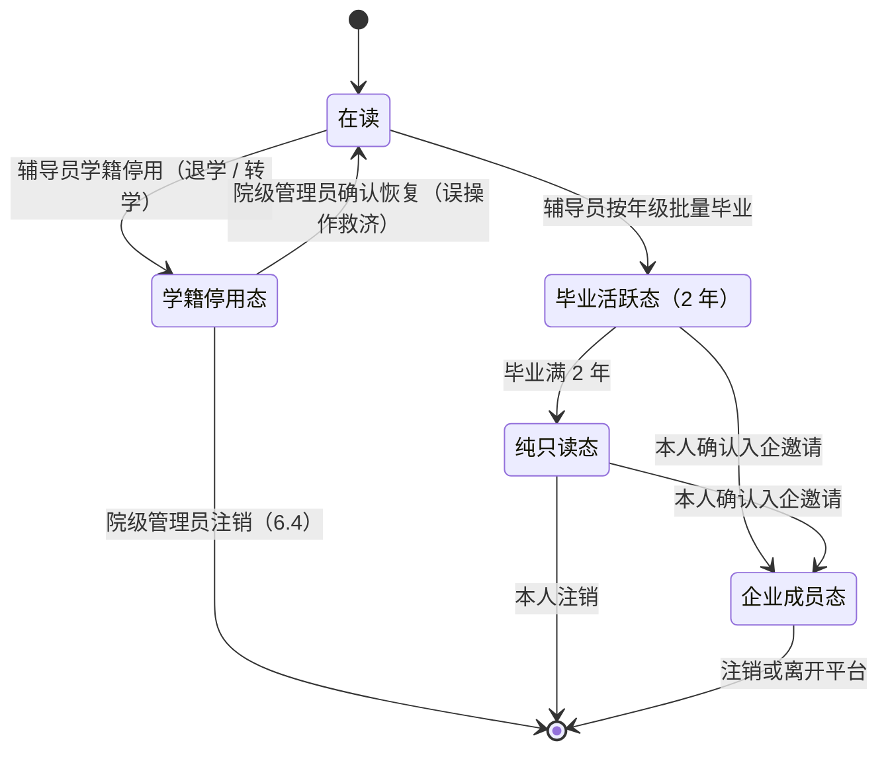

# 07 组织与账户

**文档体系 v1.0 · 组织与权限基座 · 读者：产品与研发团队、平台运营**

本文档定义平台的用户端、组织结构、角色权限、学生生命周期与账户规则。所有业务文档的权限语义以本篇为准；本篇吸收自前代产品设计并按现行体系（《01》《02》）对齐。

---

## 1. 总则

平台共有 **5 端用户**（平台、学员、高校、企业、政务），外加一个无需登录的**公共服务入口**（证书验证）。角色差异通过端内工作台与权限控制解决，不将角色拆分为独立端。

四条铁律：

1. **严格一人一号**：不存在一人多角色或跨主体兼任（如高校教师兼任企业导师）。物理执行手段 = 手机号全平台唯一（平台管理账户不绑手机号，以唯一用户名与超管开户约束，见第 7 节）；
2. **角色权限固定不可改**：各角色权限为平台内置常量，不提供自定义权限配置；
3. **管理员行政向**：各类管理员角色的职能 = 组织功能 + 聚合看板查看，尽量不承载具体业务职能；管理员账户平时不登录（制度约束）。下级账号的权限**不是**其上级管理员权限的子集；
4. **协议前置**：所有用户登录前必须同意《用户协议》与《隐私政策》，不同意不可进入；协议版本更新后，**既有会话不即时失效**，按原到期 / 退出 / 撤销规则继续，下一次登录必须重新确认当前版本。

## 2. 组织结构

高校端、企业端、政务端均**无自由注册渠道**，只能由平台管理创建（见第 7 节租户开通）。

### 2.1 平台

- 平台下可挂若干**部门**，部门下辖成员账户；一个账户只属于一个部门，**账户权限与所属部门无关**；
- 平台超管直属于平台，不挂在任何部门下；
- 平台与平台部门无"所在地"概念，但处理具体业务时支持按所在地检索。

### 2.2 高校

- 高校下设**校区**；**学院**挂载在高校下；
- **校区不是组织树的一环**：它的作用是地域锚点——学院选择本校校区（至少一个，可多个）作为自己的"所在地"参与项目地域匹配。高校本身无所在地；校区必须有且仅有一个所在地；
- 学院管理员可创建若干**专业**；专业下挂**班级**；班级具有年级属性（如 2024 级）。**年级不是组织树节点**——"管理年级"是按年份筛选、统计和批量毕业，不在各专业下重复创建年级节点。大学按四年制计算，但**该口径仅用于年级标签的默认推算**：**是否毕业只看辅导员的批量 / 单个毕业操作**（4.2），系统不按入学年自动毕业、不自动生成毕业日，五年制、延期毕业、提前毕业一律手动执行；
- 校级管理员与校级看板账户直属于高校，不挂在任何学院下。

### 2.3 企业

- 企业下可挂若干**部门**（不存在部门套部门），部门下辖成员账户；账户权限与部门无关；
- 企业应具有**至少一个所在地**；企业发布的每个项目 / 课程必须绑定其至少一个所在地（[《08 课程与项目》](08-课程与项目.md)地域匹配用）。企业部门、成员与所在地三者互不关联；
- **企业性质标签**：五档字典（央企 / 国企 / 上市公司 / 专精特新 / 一般企业，运营专员可配置档位），由组织管理员在租户开通时按执照信息登记，下拉选择、不留自由文本。该标签在老师与学生的决策场景全程可见（公开池卡片、项目详情、引入审批页、报名确认页、岗位页）；
- **行业分类**：受控字典（平台运营维护，参照国民经济行业分类门类粒度，归《05》第 2 节产品字典），由组织管理员在租户开通时登记，下拉选择；用于学生行业偏好的匹配与推荐过滤（《02》第 9 节）及数据产品的行业维度；**v1 为单选**——集团型企业只能取主行业，岗位发布不另设行业字段、不覆盖企业主体分类，接受该限制（多行业标签 v2 评估）；
- 性质标签的定位（定案）：**仅为展示信息**——在老师与学生的决策场景全程可见（上文），不参与任何证据定档与计量；平台不设企业分级名录与任何企业档位（《05》第 4 节）。

### 2.4 政府机关

- **扁平化**：一个机关直接下辖若干看板账户，无部门概念；
- 政府机关有所在地，但其**数据可见范围由平台管理配置**（与所在地不必然一致）。

### 2.5 知行公开学院（平台学员的归属容器）

- 平台内置"知行公开学院"，名为学院、实际与各真实高校**同级**；按**行政区划字典的每一个地级市节点**（《05》第 2 节，口径与收录范围见《06》第 3 节）下设校区，每个校区对应一个学院（如"知行公开学院银川校区"）；校区**由系统预置**，运营专员不可删除，无学员的市可停用（**有学员的市不可停用**）；已停用校区拒绝新注册，注册页文案引导选择邻近已启用城市或联系运营；
- 其下**不设专业与班级**，学生直属于学院；不存在院管、辅导员等角色，由平台运营专员管理；
- **注册流程**（平台学员是全平台唯一的自助注册通道）：登录页"注册"→ 手机号 + CAPTCHA + 短信验证码 → 同意协议 → 强制补齐姓名、性别、出生日期与注册城市（省/市下拉）→ 自动归入对应城市校区学院。资料未补齐时所有业务入口被门禁拦截（无例外——简历分享链接免登录可见，不为查看简历开任何注册口子，《04》第 4.7 节）；注册不强制设密码，可持续短信登录；
- **注册信息 90 天冻结**（防乱填）：自填的姓名、性别、出生日期与注册城市（含常驻城市初值）自提交起 90 天内不得修改；提交前显著提醒，期满后常驻城市恢复可改。

## 3. 角色与权限

### 3.1 平台端

| 角色 | 职责 |
|------|------|
| 超级管理员 | 内置唯一，拥有全域组织管理权限；平时不登录（安全策略见 5.4） |
| 组织管理员 | 开通高校 / 企业 / 政府机关及其首任管理员；配置政务端可见范围；登记企业性质标签；受理入驻申请线索（《04》第 4.11 节） |
| 运营专员 | 课程与项目合规预审、自报材料平台通道审核（《02》第 11 节）、学习资源库策展与行业题库投稿受理（专家审核，《04》第 4.5 节）、词表与字典日常维护（版本发布走《05》治理流程）、举报裁决、知行公开学院学员管理、全平台公告与客服工单、试点期"结论对外"开关执行（《06》第 4 节） |
| 看板账户 | 平台级聚合看板，只读 |

组织管理员只管行政开户，运营专员管内容与业务治理——两权分设，避免业务裁决权与开户权集中于一人。

《05》的平台框架委员会与联合评审委员会是**治理机构而非账户角色**：成员以各自本职账户行使职权，评审与裁决动作走治理流程留痕，不设独立委员会账号。

### 3.2 高校端

| 角色 | 职责 |
|------|------|
| 校级管理员 | 创建 / 管理校区、学院及学院管理员（可管各学院组织树全线）、校级看板账户；校级聚合看板。只能由平台管理创建 |
| 院级管理员 | 管理本院组织树（直至学生）；创建 / 管理专业、专业负责人、辅导员（配置管辖班级）、年级、班级；确认恢复学籍停用态、注销停用态账户（6.4）；院级聚合看板 |
| 专业负责人 | 名称如此，但**直属学院、管辖全院**。引入和审批企业项目与共建课程（并指定负责老师）；创建 / 管理课程目录、维护专业培养标准映射（《03》第 3 节）；院级聚合看板 + 学生个体数据查看（拥有辅导员的可见范围，仅查看） |
| 辅导员 | 直属学院。**唯一的学生创建入口**（单个创建或按班级 CSV 导入，见 5.3）；一个辅导员可管多个班级，一个班级只有一个辅导员；班级聚合看板；自报材料校内通道审核（《02》第 11 节）；录入困难群体标记（4.4） |
| 学生 | 浏览 / 报名课程与项目、参与培养过程、维护个人档案、接受推荐与匹配。身份细则见第 4 节 |
| 看板账户 | 就业指导中心、院 / 校领导等；只拥有校级聚合看板 |

学校侧另有一个**项目内职务**（非账户角色）：**负责老师**——专业负责人在引入 / 审批时指定，可指定范围**限定为 ∈{院级管理员、专业负责人、辅导员}**（指定器按此校验；**定案：永不增设独立"教师"角色**，院内课程任课教师亦不建账户，《08》第 1.1 节）；项目进行中拥有本院学生的只读视角，不发任务、不批阅，是学校知情权与异常事件的第一响应人（《08》第 6.9 节）。

### 3.3 企业端

| 角色 | 职责 |
|------|------|
| 企业管理员 | 创建 / 管理部门；创建 / 管理 HR、项目负责人、企业导师、看板账户；企业信息与所在地维护；发起"学员入企"邀请（6.2）。导师账号统一由企业管理员创建。只能由平台管理创建 |
| HR | 创建 / 发布 / 管理岗位模型与岗位发布（《04》第 4.4 节）；管理人才库；企业聚合看板 |
| 项目负责人 | 创建 / 管理 / 发布企业项目与共建课程；从已有企业成员中添加企业导师、拉本企业任何成员入项（不创建账号）；结项总评落槌定稿、标记结项资格；所有项目负责人对所有项目均有管理权，但**未入项者无评价权**；管理人才库 |
| 企业导师 | 评价所在项目的成员（日评 / 任务评，《04》第 4.2 节）、管理项目资源；可同时处于多个项目；管理人才库 |
| 看板账户 | 数据分析人员、企业高管等；只拥有企业聚合看板 |

**评价资格 = 入项**：被项目负责人拉入项目的企业成员（无论原角色）即获得该项目的评价资格。

### 3.4 政务端

| 角色 | 职责 |
|------|------|
| 看板账户（带管理权限） | 区域聚合看板 + 管理本机关不带管理权限的账户 |
| 看板账户（不带管理权限） | 区域聚合看板 |

同一政府机关的所有账户查看范围相同，范围由平台管理配置。数据产品口径见《04》第 4.6 节（区域人才供需研判）。

### 3.5 公共服务入口

**公共入口范围（定案）**：无需登录可用的业务功能为**证书验证**与**简历分享链接落地**（持有效访问密钥的单份简历视图，仅直达、无任何浏览与检索入口）两项；永不增设游客可浏览的岗位、项目、企业主页等业务橱窗。介绍首页与入驻申请表单（《04》第 4.11 节）为静态门面与线索收集，不展示任何平台业务数据；用户协议与隐私政策是登录前门禁必须可达的静态法务页面，不属于游客业务功能。

证书验证：无需登录、不要求查询者是平台用户；输入证书编号 + **查询者本人手机号**并通过短信验证码后（查询留痕、防批量爬取，无需持证人配合），显示证面同款字段。**证面字段冻结清单**：证书编号、学生姓名、项目 / 课程名称、发证企业、协作学院（如有）、项目起止日期、发证日期——**不含任何能力等级**（证书与声明解耦，《01》第 3 节）；项目名等以发证时点冻结，事后变更不追溯证面。已颁发证书及其公共验证**永久有效，与账户生命周期完全解耦**；证面例外路径仅两条：**误发更正**——运营专员重发新编号证书，旧编号验证页显示"已更正，由证书 #新编号 替代"（旧编号不消失、可追溯）；**资格恢复补发**——评价期异议恢复结项资格的补发新编号证书（《08》第 2 节），证面发证日期 = 补发日、项目起止仍为原窗口。

### 3.6 平台服务通道（举报 / 客服 / 公告）

- **举报**：对象五类（课程与项目、岗位发布、学习资源条目、行业题库题目、用户）；表单 = 分类 + 描述 + 可选附件；进入运营专员治理队列裁决（《04》第 4.8 节事项总表），处置菜单封闭：**下架 / 警告 / 账号停用**（按对象适用）+ 不成立驳回；结果通知举报人，记录留痕 3 年；同一举报人对同一对象只允许一件未决举报。处置与业务状态的接合（封闭）：岗位发布下架 = 不可逆关闭（在途申请继续流转，《04》第 4.4.1 节），举报成立且问题源于所引岗位模型的，运营可**连带停用该模型**（新发布不可再引用、已开放发布不自动关闭，《04》第 4.4.1 节）；项目下架按当前状态定效果——**草稿 / 预审中 = 直接归档为撤项；引入 / 报名阶段 = 强制流标（已支付走退款触发器③）；录取结算 / 待开始 = 同撤项（不建信封、不发证，已支付走③）；进行中 = 中止路径（运营填写理由，观察不聚合，《02》第 3 节）；评价期 = 不可再作中止（证书与信封已生成），仅下架广场与企业主页展示，评价期照常走完归档；已归档终态 = 仅隐藏展示**；警告 = 仅通知被举报对象，无状态变化；账号停用 = 立即撤销全部会话并禁止登录——学生**待开始**项目按开始前退出处理（释放名额，收费走退款触发器⑦，《08》第 4.6 节）、**进行中**项目视同中途退出，企业成员即时丧失入项与评价权（已落库观察保留），在途申请单视同撤回；**申诉**：处置结果通知附申诉入口，走客服工单（分类固定"处置申诉"），由运营专员复核、处置有误即撤销恢复；申诉期间处置不暂停执行，同一处置至多申诉 1 次（走客服工单、不进《04》第 4.8 节事项总表，与结果登记更正同款口径）；
- **客服**：站内极简工单（分类 + 描述 + 可选附件），运营专员统一处理；不做实时客服、不做机器人；
- **公告**：运营专员发布，可按端圈定接收范围；无评论、无回执。

### 3.7 跨端共享入口

- **全局搜索**：平台、学员、高校、企业四端账户均可使用（**政务端永久不含搜索，定案**，其外壳顶栏不渲染搜索框），但检索范围严格等于该账户在当前角色、身份态、管辖范围与授权规则下本来可见的对象；搜索不授予新权限、不产生业务状态；产品口径与各端对象范围见《04》第 4.12 节、《09》第 7.6 节；
- **规范中心**：平台、学员、高校与企业端登录账户可只读访问已发布使用指南、能力标准、规则与更新日志；政务端不含入口。协议与政策页免登录，其余内容需登录；访问边界与内容分组见《04》第 4.12 节、《09》第 8 节。

## 4. 学生身份与生命周期

### 4.1 两类学生

| | 高校认证学员 | 平台学员 |
|---|---|---|
| 注册渠道 | 无自由注册，仅辅导员导入 / 创建 | 开放自由注册 |
| 归属 | 直属其班级 | 直属知行公开学院对应城市校区 |
| 身份保证 | 真实在校身份（导入即学校背书） | 自报 |
| 功能 | 最齐全 | 不含校内教学相关功能 |
| 管理者 | 辅导员 | 平台运营专员 |

### 4.2 生命周期状态机（高校认证学员）

- **在读**：全功能；企业项目报名须经本院引入（《08》第 3 节）；
- **毕业活跃态（2 年）**：可报名企业项目（不含院内课程与共建课程），不走学院审批、由企业自行筛选；档案维护、外部履历上传、去向登记（《04》第 4.4.6 节）、岗位匹配、人才库照常。毕业头两年是就业服务的黄金期；**管理归属不变**——仍归原班级辅导员（自报材料校内通道受理与就业帮扶台账，《02》第 11 节），辅导员变动按 5.7 移交；
- **纯只读态**：只能查看与被统计（同侪参照数据源身份不变）；自动退出所有人才库，并退出岗位候选池、人才搜索、申请与求职可见；本人可随时注销；**在途项目例外**：转入时仍在途的项目保留学生侧过程能力至终态（提交、讨论、每日反馈、满意度与异议——与企业成员态"在途学员项目"同款口径，人仍在学员端），新报名仍禁止；
- **学籍停用态**（退学 / 转学出本校）：可登录、只读本人档案与证书；退出候选池 / 人才搜索 / 申请 / 求职可见 / 全部人才库；不再受理自报材料、不可报名任何课程与项目；不再写入去向记录；不可自助注销（身份仍由学校管理）；院级管理员确认后可恢复在读（误操作救济）；学号不释放（5.3）；**本态不是终点——出口（院级管理员注销）见 6.4**；
- 报名时学生身份显式标记为**在校生 / 已毕业 / 平台学员**，供企业筛选。

**身份切换时的在途业务（统一规则）**：在途项目 / 共建课程一律保留至该项目终态，身份切换只影响新报名——批量毕业时仍在共建课程中的学生照常参与、评价、结项；企业成员态（6.2）与纯只读态退出候选池、人才搜索、申请与求职可见（封存档案不再被任何企业检索到），**在途岗位申请单由系统以"学生撤回"关闭**（《04》第 4.4.4 节）；退学 / 转学出本校 = 辅导员操作学籍停用（操作时系统列出该生全部在途项目并二次确认）：**待开始**项目按开始前退出处理（释放名额，收费走退款触发器⑦，《08》第 4.6 节），**进行中**项目按中途退出处理（《08》第 4.5 节），账户转入学籍停用态（4.2）；院级管理员确认恢复在读**不自动拉回**已退出项目——停用后 24 小时内恢复且项目仍在进行中的，可提客服工单由运营专员人工拉回（个案处理，不走 24h 默认同意通道，防绕过清退）。

### 4.3 常驻城市

毕业生与平台学员具有**常驻城市**字段（平台学员默认 = 注册城市；毕业生默认 = 其学院校区列表中**排序第一**的校区城市——学院校区列表有序维护，不设学生个人校区字段，《08》第 3.2 节口径不变；本人自毕业当日起即可改），公开池地域过滤按此字段执行（《08》第 3.2 节）。

### 4.4 困难群体标记

- 字段涵盖就业帮扶所需类别（脱贫家庭、低保、零就业家庭、残疾等，字典受控）；
- **仅学校侧录入**（辅导员 / 院级管理员），学生本人可见自己的标记；
- 可见范围：就业帮扶场景（帮扶台账与相关看板）；已授权企业须经学生**另行开启独立开关**方可见（默认关闭、随时可关，用途限于费用减免等关怀政策——**减免等关怀由企业线下执行，平台支付不提供减免能力**）；人才库授权本身不包含此项；
- 除上述场景外一律不可见：**不进画像、不进推荐、不进报名与筛选视图**。属最高敏感级数据，加密存储、每次读取写审计。

## 5. 账户通用规则

### 5.1 登录与凭证

手机号（中国大陆 11 位）+ 密码，支持短信验证码登录；手机号全平台唯一（一人一号的物理执行）；登录前置协议同意页。**平台管理账户不经本页登录**——走用户名 + 密码 + 强制 TOTP 的独立入口（5.4、第 7 节）。

**频控 v1 初值**（可用性初值，非合规方案，登记《06》第 3 节）：同一手机号短信 60 秒间隔、每小时至多 5 条；登录连续失败 5 次锁定 15 分钟。

短信验证码 5 分钟失效、连续输错 5 次作废；激活码与登录码相互隔离，但发送冷却与每小时上限按手机号共享。短信登录与密码登录使用同一协议门禁和会话签发规则，不因免密码绕过 TOTP（已绑定者）或协议确认。

### 5.2 激活与首登补齐

- 所有被创建 / 导入的**用户端**账户走同一激活流程：创建时登记手机号 → CAPTCHA 后获取短信验证码 → 验证并设置密码、同意当前协议 → 激活并签发会话。非学生角色至此资料完整；学生仍须完成本节规定的首登资料补齐门禁；
- 平台管理账户不走手机号激活：超管创建时由系统生成一次性初始密码且仅展示一次；本人依次完成**初始密码校验 → 修改密码并绑定 TOTP → 明确确认恢复码已离线保存**。最后一步前账户保持待激活，不签发正式会话（见第 7 节）；
- **资料更正**：**姓名与性别由辅导员修改并留审计**（高校认证学员的身份字段以学校名册为准，不由学生自改）；平台学员的姓名、性别、出生日期在 90 天冻结期满后**滚动 365 天至多自助修改 1 次**（不按自然年，2.5、《06》第 3 节）；
- 学生首登补齐：出生年月日（必填）；政治面貌选填——平台当前无功能消费该字段，不得设为必填或用作筛选条件。**平台不具备任何邮件功能（定案）**：通知仅走短信 + 站内信（《04》第 4.10 节），结项证书 PDF 由学员端直接下载（《08》第 2 节），档案不采集邮箱字段。

### 5.3 学生 CSV 导入

- 学生只能在**班级上下文**中创建：辅导员先进入本人管辖班级再导入，系统自动绑定班级与专业，不允许脱离班级创建学生；CSV 无班级字段；
- 字段一律必填：姓名、学号、手机号、性别（**枚举 = 男 / 女 / 未说明**；CSV 只接受"男 / 女"，"未说明"仅平台学员自助注册可选；该字段不进任何筛选与匹配）。不收生源地、身份证号（实名责任在学校侧，导入名单即身份背书）；
- 逐行校验：CSV 内重复、平台手机号冲突、本校学号冲突、格式错误的行报错跳过，其余正常导入，返回成功数与逐行失败清单——手机号冲突的失败行**附占用主体类型与处理指引**（如"该号已注册为平台学员，请学生先自助注销后重导"）；原始 CSV 只在请求内解析、不落对象存储；
- **学号在本校租户内终身不回收**：毕业、注销均不释放，杜绝历史证据与新学生串号。

### 5.4 账户安全与超管策略

- 所有账号可绑定验证器双重验证（TOTP），默认不启用；启用后任何第一步登录方式都必须继续通过动态码或一次性恢复码；动态码同一时间步只允许成功使用一次，恢复码逐枚一次性消费；普通账号可主动停用或重绑（需再次验证），停用立即撤销全部登录会话；平台管理账号强制启用且不可停用；**修改密码同样撤销全部登录会话**（与 TOTP 停用同构）；**TOTP 与恢复码双丢**：高校认证学员由辅导员核实身份后在学生管理内关闭其 TOTP（留审计，不进审核队列），学生重新绑定；平台学员与毕业态不提供客服找回（凭据自担，与 5.6 同构）；
- 超管账户平台内置（系统第一个可登录账户），全平台唯一；**全部平台管理账户（超管、组织管理员、运营专员、平台看板）不绑定手机号、不走短信通道（定案）**，凭据 = 唯一用户名 + 密码 + 强制 TOTP，仅经不在普通登录页展示的独立入口登录；入口地址不承担安全控制，真实边界由凭据、TOTP、限流与审计构成；非超管平台账户 TOTP 与恢复码双丢由**超管在控制台重置**（留审计，账户重新激活并绑定新 TOTP——无手机号即无自助找回，超管重置是唯一救济）；超管自身凭据丢失仍走线下多人见证书面重置程序（下行）；
- **超管凭据丢失不设在线自助找回**（不做找回问答、不做客服重置、也不为此再建第二个超管账户）：产品侧只保证首次激活时的一次性恢复码；恢复走线下多人见证的书面重置程序，不作为产品功能实现；
- 全部操作留审计日志；"平时不登录"靠制度约束，长期未登录不告警。

### 5.5 注销

- **高校认证学员不可自助注销**（身份由学校管理）：退学 / 转学由辅导员操作学籍停用（4.2），其账户的注销由院级管理员执行，见 6.4；平台学员与毕业态账号可自助注销；
- 注销删除全部个人档案与数据（含外部证据）；**已颁发证书及其公共验证永久有效**，与账户生命周期解耦；**平台官方数据例外**：结项证据信封（含 claims）随证书同寿留存平台侧——脱离账户保存、不再关联可登录主体、不参与任何统计与检索，仅供 6.3 认领恢复。

### 5.6 手机号换绑

- 在用账户换绑手机号 = **本人登录 + 旧号短信验证 + 新号短信验证**三因素；换绑生效即释放旧号（手机号全平台唯一约束不变）；
- 高校认证学员换绑另须**辅导员确认**——在辅导员学生管理内完成（通过 / 驳回，展示逾期、不自动通过），**不进审核队列**（《04》第 4.8 节口径；防盗号篡改学籍身份入口）；
- 旧号已丢失：高校认证学员由辅导员核实身份后代发起换绑；平台学员与毕业态**不提供客服找回**（与 6.3 认领边界一致，凭据自担）。

### 5.7 教师岗位移交

辅导员、专业负责人账户停用或调岗前，院级管理员须先完成移交，移交完成前不得停用账户：

- **辅导员**：管辖班级（含已毕业年级）改配新辅导员，审核队列在途件自动转入新辅导员；
- **专业负责人**：在途引入审批、课程目录与培养标准映射维护权随岗位交接；
- **负责老师**（项目内职务）：其在途项目由专业负责人重新指定负责老师。

## 6. 用户流转

原则：**流转从严，特例从优**。平台仅为以下两个方向提供特殊处理，其余流向（企业成员入校、跨企业、学员跨校、平台学员转高校认证学员等）一律**销户 + 重新注册**。6.4 不是第三条流转通道，而是"销户"这条路对高校认证学员的开口——没有它，销户重注册对退学 / 转学的人并不成立。

### 6.1 同学院内流转

转出学生发起申请 → 转出班级辅导员同意 → 转入班级辅导员同意 → 生效。审批无时限，悬挂不自动通过；生效时该生辅导员通道未结案的审核事项自动转办新辅导员（与 5.7 岗位移交同构），平台通道在途件不受影响。

### 6.2 学员入企（主体转换）

- **前置条件**：账号处于毕业态或为平台学员；**在校生不可转**（避免在读学生持企业身份评价同学）；
- **流程**：企业管理员按手机号发起邀请（指定部门与角色）→ 本人登录 + 短信验证确认 → 生效。双方合意，缺一不可；
- **生效后**：账号主体切换为企业成员；学生期档案**封存**——本人永久可见、同侪统计可用、已发证书对外验证永久有效，不再出现在学校的在校生视图；去向记录自动写入"就业·合作企业"（写入优先级最高，《04》第 4.4.6 节；全平台质量最高的去向数据，就业闭环校准信号）；
- **不可逆**：欲回学生态，走销户 + 重新注册；
- **在途学生项目**：入企时在途的项目 / 共建课程保留至终态（4.2 统一规则）——账号登录进企业端，工作台提供"在途学员项目"区块，仅开放学生侧过程能力（提交、讨论、每日反馈、评价期满意度与异议），**无企业侧评价权**（不得评价同学）；项目终态后区块消失。

### 6.3 销户重建的证书认领

- 销户前可导出本人全部已获证书（PDF 及编号清单）；证书本身"注销不删、永久有效"；
- **平台官方数据的范围（封闭）** = 结项证书 + 对应的**结项证据信封（含 claims 与快照观察记录）**——信封随注销不删（5.5 例外条款），与证书同寿；
- 重建后认领：新账户激活时，若手机号命中已注销账户名下的平台官方数据，提示一键认领导入；认领导入证书与信封，信封内 claims 对新账户**重新生效**、照常进入门槛判定与重算管道——"参与画像聚合"由此有确定输入，审计链（声明 → 信封 → 载荷）完整可查；
- **边界**：过程观察活表（日评 / 任务评 / 总评的原始勾选表）、导师手记、每日反馈、自报材料、外部履历、学生目标与偏好一律不留存、不导入——旧档案随注销删除的原则不破（"评价明细"即指过程活表，不含信封快照）；认领以手机号一致为充分凭据，手机号变更过的历史账户不提供人工找回。

### 6.4 学籍停用态的出口（院级管理员注销）

学籍停用态若只进不出，"一人一号"就把人锁死：手机号与学号被占，退学的人无法以平台学员身份重新进来，转学的人也无法被新校导入。故给且只给一条出口。

- **执行者与前置**：仅**院级管理员**可对**已处于学籍停用态**的账户执行注销，二次确认并留审计；辅导员只做停用、不做注销；本人仍不可自助注销（身份权威在学校侧）；
- **效果**：删除全部个人档案与数据，口径同 5.5；**释放手机号**（此后可自助注册或被新校导入）；**学号仍按 5.3 在本校租户内终身不回收**（杜绝历史证据串号）；
- **证书**：已颁发证书及其公共验证永久有效（3.5），本人可按 6.3 在新账户一键认领平台官方数据；
- **跨校仍走销户 + 重新注册**（第 6 节"流转从严"定案不变，不设校际转入通道）：目标校辅导员在手机号释放后按 5.3 正常导入，画像、外部履历与学生目标不继承，仅平台官方数据可认领。

## 7. 租户开通

| 租户 | 开通链 |
|------|--------|
| 平台 | 超管账户平台内置，仅此一个 |
| 高校 | 组织管理员创建高校 → 创建校级管理员；允许多个校管 |
| 企业 | 组织管理员创建企业（登记性质标签、行业分类与所在地）→ 创建企业管理员；允许多个 |
| 政府机关 | 组织管理员创建机关（配置可见范围）→ 创建带管理权限的看板账户；允许多个 |

**平台管理开户**：组织管理员、运营专员与平台看板账户**仅由超级管理员创建与停用**（行政开户权不延伸到平台自身，防权力集中）；创建时登记**唯一用户名，不绑定手机号（定案）**，系统生成并仅向超管展示一次初始密码，由超管安全交付；首次登录按 5.2 三步完成改密、TOTP 与恢复码保存确认，之后只走平台管理独立入口（用户名 + 密码 + 强制 TOTP）。停用立即撤销全部会话；超级管理员不得停用自身或创建第二个超管。

## 8. 与其他文档的接口

| 接口 | 去向 |
|------|------|
| 校区所在地、企业所在地、常驻城市 → 地域匹配 | 《08 课程与项目》 |
| 入项与评价资格、负责老师职务 | 《08》《04》 |
| 辅导员 / 运营专员的审核通道 | 《02》第 11 节审核闸 |
| 人才库授权 | 《04》第 4.4 节 |
| 去向记录（毕业态登记、辅导员代填） | 《04》第 4.4.6 节 |
| 困难群体标记与数据分级 | 《05》第 5 节 |
| 认证会话、租户隔离、固定权限与安全审计实现 | 《11 技术架构》 |
