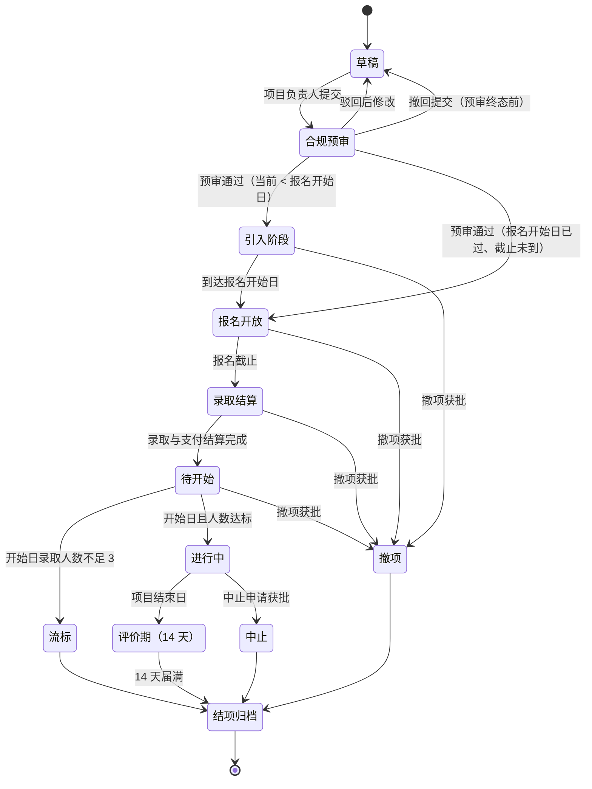

# 08 课程与项目

**文档体系 v1.0 · 培养过程的运营规则 · 读者：产品与研发团队、平台运营、企业接入对接人**

**课程与项目**是平台内承载培养过程的载体，统摄三形态：院内课程、企业项目、共建课程。三形态本质同源、共用超表，按场景启用不同能力。平台提供的是轻量的课程 / 项目过程服务——**不做课程直播、不做即时通讯（IM）**，功能取向少而简洁。

本文档吸收自前代产品设计，计量语义已全部对齐现行体系：证据与等级见[《02 证据与等级判定规范》](02-证据与等级判定规范.md)，评价交互见[《04 平台产品需求》](04-平台产品需求.md)第 4.2 节，角色与地域见[《07 组织与账户》](07-组织与账户.md)。

---

## 1. 概念与三形态

| | 院内课程 | 企业项目 | 共建课程 |
|---|---|---|---|
| 发起方 | 高校（专业负责人录入） | 企业（项目负责人） | 企业（定向唯一学院） |
| 进行地点 | 学校 | 企业 | 学校 |
| 周期 | 目录跨学期稳定，开课实例随学期（1.1） | 数天至数月（3–200 天） | 长（通常一学期起步，上限 200 天） |
| 平台过程服务 | **不启用**（仅登记） | 全过程 | 全过程 |
| 引入 / 审批 | 无（本院自治） | 平台合规预审 + 学院引入 | 平台合规预审 + 目标学院接受 |
| 报名 | 无 | 直录制 / 筛选制 | 报名制（范围可控）/ 名单导入 |
| 评价与发证 | 不启用 | 启用 | 启用 |

三形态共有的结构：

- **条目勾选**：发布 / 录入时必填 ≥1 条能力条目（从词表勾选，**不预标等级**，《01》第 3 节）；语义即《01》关系集的"活动 --训练--> 能力"——声明本活动训练哪些条目，供推荐、匹配与学生筛选使用，**不是报名门槛，也不预示评价结果**（等级只产生于评价环节）；
- **建议前置能力**（可选）：仅展示、不做硬校验，与条目勾选语义相互独立；与条目自身的前置知识域（进可行性计算，《02》第 9 节）也是两回事，创建向导不得合并为一个字段；
- **岗位族标准关联**（可选，至多一个）：为评价表带入通用条目的语境化描述、为结项总评带入评价问题库引导（《04》第 4.2 节）；未关联时评价表显示条目的全局定义、无问题库引导；
- **培养标准挂点**：课程 / 章节可被专业培养标准映射（《03》第 3 节）。

### 1.1 院内课程：课程目录 + 开课实例两层

院内课程拆成两层，解决"课程随学期开、成绩却要绑稳定对象"的矛盾。

**课程目录（平台课程库）**——专业负责人维护的**跨学期稳定条目**，是成绩绑定与培养标准挂接的对象：

| 字段 | 约束 |
|------|------|
| 课程代码 | 必填；**学院内唯一**（硬约束）。跨学院公共课各院自录自管，不做全校去重协调 |
| 课程名称 | 必填 |
| 学分 | 必填；成绩记录以目录学分为准，成绩单识别值仅作匹配校验 |
| 课程性质 | 必填；专业课 / 专业相关公共基础课（二选一，决定成绩通道准入） |
| 条目勾选 | 必填 ≥1；与专业培养标准的"课程 → 能力目标"**是同一字段**（《03》第 3 节的映射页为同一数据的另一种视图），维护入口唯一为本目录，不得两处分别录入 |
| 标准挂接 | 课程 → 知识点 → 知识域 / 能力条目，挂在目录层 |
| 状态 | 启用 / 停用；停用不删，存量成绩与挂接引用永久有效 |

**开课实例**——目录课程在某学期的一次开设：字段 = 目录课程引用 + 学期（标准化为"学年-学期序"，如 2024-2025-1）+ 任课教师（可选，纯登记字符串，不关联账户）。同一课程同一学期允许多个实例（多教学班），不做唯一性硬约束。实例继承目录的条目勾选与标准挂接，不可改——变更挂接是目录层动作。院内课程不启用过程域、报名与评价发证，实例仅作开课事实登记与教务抽检——**成绩证据绑定的是目录条目、不是实例**（《02》第 4.2 节），故实例无其它下游消费者。

**课程成绩通道（已拍板：上传 + 核验，不依赖教务对接）**：学生上传成绩单 PDF，经 OCR + 大模型预识别、本人确认后**绑定到课程目录条目**（仅限已录入的专业课与专业相关公共基础课），学期作为成绩记录自身的属性字段保留；成绩单上未匹配到目录的课程，学生可提交**"待建目录"申请**至专业负责人（进《04》第 4.8 节事项总表），目录建立前该科成绩停在"待核材料"、不进证据；随后走审核闸双通道核验（辅导员 / 平台任一，《02》第 11 节）——**审核单为整单、判定到逐门课**：一张成绩单 = 一件审核单，解析为逐门课数据行，审核人逐条判定（通过 / 驳回附原因），单条驳回不阻塞同单其余课程过审（与"待建目录不阻塞"同款），通过的课程行即时各自成 A 类课程学业证据（一门课一封）——经课程的条目映射自动获得挂载，按含金量字典（课程性质 × 成绩段）定档，领域条目 L1 上限（《02》第 1.2 节）。识别只做预填、学生确认、审核终审，识别失败可全手动录入。**不及格 / 不通过的科目不予过审、不建声明**；百分制、五级制与两级制的换算见《02》第 4.2 节。**信封粒度**：一门课一封 A 类信封（活动整体 = 该门课程），同一成绩单 PDF 可生成多封信封、artifact 可指向同一载荷；待建目录的课程停在"待核材料"，不阻塞同单其余已匹配课程过审；成绩单识别学分与目录学分不一致时不自动驳回，差异展示给审核人裁决。成绩单核验时可同步登记 GPA 与专业排名（入档案区，不产生声明，《02》第 1.1 节）；同一学期多次上传按**后过审覆盖**，旧值入档案史、报表取当前值（《06》第 3 节）。教务系统批量导入作为可选增强，有则批量、无则不阻塞。

### 1.2 共建课程特有规则

- **只能由企业发起**，发起时**定向唯一学院**——无公开池、无多学院投放；
- 目标学院（专业负责人）接受后，选择招生方式二选一：**报名制**（面向本院学生开放报名，范围由学院控制到专业 / 年级 / 班级）或**名单导入**（学院直接指定名单，无报名环节）；
- 企业侧指派企业导师、学院侧指定负责老师，与企业项目一致；过程域全量适用（第 6 节）。

**规则裁剪表**（相对企业项目主线 §2–§5、§7 的逐条改写，实现以此为准）：

| 主线规则 | 共建课程的改写 |
|---|---|
| 状态机（§2） | 草稿 → 合规预审 → **定向接受**（替代引入阶段）→ 报名制走"报名开放 → 录取结算"，名单导入（**名单非空**方可）**直接进待开始**并向名单学生发送入项通知（《04》第 4.10 节）——导入即入项、即授权企业查看画像明细与证据链（入项通知中明示，《04》第 4.4.2 节）→ 进行中 → 评价期 → 结项归档 |
| 收费（§4.1、§4.6） | **全程无收费环节，无论何种招生方式**——校企共建的对价在校企之间解决，不进平台支付 |
| 录取（§4.2） | 报名制 = **先到先得**（直录语义、免费、无支付环节）：报名范围已由学院控制，不再叠加企业筛选；**报名制可设名额上限**（满额关入口，余量释放后窗内自动重开，同 §4.5），名单导入方式以名单长度为人数、不设名额字段 |
| 流标（§2、§5.2） | "开始日 <3 人流标"**不适用**；两种招生方式下**仅开始日 0 人才流标归档**——名单即学院意志 |
| 企业对名单的权力（§4.3、§7） | **零决定权**：名单对企业全程可见，但无报名拒绝渠道、无清退通道；纪律问题走**学院侧清退**（负责老师或专业负责人发起，通道与效果见第 7 节），企业端只读结果 |
| 时间规则（§5） | 照用；名单导入方式下无报名窗相关约束 |

**名单导入的匹配与校验（封闭）**：导入字段 = 学号 + 姓名（两者须一致方可匹配）+ 手机号（可选，仅作辅助校验）；只允许导入**本院、在读、未学籍停用**的学生；匹配失败的行整行拒绝并返回逐行清单（不做模糊匹配、不自动建号——学生创建的唯一入口仍是辅导员，《07》第 5.3 节）；导入即入项、发入项通知、即产生企业画像授权（《04》第 4.4.2 节）。

**名单的加减人（封闭，名单导入方式适用）**：待开始阶段可**追加导入**（校验规则同上，即时入项、发入项通知）；待开始阶段学院可**移除**未开项学生（不走清退、不进黑名单、不留负面记录）；进行中减人一律走学院侧清退（第 7 节），进行中加人走追加导入、导入即入项。

以下 §2–§5 以流程最全的**企业项目**为主线展开；共建课程按上表裁剪适用。

## 2. 企业项目状态机

> 草稿 → 合规预审 → 引入阶段 → 报名开放 → 录取结算 → 待开始 → 进行中 → 评价期（14 天）→ 结项归档



报名满额只临时关闭入口，**不改变项目状态**；报名窗内有人撤回、放弃支付或被拒后，入口按余量自动重开。项目仅在报名截止后进入录取结算。

旁路与异常：

| 情形 | 处置 |
|---|---|
| **用工红线（预审硬规）** | 实训项目产出仅限**教学目的**；企业拟将学生产出**商用**（形成经营性收入）的，必须与学生另行建立正规用工关系（劳动合同 / 劳务协议、工资、社保），不得以实训之名获取商业产能——预审发现即按「与实训定位不符」驳回 | 
| 预审驳回 | 驳回原因为封闭枚举：虚假项目 / 与实训定位不符 / 材料不足 / 其他（附选填说明）；可修改后重新提交 |
| 合规预审中企业反悔 | **撤回提交（R12 修订 R6）**：预审作出终态前项目负责人可撤回，项目退回**草稿**（可改可弃，不算撤项、不建黑名单、不留负面记录）；审核队列中在途预审件自动作废；撤回与预审终审并发时以先落生效——新增的仅是 Compliance → Draft 一条迁移，无新状态、无新审核环节 |
| **预审未通过而报名开始日已到** | 不进入引入阶段，报名开始日**空转**、不自动开放报名（预审是发布的前置闸，时间到不等于闸开） |
| **预审通过时报名开始日已过** | 若仍在报名截止前 → **直接进入报名开放**（跳过引入阶段的等待，引入审批照常并行受理）；若报名截止亦已过 → **不得开放报名**，项目负责人须先往后改报名截止（且开始日仍须满足 §5.1 缓冲），否则只能撤项 |
| 定向全部被拒、仅剩公开池 | 不影响项目推进：公开池的毕业生与平台学员报名不依赖任何学院引入（§3.2）；**流标人数按项目全局已完成录取结算的人数计，不按学院切片** |
| 项目开始日录取人数 <3 | 自动**流标**归档 |
| **开始前企业退出**（引入阶段 / 报名开放 / 录取结算 / 待开始） | 企业申请**撤项**，走《04》第 4.8 节"项目中止 / 撤项申请"审核；获批即归档，效果同流标——**不建证据信封、不发证**，已支付学生走退款触发器③（4.6），已报名与在项学生按《04》第 4.10 节通知。进行中退出仍走中止，两者不可互替 |
| 进行中重大异常 | 企业可申请**中止**，平台审核后归档；已产生的过程数据与观察记录保留，但不聚合为声明（《02》第 3 节）；流标、撤项与中止均**不发结项证书**（未走到结项） |
| 中止 / 撤项审核悬挂期间 | 过程域与项目状态**不冻结**（避免未获批就停摆），获批瞬间按对应路径收口；悬挂超时不默认同意（《04》第 4.8 节），运营积压风险见《06》第 4 节 |

**评价期的语义（现行体系口径）**：企业侧的全部评价动作（日评、任务评、结项总评）与发证**硬截止于项目结束日**；结束后的 14 天窗口留给学生——**学生满意度总评 + 声明异议窗口**。满意度总评以项目级匿名均值反馈企业端（见下）；每日反馈仅作项目健康监测（6.8）；异议走审核队列（《02》第 11 节）。

**结项资格**：进行中未中途退出、未被清退的学生默认具备结项资格；中途退出（4.5）与清退（第 7 节）自动丧失；项目负责人可在**结束日前且该生总评尚未定稿**时逐人取消资格（理由为封闭枚举：违纪 / 长期失联 / 材料不实 / 其他，附选填说明——与清退、报名拒绝共用同一枚举；结束日后至归档**不得**再取消，纠错只走异议），被取消者可在评价期内异议（走审核队列，《02》第 11 节）。结项证书按资格发放（完成即得），与评价声明解耦（《01》第 3 节）；**发证时点 = 项目结束日 24:00（北京时间）**，与观察快照同刻自动执行，证书 PDF 由学员端下载（《07》第 5.2 节）；证面"协作学院" = 该生报名所经的引入学院（共建课程 = 定向学院；公开池报名的毕业生与平台学员无协作学院）；评价期异议恢复资格的走**补发**（新编号，发证日期 = 补发日、项目起止为原窗口，《07》第 3.5 节）。

**结束日 24:00 同刻作业的语义（封闭）**：

- **截止时刻 T = 项目结束日 24:00:00（北京时间）**：此前（含 23:59:59）允许总评定稿，T 起企业侧评价一律不可写（《04》第 4.2 节）；
- **两段提交**：第一段于 T 立刻切断评价写入，并将过程观察表固化为**不可变截止副本**（活表随即整体只读——即使第一段之后的步骤失败，活表也不得再写）；第二段基于该副本计算信封 claims、按资格发证、发站内信；任一步失败**只重跑第二段，禁止重拍副本**（时钟回拨、手工修数、迟到写入均不得进入副本）；
- **快照只读取 T 时已定稿的总评**；未定稿的按《02》第 3 节全体条目封顶 L2，**仍建信封、仍按资格发证**（不因未定稿而不发证）；
- **幂等**：同一学生 × 同一项目 × 同一结束日至多一张资格证书、至多一条项目信封（信封按"学生 × 项目 × 结束日"upsert）；证书与信封允许分两步提交但共用同一次作业标识，已发出的证书编号不因补跑改变（证面例外路径仅误发更正与资格恢复补发，《07》第 3.5 节）；
- **评价期时刻语义**：起点 = T，终点 = T + 14 个自然日的 24:00:00（与结束日同款时刻语义）；归档作业读终点时刻，不读补跑时刻；
- 清退与中途退出的学生不建信封、无声明可异议，且**不采集其结项满意度总评**（流标项目不经评价期，同样不采集）；结项资格不因异议而恢复（清退已走 24h 审核，第 7 节），资格取消的异议成立走补发证书。

**结项满意度总评的可见性**：中止与撤项的项目**不采集**满意度总评；正常结项的项目，企业端仅见项目级匿名均值（样本 <10 不展示数值）；负责老师可见匿名明细（去名与防识别加固同 6.8）；平台运营可见实名（抽检用）。评分 1–5 强制、文本可选。

## 3. 引入机制

企业发布项目时，投放方式可单选或并用。

### 3.1 定向投放

- 目标可选**学院**或**整校**（整校 = 该校全部学院，逐院各自审批）；
- **不受地域限制**（企业指名投放，距离由其自行权衡），但选择列表按本地优先排序；
- 由目标学院的专业负责人审批：**通过后不可改为拒绝；拒绝可改为通过**（审批窗内）；例外：**报名开始前**专业负责人可撤销引入（学院发现项目不可做的纠错口，报名开放后不可撤）；引入申请为**学院 × 项目唯一单**——无论来自企业定向投放还是学院从公开池主动引入，后到的动作一律打开已有单，求引入信号亦聚合到该单；任一专业负责人终审、**先落生效**（多负责人不并行审批同一件）；通过时**指定负责老师**（∈{院级管理员、专业负责人、辅导员}，《07》第 3.2 节）。

**零引入提示（纯展示，不改状态机，R12）**：定向项目处于报名开放且未开公开池时，若当前没有任何学院通过引入，项目管理页与企业工作台显示提示条"尚无学院通过引入——在校生无法报名"，供企业决策补开公开池、追加投放或放弃；不自动通知任何一方、不自动流转、不设新状态。

### 3.2 公开池

- 按**城市**过滤可见性：项目绑定的企业所在地城市 = 学院所选校区的城市（对师生；多校区学院取其校区城市**并集**，不设学生个人校区字段）或常驻城市（对毕业生与平台学员）；
- **在校生 = 橱窗 + 求引入**：可浏览同城公开池的项目基本面（含企业性质标签），**不可报名**；可点"希望学院引入"，专业负责人端聚合需求信号（如"本院 23 人希望引入"）；经其审批引入并指定负责老师后，本院学生方可报名。**报名权在学院，发现权在学生**；
- **毕业生与平台学员**：直接从公开池报名，不经任何学院，由企业自行筛选；
- 学院也可主动从公开池引入（等同审批通过）。

### 3.3 引入的时效

报名截止时仍未通过审批的引入申请**自动失效**（关联的"求引入"信号同步清除）。公平性依赖"报名开始日期统一起跑线"：平台引导企业将报名开始设在离审核期足够远的位置，使学生看到的多数是"已获批准、报名未开始"的项目；不设学院配额（避免配额被拒后的名额僵局）。

## 4. 报名与录取

### 4.1 发布时配置

报名时间窗（开始 / 截止日期）、名额上限、录取方式（直录制 / 筛选制）、是否收费及金额、报名测评（可选）。

**配置锁定（报名开始日 00:00 起）**：锁定录取方式、是否收费及金额、报名测评题目（含题序）；名额上限只可上调、不可下调；投放方式可追加（新增定向学院或补开公开池）、不可收回——已通过引入的撤销仍按第 3.1 节规则。**项目名称在首次进入报名开放后锁定**（保证证面与广场一致），简介等描述性字段可改。

### 4.2 两种录取制

| | 直录制 | 筛选制 |
|---|---|---|
| 语义 | 报名即默认录取（先到先得） | 接受是主动动作，未录取默认落选 |
| 支付时点 | 报名进入支付即**锁定名额**（锁定 **30 分钟**，v1 初值），支付成功转正式占用；超时未支付自动释放、可重新报名 | 报名免费；录取后 **48h 支付确认**席位，超时放弃、名额释放 |
| 企业动作 | 仅对极个别人发起**拒绝**（该生支付成功起 24h 内） | 报名截止后 **48h 统一筛选窗**内主动录取（依筛选视图判断：画像、经历与证书、附言、测评分；不含联系方式与困难情况） |
| 落选者成本 | —（被拒者已支付的走线下退款，属少数例外） | 从未付费，无退款场景 |

**报名表字段（封闭清单）**：身份标记（在校生 / 已毕业 / 平台学员，自动带出，供企业筛选，《07》第 4.2 节）、附言（选填，≤200 字）、报名测评（如配置，4.4）、收费与授权明示（确认页；收费项目同时写明退款政策——**开始前退出可全额退、开项后不退**，4.6）。企业筛选视图展示报名当日画像汇总快照 + 授权内实时画像（快照对照口径同《04》第 4.4.4 节）。

**名额语义（两制通用）**：项目名额是**硬席位**（区别于岗位发布"名额仅展示、不占位"，《04》第 4.4.1 节）——直录制由支付锁定与正式占用消耗名额；**筛选制录取人数不得超过名额上限**（已支付与处于 48h 支付窗的占用一并计入），禁止超录。

**报名即授权**：报名 / 申请即视为对该企业授权查看画像明细与证据链（授权闸口径见《04》第 4.4.2 节），报名确认页明示。

### 4.3 企业拒绝权与单项目黑名单（两制通用的重武器）

设立动机：存在学生扰乱纪律、破坏企业生产活动的先例。区别于筛选制的常规"默认落选"，**拒绝**是带黑名单效果的重武器：

1. 企业发起拒绝（直录制：该生**支付成功起 24h 内**——支付锁定中不可拒，超时未支付自动释放、与拒绝无关；筛选制：筛选窗内；理由为封闭枚举：违纪 / 长期失联 / 材料不实 / 其他，附选填说明——与清退、取消结项资格共用同一枚举）→ **平台审核**；
2. 默认规则：直录制企业 24h 不动作 = 默认接受该报名；平台 24h 不审 = 默认同意拒绝；平台驳回 = 强制改"已通过"；
3. 拒绝生效 → 该生进入**该项目的单项目黑名单**，不可再报名此项目；
4. 平台管理可将学生移出黑名单（投诉救济场景），移出后可重新报名（企业是否再次拒绝，平台不干预）。

### 4.4 报名测评（可选）

- 形式：客观题（单选 / 多选 / 判断）**≤20 题**，平台自动判分；**每题等权、多选全对才得分**（不给部分分）；计分为百分制、四舍五入到整数；提交后不可重做，未提交而退出不计一次作答；答题时长可选配置（默认不限时）；不做防作弊；
- **分数可见性**：学生提交后可见自己的得分与完成状态，**不可见正确答案与逐题对错**（防测评供题区题源外泄）；企业在筛选视图可见分数；
- **仅供企业参考：任何录取制下都不允许设置及格线**；测评分**不进证据区、不进画像**——报名摸底不是能力评价（平台不提供产生声明的测评服务，《02》第 1.2 节）；题目由企业自拟或选用平台行业题库**测评供题区**的题目（分区规则见《04》第 4.5 节），自拟题可自愿共享回流沉淀入测评供题区；
- **作答时机**（设计目标：测评永不站上抢名额的关键路径）：筛选制 = **报名内联**（报名表单最后一步，无竞速故无抢答动机）；直录制 = **占位后测评**（支付占位成功后解锁，项目开始前完成即可；未完成不释放名额、不惩罚，仅在企业端标注"未完成测评"）。

### 4.5 名额、撤回与退出

- **名额自动重开**：报名入口开放条件 = 报名窗内且有余量（含锁定中名额）；撤回 / 支付锁定超时 / 放弃支付 / 被拒释放名额后窗内自动重开，窗外不重开；
- **截止后不补录（定案）**：报名截止后因支付超时、被拒或开始前退出而释放的席位**不再补录**——不重开报名、不设补录通道；流标判据仍按开始日已完成录取结算的人数计（第 2 节），企业将名额设在人数下限之上自担余量（《06》第 4 节风险表）；
- 报名截止前可自由撤回；录取后、开始前退出释放名额（收费项目全额退，触发器⑦，4.6）；
- **进行中退出**记为"中途退出"进入档案事件流（留痕不打负面标签，企业筛选时可见）；中途退出者自动不予结项。

### 4.6 支付

平台仅做报名场景的支付（支付宝 + 微信支付）；**不做任何线上退款**，退款一律平台线下处理。**退款工单触发器（封闭枚举）**——本质是"支付成功但席位无法兑现"的全部情形：① 直录被拒；② 支付锁定超时后回调迟到（钱到而位失）；③ 项目流标或**撤项**（已支付学生，第 2 节）；④ 项目中止（收费项目，金额线下协商）；⑤ 开始前推迟的无责退出（5.3）；⑥ **支付成功但占位事务失败**（平台内部错误）——处置同②，一律退款、不自动占位，学生可重新报名；⑦ **开始前退出**——学生自愿退出，及学籍停用、账号停用等被动情形导致的开始前退出（《07》第 3.6、4.2 节），全额退。**开项后不退**：进行中中途退出与清退不触发退款（确认页明示，4.2；中止仍走④线下协商）。除此之外无退款场景（筛选制超时放弃者从未付款）。

**录取结算完成判据**：直录制 = 报名截止**且全部在途支付锁定完结**（成功或超时释放——截止只关新报名，不打断在途锁定）；筛选制 = min(48h 筛选窗 + 48h 支付窗, 项目开始) 到达且在途支付完结。

**支付单状态机（封闭，一单对一名额锁）**：

```
创建 → 锁定中（占余量，30 分钟）
  ├─ 支付成功回调 → 占位确认（写占用；写失败即转⑥退款、释放锁定，永不自动占位）
  ├─ 超时未支付 → 已释放（余量 +1；此后迟到的成功回调一律走②退款、不占位）
  └─ 业务取消（撤回 / 项目撤项等）→ 已释放；已成功支付的按触发器枚举开退款工单
终态 = 已占位 / 已释放 / 退款中 / 已退款
```

全部状态迁移**幂等**，以支付单号去重（重复回调、用户连点多笔均收敛，不产生第二笔占用）。**余量公式（唯一口径）**：余量 = 名额 − 已占位 − 锁定中 − 筛选制支付确认窗占用；锁座用原子减，余量为 0 拒绝进入支付；筛选制录取动作同样原子校验名额上限（禁止超录口径见 4.2）；共建课程报名制无支付环节，报名提交即占位。

是否收费及金额、**平台服务费（抽成）比例**均为发布时配置项（4.1）；学生支付的费用由平台按比例收取服务费后结算给企业（**平台抽成**，比例 v1 初值作为冻结参数登记《06》第 3 节；退费场景下服务费随退款全额同退，走线下退款流程）。支付通道服务费按支付服务商结算规则在通道侧扣收。商户主体、资金结算与退款资金能力由选定的支付服务商接入方案承担（定案，不在本文档体系内展开）；退款的操作载体为退款工单（《04》第 4.8 节）。支付锁定超时后回调迟到（触发器②）**一律退款、不自动占位**，学生重新报名。

## 5. 时间规则

全部时间按自然日、北京时间（UTC+8）。

**日期型时点的统一时刻表（封闭）**：

| 时点 | 时刻（北京时间） |
|------|----------------|
| 报名开始、项目开始（转进行中 / 流标判定）、引入"到达报名开始日" | 当日 00:00:00 |
| 报名截止、日评当日冻结、项目结束、评价期届满 | 当日 24:00:00（即次日 00:00:00） |
| 支付锁定 30 分钟、筛选窗 48h、支付确认 48h、直录拒绝 24h、平台审核 24h、面试改期响应 48h | 自触发时刻起的精确时长，不取整到日 |
| 申请单停滞 30 天 | 最后一次有效动作起 30 个自然日的 24:00:00（《04》第 4.4.4 节） |

### 5.1 不变量

- 报名开始 < 报名截止 < 项目开始 ≤ 项目结束；
- 项目持续天数（含首尾）**3–200 天**；
- **录取链条缓冲**（按"报名截止日 24 时 → 开始日 0 时"计）：直录制项目开始日晚于报名截止日 **≥3 天**（覆盖 24h 拒绝 + 24h 平台审）；筛选制 **≥5 天**（覆盖 48h 筛选 + 48h 支付）；
- 所有窗口以项目开始时点为硬截止（min(窗口期, 项目开始)）；筛选制中对落选者的拒绝审核可悬挂至窗后（不影响占位与开始）。

### 5.2 过期自动化

| 时点 / 情形 | 自动行为 |
|---|---|
| 报名截止或名额满 | 关闭报名入口 |
| 报名截止时未过审的引入申请 | 自动失效（求引入信号同步清除） |
| 直录制支付锁定超时（30 分钟） | 锁定名额释放，可重新报名 |
| 录取后支付确认超时（筛选制 48h） | 视为放弃，名额释放 |
| 项目开始日，录取人数 <3 | 自动流标归档 |
| 项目开始日 | 自动转"进行中" |
| 项目结束日 | 自动转"评价期"（14 天，平台常量），企业侧评价与发证冻结 |
| 评价期届满 | 自动结项归档 |

### 5.3 时间修改

**只能往后改，不能往前改**（延长报名、推迟开始、延长结束均可，上限 200 天；任何提前均不可，防止对观望与已报名学生偷跑）。任何时间变更自动通知已报名与已录取学生；开始日前的推迟允许已录取学生**无责退出**（收费项目走线下退款）。

**触发即封（不变量）**：5.2 的时点触发是不可逆的（录取结算、转进行中、发证与观察快照），因此时间修改**只在对应时点尚未触发时**可行；触发之后该时点及其之前的窗口一律锁死，状态机永不回退。

| 已触发的时点 | 触发的后果 | 此后禁止 |
|---|---|---|
| 报名截止（进入录取结算） | 关闭报名入口、开始结算 | 再改报名开始日与报名截止日；不可退回报名开放 |
| 项目开始日（转进行中或流标） | 过程域开放，或流标归档 | 再改报名窗与开始日 |
| 项目结束日 24:00（发证 + 观察快照 + 转评价期） | 证书与信封已生成（第 2 节） | 再改结束日；评价期 14 天为平台常量，不可改 |

仍允许：**进入录取结算前**推迟开始日、延长报名（须仍满足 5.1 的录取链条缓冲）；**结束日尚未触发时**延长结束日（上限 200 天）。因预审滞后而报名窗整体过期的补救见第 2 节旁路表。

## 6. 过程域（进行中）

企业项目与共建课程适用。学生的产出物、批阅记录与评价勾选是能力证据的核心来源，最终聚合为一条证据信封（《02》第 2–3 节）。

**预建**：项目通过预审（进入引入阶段）后，企业即可预建章节、任务与团队并上传资料（6.10 的上传时点同此），**对学生不可见**；开始日按当时快照自动开放，第一天即可发任务；学生提交仅在进行中开放。预建阶段的任务只是模板、不算 6.5 意义上的发布：其**参与者快照钉在该任务对学生生效的时刻**——开始日统一开放的按开放时名单固化，进行中新发布的当场固化，均不钉在预建保存时刻。

**待开始期间学生可见范围**：仅项目基本面与时间窗（含"即将开始"提示）——章节、任务、资料区、团队名单、讨论区与每日反馈**一律不可见、不可提交**，与预建"对学生不可见"同口径；全部过程域在开始日按当时快照一次开放。开始前的时间变更等信息走通知，不靠项目空间承载（《04》第 4.10 节）。

### 6.1 章节与教学内容

- 结构：**章 - 节**两级树；节下挂内容块（富文本、附件、外链）与任务；
- 开放方式每章三选一：发布即开放 / 定时开放（到日自动）/ 手动开放（导师操作）；
- 节预留培养标准挂点（知识点、条目映射，《03》第 3 节）。

### 6.2 项目公告

单向公告（项目负责人 / 企业导师发布），学生已读回执。项目内唯一的"消息"形态，替代 IM 的存在。

### 6.3 资料区

企业上传项目资料（需求文档、数据集、规范等），学生只读。

### 6.4 任务与提交

- 导师发布任务：标题、说明、附件、截止时间、**发布目标（全员或某团队）**；任务勾选条目 ≤20 条（《04》第 4.1 节发布端约束）；
- 学生提交产出物 → 导师批阅（通过 / 打回重交 + 评语）；任务截止后仍可提交至项目结束日，列表标"逾期"，打回重交同样收至结束日；
- **任务一律个人提交，团队提交永不考虑**——团队产出的证据归属无法区分个体贡献，搭便车会污染画像地基；与《02》"观察落到个人"的归因设计同构；
- 任务是日评 / 任务评的挂载点（《04》第 4.2 节）：产出物与批阅记录为评价勾选提供依据；
- **任务的取消与删除**：已有提交或观察记录的任务不可删除，只能标记"取消"——保留既有提交与观察、不再要求新提交，其条目仍计入项目条目全集；无提交且无观察的任务（含预建模板）可直接删除；任务截止只可往后改、不得越过项目结束日；已发布任务的参与者快照不可改（6.5）。

### 6.5 团队（快照制）

> **红线：学生端不存在任何组队渠道——没有创建、申请、邀请、退出入口。团队的建立、调整、解散全部是企业侧动作。**

- 企业侧（项目负责人 / 企业导师）后台创建团队并分配成员；**严格一人一团队**（同一项目内一个学生至多属于一个团队）；
- **快照制**：任务 / 资料发布时选定目标（全员或某团队），系统当场将目标名单固化为该任务的参与者快照；此后团队成员变更**不影响任何已发布任务**——移出者保留旧任务可见性与自己的提交记录，新成员不背历史任务；成员变更只影响之后发布的任务；
- **移出后的旧任务能力**：仍在项的学生（仅换团队或被移出团队）对旧任务**可继续提交至项目结束日、可继续被评价**（快照锁定的是参与者，不是团队归属）；已清退或中途退出的学生只读历史、不可新提交、不再产生新观察，已落库观察按证据不可变保留（《02》第 3 节）；
- 团队结构对项目内全员透明可见（线下本就共事，遮掩只添沟通成本）；
- 团队同时充当评价 D4 协作类条目时的语境记录。

### 6.6 讨论区 / Q&A

站内非实时：学生提问 + 全员可回复 + 导师置顶 / 标记已解答。无点赞、无楼中楼。允许上传与任务提交相同类型的附件，计入项目文件配额（6.10）。

### 6.7 导师过程手记

导师随时对某学生记录私有备注（学生不可见），结项总评页自动聚合展示——把"凭印象打档"变成"凭记录打档"的最低成本手段，与评价问题库引导（《04》第 4.2 节）配合使用。手记**随项目留存、不随人才库授权流转**（人才库是企业级授权，手记始终是项目内的私有记录，《04》第 4.4.3 节）；项目归档后只读。

### 6.8 学生每日反馈

- **每天一次，评分（1–5）强制 + 自由文本可选**；在**当日日程结束后**收集（日终反馈，定案）——项目负责人 / 企业导师在项目设置中配置**每日反馈开放时点**（默认 18:00，北京时间，登记《06》第 3 节）；开放前进入项目空间不弹，开放后**当日首次进入项目空间**弹层，提交即放行、当天不再打扰；开放时点后当日未再进入项目空间者漏，**不做补交**（补交出来的是记忆不是反馈）；
- 可见性：企业端可见逐条明细但**不显示姓名**（去名非匿名），且时间只到日、同日条目随机排序、不按人分组、不可按人筛选或导出——小项目里单纯去名等于实名，故加固；负责老师可见**实名**明细；
- **不做自动预警**——连续低分与异常靠负责老师自行勤看（他是学校侧第一响应人）；
- 每日反馈仅作项目健康监测与负责老师查看，不对外展示；对外的满意度数据仅取结项满意度总评（第 2 节评价期）。

### 6.9 负责老师的只读视角

本院入项学生的任务提交与批阅情况、项目公告、每日反馈实名明细。**不发任务、不批阅**——培养过程的裁决权在企业侧；他承载学校的知情权，是异常事件的学校侧第一响应人。

无引入学院的项目（仅毕业生与平台学员参与）不存在负责老师：每日反馈实名明细改为平台运营专员可查，异常事件的第一响应人为平台运营专员。

### 6.10 文件空间与归档释放

企业项目与共建课程各自拥有受配额约束的文件空间，承载章节附件、项目资料、任务附件与学生个人提交，不扩张为通用网盘或在线文件协作产品。

- 平台设置默认配额并可逐项目调整；企业与学生可见用量，配额耗尽后停止新上传、不影响已有文件查看；
- 所有文件必须归属于一个明确的企业项目或共建课程；企业仅在项目通过预审、进入引入阶段后方可上传，草稿与预审中不可提前占用空间；学生仅可在进行中上传自己的任务提交与讨论区附件（同类型、同配额，6.6）；
- 项目进入归档 / 流标 / 中止终态后空间立即只读，以进入终态的时间为保留期起点；
- 默认在终态后 **30 天提醒导出，90 天释放普通过程文件**；两个节点分别计算，不相加为 120 天；
- 平台可将单个项目设为永久保留；取消永久保留时，若原 90 天期限已过，给予 7 天缓冲后再释放；
- **升格为证据保留口径的文件 = 证据信封 artifact 引用集**，自动引用规则（封闭）：该生每个**有观察记录（日评或任务评均算）的任务**的**最后一次提交**（含逾期）+ 任务评与结项总评表原件——只按任务评取会让"仅有日评"的任务在 90 天后只剩勾选、没有产出物，审计链断在最关键处；评价人**不可**勾选排除（防事后抽走不利证据）；引用集不计项目普通配额，也不随项目空间释放（证据不可变纪律）；未被信封引用的普通过程文件一律按上述保留期释放；
- 平台超管与运营专员可跨租户管理项目文件（配额、下载、隔离、恢复、删除、保留策略），高风险动作留审计；业务引用中的文件只允许隔离，不允许手工硬删。

### 6.11 刻意不做

IM 与直播、考勤签到、日报周报、学生端组队、团队提交、每日反馈自动预警、项目内文件协作。

## 7. 进行中的成员管理

- **拉人入项**：项目负责人可将本企业任何成员拉入项目；入项即获得该项目的评价资格（《07》第 3.3 节），未入项者无评价权；一人可同时处于多个项目；
- **移出项目**：项目负责人可将企业成员移出项目；移出即丧失评价权（其当日未冻结的日评仍可修改至当日 24:00），已落库观察记录保留（证据不可变）；其起草的结项总评草稿保留，其他入项评价人可继续覆盖写（《04》第 4.2 节）；
- **清退**（进行中的重武器）：企业项目由企业发起；**共建课程由学院侧发起（负责老师或专业负责人，企业无此通道）**——均复用 4.3 的"发起 → 平台 24h 审核（超时默认同意）"通道，生效后同样进入该项目的单项目黑名单；清退者自动不予结项（不发结项证书；已落库的观察记录按"证据不可变"纪律保留，但不聚合为声明、仅入轨迹，《02》第 3 节）；
- **中途退出**（学生自愿）：见 4.5，留痕不打标签。

## 8. 与其他文档的接口

| 接口 | 去向 |
|------|------|
| 评价交互（日评 / 任务评 / 结项总评）、观察聚合 | 《04》第 4.2 节、《02》第 3 节 |
| 课程成绩核验、异议、清退救济 | 《02》第 11 节审核闸 |
| 结项证书与声明解耦、证书验证 | 《01》第 3 节、《07》第 3.5 节 |
| 公开池与推荐消费、条目勾选 | 《04》第 4.5 节 |
| 角色、地域锚点、学生生命周期 | 《07 组织与账户》 |
| 状态扫描、支付并发、文件直传与结束日幂等作业实现 | 《11 技术架构》 |
