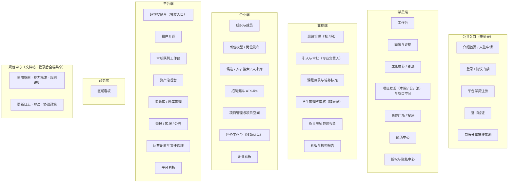

# 09 网站地图与页面功能清单

**文档体系 v1.0 · 产品设计交付物（站点结构层） · 读者：产品与研发团队**

本文档把《04》定义的功能模块组织为可实现的站点结构：按五端（平台 / 学员 / 高校 / 企业 / 政务）+ 公共入口分区，粒度到"页面—区块—主要交互"，并定义导航结构与角色可见性。**本文档不定义任何规则**——每个功能点标注其唯一定义处（"《XX》第 N 节"），如本文档措辞与被引条款有出入，一律以条款为准。全站实现遵守《00》第 6 节五条设计纪律与《04》第 5 节产品红线。编制中发现的规则缺口均已拍板并回填至各册，记录索引见第 9 节。

**四层边界**：《00》—《08》定业务规则与设计纪律；**本册定信息架构**（有哪些页面、每页有哪些区块与功能点、谁能看见）；[《10 界面设计规范》](10-界面设计规范.md)定视觉与交互形态；[《11 技术架构》](11-技术架构.md)定技术实现。本册的"布局"行只给结构基线，不给视觉规格；09—11 均不得改写被引业务条款。

---

## 0 全站总览

### 0.1 分区地图

七分区：公共入口（无需登录）+ 五端（《07》第 1 节）+ 规范中心（登录后全端共享的文档站，第 8 节）。角色差异在端内用工作台与权限控制解决，不拆分为独立端（《07》第 1 节铁律）；规范中心不是第六端，它是跨端共享的只读文档层，从各端顶栏进入。

### 0.2 通用约定

- **全端通用组件**（通知中心、举报入口、客服工单、公告接收、账户安全、协议门禁）统一定义于第 7 节，各端页面表不再重复列出；
- **审核队列工作台是跨端共享形态**（《04》第 4.8 节）：完整规格见 2.3，高校端受理视图（4.6）为同一队列按受理角色过滤，不重复定义；
- **布局基线**：每个页面归属一个布局原型（L-A…L-J）与一档响应式策略（M / R / D），映射表见 0.4，原型与档位的定义见《10》第 6、9 节；页面表内不再重述外壳结构；
- **五端控制台共用同一外壳**（L-C：左两级导航 + 顶栏全局搜索 + 内容区），端与角色的差异只体现为导航项裁剪（0.3）与页面内权限控制，不做外壳分叉（政务端顶栏不渲染全局搜索框，7.6）；
- 涉及学生数据的每一处展示必须能落到授权闸口径（《04》第 4.4.2 节）与匿名纪律（《05》第 5 节）；
- 页面表三列 = 区块 / 主要交互 / 依据条款；"布局"行给单句结构基线，视觉细化见《10》。

### 0.3 导航结构与角色可见性

导航为**左侧两级**（L-C 外壳）。同一端内不同角色**看到的是同一棵树的裁剪结果**，不为角色建独立导航；无权限的一级组整组隐藏（不做灰显）。详情页（如审计链、项目详情、申请单详情）不进导航，只从列表进入。

**学员端**（身份态裁剪见第 3 节开头的差异表）

| 导航组 | 二级项 | 页面 | 身份裁剪 |
|--------|--------|------|---------|
| 工作台 | — | 3.1 | 全部 |
| 我的成长 | 我的画像 / 成长时间线 / 成长档案与证据 / 同侪参照 | 3.2 · 3.21 · 3.4 · 3.17 | 纯只读态与学籍停用态：证据上传入口隐藏（成长时间线全部身份态可回看，4.13） |
| 机会 | 成长推荐 / 本院项目 / 公开池 / 学习资源与自测 | 3.6 · 3.8.1 · 3.8.2 · 3.7 | **本院项目仅在校生可见**；纯只读态与学籍停用态隐藏本组 |
| 我的项目 | 我的项目 / 我的证书 | 3.10 · 3.11 | 全部（无在途项目时组内为空态） |
| 求职 | 岗位广场 / 我的投递 / 简历中心 / 目标与求职意向 | 3.12 · 3.15 · 3.16 · 3.5 | 学籍停用态与纯只读态隐藏岗位广场与投递，保留简历中心与去向登记 |
| 设置 | 授权与隐私 / 账户设置 | 3.18 · 3.20 | 全部 |
| 常驻（非导航） | 通知中心（顶栏）· 全局搜索（顶栏 ⌘K）· 规范中心（顶栏「文档」） | 7.1 · 7.6 · 第 8 节 | 全部 |

**企业端**

| 导航组 | 二级项 | 页面 | 角色可见 |
|--------|--------|------|---------|
| 工作台 | — | 5.1 | 全部角色 |
| 招聘 | 岗位模型 / 岗位发布 / 候选与人才搜索 / 招聘漏斗 | 5.3 · 5.4 · 5.5 · 5.7 | HR（企业管理员只读） |
| 人才库 | — | 5.6 | HR · 项目负责人 · 企业导师 |
| 项目 | 项目管理 / 报名与录取 / 项目空间 | 5.8 · 5.9 · 5.10 | 项目负责人（企业导师仅见所在项目的项目空间） |
| 评价 | 评价工作台 | 5.11 | 入项成员（评价资格 = 入项，《07》第 3.3 节） |
| 组织 | 组织与成员 / 企业信息 | 5.2 | 企业管理员 |
| 看板 | 企业看板 | 5.12 | 全部角色（看板账户仅此组） |
| 在途学员项目 | — | 5.1 内区块 | 仅由学员入企转换而来且有在途项目的成员（《07》第 6.2 节） |

**高校端**

| 导航组 | 二级项 | 页面 | 角色可见 |
|--------|--------|------|---------|
| 工作台 / 看板 | 校级看板 / 院级看板 / 班级看板 | 4.1 · 4.2 · 4.7 · 4.9 | 按角色层级各见其一 |
| 组织管理 | 校区与学院 / 本院组织树 / 岗位移交 | 4.1 · 4.2 | 校级管理员 · 院级管理员 |
| 教学 | 引入与审批 / 课程目录与培养标准 | 4.3 · 4.4 | 专业负责人 |
| 学生 | 学生管理 / 审核工作台 | 4.5 · 4.6 | 辅导员（专业负责人有学生个体只读范围，无管理动作） |
| 我负责的项目 | 负责老师只读视角 | 4.8 | 被指定为负责老师者（∈{院级管理员、专业负责人、辅导员}） |
| 机构报告 | 就业质量 / 教改支持 / 专业设置参考 | 4.9 | 校级 / 院级管理员 · 看板账户 |

**平台端**（超管控制台 2.1 为独立入口，不在本树内）

| 导航组 | 二级项 | 页面 | 角色可见 |
|--------|--------|------|---------|
| 工作台 / 看板 | 平台看板 | 2.10 | 全部（看板账户仅此项） |
| 审核队列 | — | 2.3 | 运营专员 |
| 资产治理 | 词表 / 含金量字典 / 岗位族标准 / 产品字典 / 算法规则 / 版本与重算 / 判例库 | 2.4 | 运营专员 |
| 内容 | 学习资源库 / 行业题库 | 2.5 | 运营专员 |
| 平台服务 | 举报裁决 / 客服工单 / 公告 | 2.6 | 运营专员 |
| 公开学院 | 学员管理 / 校区管理 | 2.7 | 运营专员 |
| 运营 | 运营配置 / 项目文件空间 | 2.9 · 2.8 | 运营专员（文件空间超管亦可） |
| 租户开通 | 高校 / 企业 / 政务 / 入驻线索 | 2.2 | 组织管理员 |

**政务端**：扁平两项——区域看板（6.1）· 账户管理（6.2，仅带管理权限的看板账户可见）。

**规范中心入口（全端一致）**：不占左导航位，统一挂在各端**顶栏的「文档」链接**，新窗口打开文档站独立外壳；文档站内提供"返回工作台"按钮回到来源端。政务端不含此入口。

### 0.4 页面 × 布局原型 × 响应式档

原型与档位定义见《10》第 6、9 节。未列入的详情页随其列表页取同档。

| 布局原型 | 页面 | 响应式档 |
|---------|------|---------|
| L-A 营销长页 | 1.1 介绍首页 | R |
| L-B 认证分屏 | 1.2 登录 · 1.3 注册 · 1.4 激活 | R |
| 单列文档页 | 1.5 证书验证 · 1.6 简历分享落地 | M |
| L-C 控制台外壳 | 全部登录后页面的外壳 | 随内页 |
| L-D 列表—筛选 | 3.7 · 3.8.1 · 3.8.2 · 3.12 · 5.5 人才搜索 · 2.4 字典维护 · 2.5 | R（2.4 / 2.5 为 D） |
| L-E 三栏详情 | 3.9 项目详情 · 3.13 岗位详情 · 3.14 企业主页 | R |
| L-F 三栏工作台 | 2.3 · 4.6 · 5.7 · 5.9 · 2.6 举报裁决 | D |
| L-G 移动优先评价台 | 5.11 评价工作台 | **M** |
| L-H 看板 | 2.10 · 4.7 · 4.9 · 5.12 · 6.1 | D |
| L-I 设置 / 表单 | 3.5 · 3.18 · 3.20 · 4.1 · 4.2 · 4.5 · 5.2 · 5.4 · 2.2 · 2.7 · 2.9 · 6.2 | D（3.x 学员侧为 R） |
| L-J 文档长文 | 第 8 节规范中心全部页面（使用指南 / 能力标准 / 规则说明 / 更新日志 / FAQ / 协议政策） | R |
| 混合 | 3.1 / 5.1 工作台（卡片流）· 3.2 画像 · 3.3 审计链 · 3.4 档案 · 3.10 项目空间 · 3.15 我的投递 · 3.21 成长时间线 · 5.3 模型编辑器 · 5.8 项目管理 · 5.10 项目空间 · 4.3 · 4.4 | 见各页（3.21 为 R） |

**必须在手机上一等公民完成的四件事（M 档，定案）**：企业侧日评 / 任务评 / 结项总评（《04》第 4.2 节交互红线）、学生每日反馈（《08》第 6.8 节日终弹层）、通知中心、证书验证与简历分享链接落地。

---

## 1 公共入口（无需登录）

### 1.1 介绍首页与入驻申请

用途：无登录的静态门面与机构线索收集——它是平台唯一的对外招商界面。游客可用的业务功能仅证书验证与持有效访问密钥直达的单份简历分享落地页；后者无浏览与检索入口，永不做游客业务橱窗（《07》第 3.5 节定案）。布局：L-A 营销长页，自上而下单页滚动，分区交替白底与浅底块。

**内容硬约束**：全页内容为**静态文案与静态图形**，不接任何接口——不出现租户数、学生数、项目数、岗位数、企业名录、真实画像样例等平台业务数据（《04》第 4.11 节）。需要举例时一律用明确标注的虚构示意。

| 区块 | 主要交互 | 依据 |
|------|---------|------|
| 悬浮顶栏 | 紧凑标识 + 全局搜索（站内静态内容与帮助）+ 导航锚点（方案 / 价值 / 入驻）+ 皮肤切换 + 证书验证入口 + 墨色 CTA「登录 / 注册」；初始透明，滚动后以白底、细边框固定 | 《07》第 3.5 节、《10》第 6 节 L-A |
| Hero | 一句话定位（以能力为公共语言连接高校培养、学生成长与企业用人）+ 一段副文案 + 双 CTA（机构入驻 / 证书验证）+ 大幅静态语义空间 / 产品界面示意图；示意必须标注为虚构，不使用真实业务数据 | 《00》第 1 节 |
| 三方困境 | 三列静态卡：学校谈课程与学分、学生经历难度量、企业靠简历初筛——点出三方各说各话的翻译损耗 | 《00》第 2 节 |
| 解决方案：同一套坐标系 | 静态示意图（学校语言 / 学生语言 / 企业语言 → 能力语义空间 → 可比对可计算）+ 三层资产（词表 / 标准 / 实例）一句话说明 | 《00》第 3 节 |
| 四大业务闭环 | 项目 / 成长 / 教学 / 就业四张卡，每卡一句路径描述 | 《00》第 4 节 |
| 三方价值 | 三列分区（学生 / 学校 / 企业），每列 3–4 条要点；企业列突出"先用后招"与预熟化 | 《00》第 5.1–5.3 节 |
| 可验证性 | 对外讲得通的三条：每段经历可追溯到原始材料、结项证书支持公开验证、导出简历可分享带访问密钥的链接 | 《00》第 5.1 节、《07》第 3.5 节、《04》第 4.7 节 |
| 面向政府与行业 | 一段说明：岗位族需求趋势与区域人才供需研判 | 《00》第 5.4 节 |
| 入驻申请表单 | 高校 / 企业线索表单（机构名称、机构类型、联系人、联系方式、意向说明），提交转组织管理员线下跟进；**不开通账户、不进审核队列、不承诺处理时限**（表单下方明示） | 《04》第 4.11 节、《07》第 3.1、7 节 |
| 功能入口 | 登录（1.2）、平台学员注册（1.3）、证书验证（1.5）直达 | 《07》第 3.5 节 |
| 站点页脚 | 四列（产品 / 机构 / 资源 / 法务）+ 版权与备案位；不放任何业务数据与实时统计 | 《10》组件 C18、《07》第 3.5 节 |

### 1.2 登录页

用途：全平台统一登录门户。布局：L-B 认证分屏，左侧为静态品牌说明与抽象示意，右侧为 400 宽表单列；窄屏收为居中单列。两种登录方式页签切换。

| 区块 | 主要交互 | 依据 |
|------|---------|------|
| 账密登录 | 手机号（大陆 11 位）+ 密码 | 《07》第 5.1 节 |
| 短信登录 | 手机号 + 短信验证码 | 《07》第 5.1 节 |
| 协议门禁 | 登录前必须勾选同意《用户协议》《隐私政策》当前版本；版本更新不即时踢掉既有会话，待会话自然到期 / 退出 / 被撤销后的下一次登录重新弹出确认 | 《07》第 1 节 |
| 注册入口 | 仅平台学员自助注册（全平台唯一自助通道），跳转 1.3；高校 / 企业 / 政务无自由注册（入驻线索走 1.1） | 《07》第 2 节、第 2.5 节 |
| TOTP 二次验证 | 绑定验证器的账号在第一步登录后须过动态码或一次性恢复码 | 《07》第 5.4 节 |

平台管理账号不在本页登录，走不在普通登录页展示的独立入口（见 2.1，《07》第 5.4 节）。

### 1.3 平台学员注册流程

用途：知行公开学院学员的自助注册。布局：分步向导。

| 区块 | 主要交互 | 依据 |
|------|---------|------|
| 手机验证 | 手机号 + CAPTCHA + 短信验证码；手机号全平台唯一校验 | 《07》第 2.5 节、第 5.1 节 |
| 协议同意 | 同意方可继续 | 《07》第 1 节 |
| 资料补齐 | 强制补齐姓名、性别、出生日期、注册城市（省 / 市下拉）；提交前显著提醒"90 天内不得修改"；未补齐则所有业务入口门禁拦截 | 《07》第 2.5 节 |
| 归属生效 | 自动归入对应城市校区学院；不强制设密码，可持续短信登录 | 《07》第 2.5 节 |

### 1.4 账户激活与首登补齐流程

用途：全部被创建 / 导入账户的统一激活。

| 区块 | 主要交互 | 依据 |
|------|---------|------|
| 激活 | 创建时登记的手机号 → CAPTCHA → 短信验证码（5 分钟失效、错 5 次作废）→ 设置密码 + 同意当前协议 → 激活并签发会话；短信响应正式环境不回显验证码 | 《07》第 5.1、5.2 节 |
| 学生首登补齐 | 出生年月日必填；政治面貌选填（不得设必填、不得用作筛选）；不采集邮箱（平台无邮件功能，定案，《07》第 5.2 节） | 《07》第 5.2 节 |
| 证书认领提示 | 手机号命中已注销账户名下平台官方数据时，提示一键认领导入 | 《07》第 6.3 节 |

### 1.5 证书验证页

用途：无需登录的公共证书查验。布局：单页两步（查询表单 → 结果卡片）。

| 区块 | 主要交互 | 依据 |
|------|---------|------|
| 查询表单 | 证书编号 + 查询者本人手机号 + 短信验证码（查询留痕、防批量爬取，无需持证人配合） | 《07》第 3.5 节 |
| 结果卡片 | 展示证面冻结清单同款字段：证书编号、学生姓名、项目 / 课程名称、发证企业、协作学院（如有）、项目起止日期、发证日期；**不含任何能力等级** | 《07》第 3.5 节 |
| 更正提示 | 误发更正的旧编号显示"已更正，由证书 #新编号 替代" | 《07》第 3.5 节 |

### 1.6 简历分享链接落地页

用途：学生简历分享链接（带访问密钥，免登录）的落地视图。布局：单列文档页（移动一等公民）。

| 区块 | 主要交互 | 依据 |
|------|---------|------|
| 落地校验 | 链接形如 `…/r/{id}?viskey=…`：密钥有效且在有效期内 → 展示简历全页；过期或已撤回 → 仅提示"链接已失效"（证书公共验证不受影响）；重新生成即轮换密钥、旧链失效 | 《04》第 4.7 节 |
| 简历视图 | 与本人导出同源的简历全页（过滤 L0 / N/A 的裁剪视图）；每条平台经历可展开证据链裁剪视图与证书验证入口；"结论对外"开关关闭时只显示经历事实与证书、不显示等级 | 《04》第 4.3、4.7 节、《06》第 4 节 |
| 访问留痕 | 访问时间与来源记入留痕，学生本人可见（授权与隐私中心 3.18 查看） | 《04》第 4.7 节 |

---

## 2 平台端

### 2.1 超管控制台（平台管理独立入口）

用途：平台自身账户的开设与安全兜底。布局：独立入口（用户名 + 密码 + 强制 TOTP），极简功能列表。

| 区块 | 主要交互 | 依据 |
|------|---------|------|
| 独立登录 | 不在普通登录页展示；入口地址不承担安全控制，边界由凭据、TOTP、限流与审计构成 | 《07》第 5.4 节 |
| 平台账户开设 | 创建 / 停用组织管理员、运营专员、平台看板账户（仅超管可为）；登记唯一用户名（**不绑手机号，定案**），系统生成的初始密码仅在创建成功页展示一次；首次登录分三步：校验初始密码 → 改密并绑 TOTP → 勾选确认恢复码已离线保存，完成前保持待激活且不签发会话；可重置下属账户 TOTP（双丢救济，留审计） | 《07》第 5.2、5.4、7 节 |
| 审计日志 | 全部操作留审计；"平时不登录"靠制度约束 | 《07》第 5.4 节 |

### 2.2 租户开通工作台（组织管理员）

用途：高校 / 企业 / 政务的行政开户（与业务治理两权分设）。

| 区块 | 主要交互 | 依据 |
|------|---------|------|
| 高校开通 | 创建高校 → 创建校级管理员（允许多个） | 《07》第 7 节 |
| 企业开通 | 创建企业：登记企业性质标签（五档字典、下拉）、行业分类（受控字典、下拉）、所在地（≥1）→ 创建企业管理员 | 《07》第 7 节、第 2.3 节 |
| 政务开通 | 创建机关 + 配置数据可见范围（v1 = 勾选高校租户列表，与所在地不必然一致）→ 创建带管理权限看板账户 | 《07》第 7 节、第 2.4 节、《06》第 3 节 |
| 入驻线索 | 介绍首页表单提交的线索**只读列表** + 状态标记（新 / 跟进中 / 已开户 / 关闭）；不进审核队列、不承诺时限 | 《04》第 4.11 节 |

### 2.3 审核队列工作台（运营专员；跨端共享形态）

用途：全部人工事项的唯一承载（不设体系外通道）。布局：L-F 三栏工作台——左侧事项类型过滤 + 中部队列列表 + 右侧单件详情（材料预览 / 核验直达 / 动作区）；窄屏按《10》第 9 节降级（右详情转抽屉，再窄转两级页面）。审核是逐件裁决的重操作场景，列表与详情必须同屏，避免"点进去—退回来"丢失队列位置。

| 区块 | 主要交互 | 依据 |
|------|---------|------|
| 事项类型过滤 | 按人工事项类型总表过滤：自报材料前置审核、低置信度抽取复核、学生异议、课程 / 项目合规预审、岗位发布合规预审、报名拒绝审核、清退审核、**项目中止 / 撤项申请**、举报裁决、待建课程目录申请、退款工单、培养标准挂接复核；治理类事项不进本队列（口径见总表注） | 《04》第 4.8 节（唯一定义处） |
| 单件详情 | 材料预览 + 大模型预检结果（字典行对齐建议、核验线索预填、疑点标注，审核人裁决）；自报单内的低置信抽取只标红并禁止一键通过、须逐条确认，不另派单 | 《02》第 8 节、《04》第 4.8 节 |
| 核验直达 | 官网名单、DOI 检索、证书编号核验、教务名单直达链接，压缩单件时长 | 《04》第 4.8 节 |
| 动作区 | 通过（成证据，审核人计入 source、填定 verifiability）/ 驳回（退回"待核材料"附原因）/ 转办（双通道一键转办，不并行终审，先落生效） | 《04》第 4.8 节、《02》第 11.2 节 |
| 时限提示 | 24h 默认同意类（报名拒绝、清退）显示倒计时与超时后果；其余展示逾期、超时悬挂不自动通过 | 《04》第 4.8 节、《08》第 4.3 节、第 7 节 |
| 去重拦截 | 已有平台信封的 activity_ref 禁止自报重复立证；毕设双通道并存时提示互链"同一经历"标记 | 《02》第 11.2 节 |

合规预审（课程 / 项目、岗位发布）与项目中止审核均为本队列内事项类型，不另设页面；预审驳回后企业可修改重提（《08》第 2 节）。

### 2.4 资产治理台（运营专员日常维护 + 委员会流程留痕）

用途：词表、字典、标准、算法规则的版本化维护与发布。布局：**左侧二级导航按资产类型分项**（词表 / 含金量字典 / 岗位族标准 / 产品字典 / 算法规则 / 版本与重算 / 判例库）+ 右侧该资产的维护台；资产类型有八类，横向页签会溢出，故不用页签（《10》第 7 节：> 5 项一律改二级导航）。

| 区块 | 主要交互 | 依据 |
|------|---------|------|
| 词表条目准入 | 收案队列（随时收案、学期发布）；四项审查核对（命名 / 行为锚定 / 挂靠 / 查重）；大模型近义查重辅助（委员会裁决）；入库声明前置知识域 + 时效特征三选一 | 《01》第 2.3 节、《05》第 2 节 |
| 主题组管理 | 新增与重组；重组触发"版本化发布 + 全量重算"强警示 | 《01》第 2.1 节 |
| 含金量字典 | 三部字典（竞赛 / 论文 / 认证）逐行维护三输出参数（强度档、可证上限、默认声明等级）；定档自洽约束自动校验（弱≤L1、中≤L2、强≤L4）；大模型长尾起草与实体对齐队列（确认后入库，运行时只查表）；E 类评价证据按 4.3 规则定档（基准中档 + 降档路径） | 《02》第 4.1–4.3 节 |
| 岗位族标准发布 | 标准草案登记 → 编制检查清单核验 → 联合评审过审 → 学期节奏发布；岗位族目录与已发布标准同步（学生目标可选范围） | 《03》第 1 节、《05》第 2 节 |
| 产品字典 | 岗位族目录、企业性质标签、行业分类、职位类型 / 经验档 / 学历档、薪酬档位、**行政区划（省 + 地级市，公开学院校区按市级节点预置、不可删可停用）**等受控扩展 | 《05》第 2 节、《07》第 2.5 节、《06》第 3 节 |
| 算法规则版本 | 观察聚合规则、门槛表、时效参数的版本化发布（委员会流程留痕）；条目时效类型改判按词表版本 + 全量重算处理，发布说明须标"结论可能回升" | 《05》第 2、3.1 节 |
| 版本与重算控制台 | 七元版本向量总览（每元 `主.次`，含抽取模板与星级规则版本，R13）；发布附迁移表与生效日期；重算槽（每周一 02:00 / 加开即时槽）执行与"校准中"状态监控（槽内结论只读、采集照常入库）；抽取模板升级的全量重抽 + 抽检进度 | 《05》第 3 节、《02》第 12 节 |
| 判例库 | 裁决记录沉淀与语义检索（大模型检索、委员会裁决） | 《05》第 1 节、《02》第 8 节 |

### 2.5 学习资源库与行业题库管理（运营专员受理 + 校企专家审核）

| 区块 | 主要交互 | 依据 |
|------|---------|------|
| 资源库策展 | 投稿受理（教师 / 企业工程师推荐）→ 审核入库；元数据 = 标题、类型（书 / 课程 / 文档）、URL 或 ISBN（二选一）、关联知识域 ≥1、可选关联条目、投稿人、审核状态；平台不自制内容、不托管课件文件 | 《04》第 4.5 节 |
| 题库受理 | 校企投稿 + 报名测评题回流（默认入测评供题区）；投稿时定区（公开自测区 / 测评供题区）、审核可改判；不走大模型起草 | 《04》第 4.5 节 |

### 2.6 举报裁决台 / 客服工单台 / 公告发布（运营专员）

| 区块 | 主要交互 | 依据 |
|------|---------|------|
| 举报裁决 | 五类对象队列（课程与项目、岗位发布、学习资源条目、行业题库题目、用户）；处置菜单封闭：下架 / 警告 / 账号停用 + 不成立驳回；结果通知举报人；记录留痕 3 年 | 《07》第 3.6 节、《04》第 4.8 节 |
| 客服工单 | 站内极简工单统一处理（不做实时客服、不做机器人） | 《07》第 3.6 节 |
| 公告发布 | 按端圈定接收范围；无评论、无回执 | 《07》第 3.6 节 |

### 2.7 知行公开学院学员管理（运营专员）

| 区块 | 主要交互 | 依据 |
|------|---------|------|
| 学员列表 | 按城市校区组织；平台学员由运营专员管理（无院管 / 辅导员角色） | 《07》第 2.5 节、第 4.1 节 |
| 校区管理 | 校区按行政区划字典市级节点系统预置：**不可删除**，无学员的市可停用 | 《07》第 2.5 节、《05》第 2 节 |
| 注册信息冻结 | 自填资料 90 天冻结状态查看 | 《07》第 2.5 节 |

### 2.8 项目文件空间管理（超管 / 运营专员）

| 区块 | 主要交互 | 依据 |
|------|---------|------|
| 跨租户文件管理 | 配额调整、下载、隔离、恢复、删除、保留策略；业务引用中的文件只允许隔离不允许手工硬删；高风险动作留审计 | 《08》第 6.10 节 |
| 保留策略 | 终态后 30 天提醒导出 / 90 天释放监控；单项目永久保留设置与取消（7 天缓冲）；证据保留口径文件（信封 artifact 引用集）不随释放 | 《08》第 6.10 节 |

### 2.9 平台运营配置

| 区块 | 主要交互 | 依据 |
|------|---------|------|
| "结论对外"开关 | 试点期全局开关：关闭时企业端只见经历与参与记录、不见等级与覆盖率（证书验证照常）；运营专员执行、平台框架委员会决策留痕 | 《06》第 4 节、《07》第 3.1 节 |
| 法务版本管理 | 运营专员创建 / 编辑用户协议与隐私政策 Markdown 草稿；发布时必须各选一份草稿成对原子生效，旧生效版本同时退役；页面明确提示“既有会话不即时退出、下次登录重新确认”，并提供公开只读页预览 | 《07》第 1 节、《11》第 8.4 节 |
| 证书误发重发 | 重发新编号证书，旧编号验证页转"已更正"（唯一例外路径） | 《07》第 3.5 节 |
| 单项目黑名单救济 | 将学生移出单项目黑名单（投诉救济场景），移出后可重新报名 | 《08》第 4.3 节 |

### 2.10 平台级看板（超管 / 平台看板账户）

| 区块 | 主要交互 | 依据 |
|------|---------|------|
| 平台聚合看板 | 只读聚合指标；按所在地检索业务。**试点期最小集**：租户数、在读学生数、进行中项目数、开放岗位数、待审工单数、预审中项目数——试点期不做自动报告生成 | 《07》第 3.1 节、第 2.1 节、《06》第 3 节 |

---

## 3 学员端

学员端三类身份共用同一端，功能差异按下表裁剪（页面内以身份态门禁实现）：

| 差异点 | 在校生 | 毕业活跃态（2 年） | 平台学员 | 纯只读态 |
|--------|--------|------------------|---------|---------|
| 公开池报名 | 橱窗 + 求引入，不可报名 | 直接报名 | 直接报名 | 不可 |
| 院内课程 / 共建课程 | 可参与 | 不含 | 不含（无校内教学功能） | 不可 |
| 自报通道 | 双通道全类型 | 同在校（原辅导员继续受理，可补报旧材料） | 仅辅导员通道类型与 A 类不受理，余走平台通道 | 不再受理 |
| 求职可见 / 候选池 | 正常 | 正常 | 正常 | 自动退出 |
| 注销 | 不可自助 | 可自助 | 可自助 | 可自助 |

依据：《07》第 4.1、4.2 节，《08》第 3.2 节，《02》第 11.1 节，《07》第 5.5 节。

另两种身份态不在上表：**学籍停用态**——可登录、只读本人档案与证书，退出候选池 / 人才搜索 / 申请 / 求职可见与全部人才库，不受理自报材料、不可报名、不写去向，不可自助注销（出口为院级管理员注销，《07》第 4.2、6.4 节）；**企业成员态**——学员端入口整体消失、改走企业端，仅保留"在途学员项目"区块的学生侧过程能力（《07》第 6.2 节，页面见 5.1）。

### 3.1 学员工作台（首页）

用途：待办与关键入口聚合。布局：顶部待办卡片横排 + 中部推荐与项目速览两栏。

| 区块 | 主要交互 | 依据 |
|------|---------|------|
| 待办卡片 | 支付锁定倒计时（30 分钟）、录取后支付确认（48h）、满意度总评与异议窗（14 天）、岗位邀约待处理、面试邀约待处理、offer 待答复、人才库请求待批准、零引入定向项目提醒（报名开放中、无学院通过引入且未开公开池，《08》第 3.1 节） | 《08》第 4.2、3.1 节、第 2 节；《04》第 4.4.3、4.4.4、4.10 节 |
| 我的项目速览 | 进行中项目卡片直达项目空间；每日反馈于日终开放时点后当天首次进入项目空间触发弹层（《08》第 6.8 节） | 《08》第 6.8 节 |
| 推荐摘要 | 成长推荐前若干条 + 缺口概览，直达 3.6 | 《04》第 4.5 节 |

### 3.2 我的画像

用途：能力画像的取景展示。布局：顶部取景切换器**与轨迹信号摘要条同处一行**（轨迹是全局摘要，置于底部需滚到最后才可见，故上提）+ 左侧 D1–D5 维度树（主题组分组，粘性）+ 右侧条目卡流。

| 区块 | 主要交互 | 依据 |
|------|---------|------|
| 取景切换器 | 默认主目标岗位族，备选目标快捷切换；可切换任意已发布岗位族；按标准当前已发布版本取景（版本钉定） | 《04》第 4.3 节、《02》第 1.1 节 |
| 条目卡 | 等级 + 星级与星点堆叠（R13，《10》C24/C25，点开可展开星点构成）+ 同侪档位直方图（高亮所在档、匿名聚合、不出精确百分位；可比群体 <20 人不展示）+ 时效状态（"L2，曾达 L3，可通过新证据恢复"）+ 累积增值条目经验厚度；**无证据条目留白** | 《04》第 4.3、4.13 节、《02》第 9、14 节 |
| D1-C1 上卷视图 | 按主题组分别展示上卷值（不接收直接证据） | 《02》第 9 节 |
| 轨迹信号 | 活跃度 / 近期性 / 强度构成三项（只进展示） | 《02》第 9 节 |
| L0 与待核区 | L0 仅本人可见；待核材料标注"待核"不进画像 | 《04》第 4.3 节 |
| 校准中状态 | 重算槽内标注"校准中"、只读旧版本向量结论 | 《05》第 3.2 节 |
| 审计链入口 | 任一等级点开进 3.3 | 《04》第 4.3 节 |

### 3.3 审计链详情

用途：任一结论的反向遍历视图（同一数据源，按角色裁剪视图）。布局：结论 → 声明 → 证据信封 → 原始载荷的纵向展开树。

| 区块 | 主要交互 | 依据 |
|------|---------|------|
| 反向遍历树 | 逐层展开，每步附规则与字典版本号，结论可完整复现 | 《02》第 10 节 |
| 视图裁剪 | 同一条链、按角色裁剪：本人与审核队列见完整链（含 L0 观察与 L0 声明）；授权企业与简历分享视图见过滤掉 L0 / N/A 的链 | 《04》第 4.3 节、《02》第 10 节 |
| 评价人实名 | 观察记录与声明的评价人实名可见（签字负责） | 《04》第 4.3 节、《05》第 5 节 |
| 异议入口 | 对声明发起异议 → 进审核队列双通道复核；集中受理窗为评价期 14 天，其余时间照常 | 《05》第 5 节、《02》第 11 节 |

### 3.4 成长档案与证据管理

用途：证据全量清单与自报材料入口。布局：左侧类型导航（封闭枚举）+ 右侧列表 / 上传向导。

| 区块 | 主要交互 | 依据 |
|------|---------|------|
| 证据列表 | 按七类证据 + 档案区数据分组；每条显示状态（已入库 / 待核 / 驳回附原因）与 issued_at | 《02》第 1、2 节 |
| 自报上传向导 | 类型选择为封闭清单（无"其他"）；按类型路由提示（辅导员 / 平台通道）；缺 issued_at 对应日期的材料提交前拦截提示 | 《02》第 1 节、第 11.1 节、第 2 节 |
| 成绩单上传 | PDF 上传 → OCR + 大模型预识别 → 本人确认 → 绑定课程目录条目（仅限已录入专业课 / 专业相关公共基础课）→ 提交审核；识别失败可全手动录入；可同步登记 GPA 与专业排名（入档案区） | 《08》第 1.1 节、《02》第 1.1 节 |
| 待建目录申请 | 成绩单未匹配到目录的课程，提交申请至专业负责人；建立前该科停在"待核材料" | 《08》第 1.1 节、《04》第 4.8 节 |
| 简历导入 | 上传简历 / 证书 → 大模型抽取为结构化自报材料 → 逐条走审核闸 | 《04》第 4.7 节 |
| 活动参与记录 | 参与轨迹只读列表（含中途退出、清退等档案事件，留痕不打标签） | 《02》第 1.1 节、《08》第 4.5 节 |

### 3.5 目标与求职意向设置

| 区块 | 主要交互 | 依据 |
|------|---------|------|
| 发展目标 | 主目标 1 + 备选至多 2，可选范围 = 已发布岗位族标准清单 | 《02》第 1.1 节 |
| 偏好 | 行业（受控字典）、地域偏好、发展选择（升学 / 就业 / 创业 / 未定） | 《02》第 1.1 节 |
| 求职意向 | 求职状态（随时到岗 / 月内到岗 / 看机会 / 暂不找）+ 期望薪资（受控档位取最低可接受档 + 面议开关；仅展示与企业筛选，不进计量与排序）；"暂不找"默认从候选列表与人才搜索排除的说明 | 《04》第 4.4.5、4.4.1、4.4.2 节 |
| 去向登记 | 当前去向唯一一条（就业·合作企业 / 就业·平台外 / 升学 / 创业 / 未就业 / 未登记）；学员入企与申请单"已入职"自动写入，本人可更正、留痕；纯只读态与学籍停用态不再写入 | 《04》第 4.4.6 节、《02》第 1.1 节 |
| 常驻城市 | 毕业生与平台学员可改（平台学员 90 天冻结期满后）；城市取行政区划字典（省 + 地级市） | 《07》第 4.3 节、第 2.5 节、《05》第 2 节 |

### 3.6 成长推荐

用途：缺口驱动的机会与资源推荐。布局：左侧缺口清单（可点选条目作为筛选条件）+ 右侧结果区，结果区内**"补证据的机会"与"助学习的资源"分两个页签**——二者分两路计算、排序键完全不同（《04》第 4.5 节），并排双列会让用户误以为同一榜单。

| 区块 | 主要交互 | 依据 |
|------|---------|------|
| 缺口清单 | 按主目标计算，三分类展示：差 1 级 / 差多级 / 无证据（留白） | 《02》第 9 节、《04》第 4.4.2 节 |
| 机会列表 | 字典序排序（差 1 级覆盖 → 总覆盖 → 可行性 → 截止近；无截止日期的机会排在有截止者之后），每个排序键一句话解释；输出标识两类、分两路排序：补证据的机会（四键字典序）/ 助学习的资源（按前置知识域覆盖数，不走出列规则）；在校生对未引入项目的行动入口标注"求引入"，可报名的本院项目直达 3.8.1 | 《04》第 4.5 节、《02》第 9、4.2 节 |
| 可恢复提示 | 时效降档触发的"可通过新证据恢复"常驻入口 | 《04》第 4.5 节 |
| 空态 | 未设主目标只给岗位族选择引导，不出缺口与推荐 | 《04》第 4.5 节 |

### 3.7 学习资源库与行业题库自测

| 区块 | 主要交互 | 依据 |
|------|---------|------|
| 资源库 | 按知识域浏览 / 检索；一律不产生证据 | 《04》第 4.5 节 |
| 公开自测区 | 按知识域组织的自测（前置知识覆盖的自助入口）；测评供题区学生不可浏览 | 《04》第 4.5 节 |

### 3.8 项目发现（本院项目 / 公开池两页）

用途：企业项目与共建课程的发现入口。**两页不得合并**——可报名的与只能求引入的混在一起，学生会反复扑空；跨城定向引入的项目也不会出现在同城公开池里，推荐深链不能当主入口（信息架构见《04》第 4.5 节）。布局：均为筛选条 + 卡片流。

**3.8.1 本院项目**（在校生默认落地页；毕业生、平台学员无此页）

| 区块 | 主要交互 | 依据 |
|------|---------|------|
| 列表范围 | 本院**已引入**的企业项目 + 本院开放报名的共建课程（报名制）；不受同城过滤限制（定向投放不受地域限制） | 《08》第 3.1、3.2 节、第 1.2 节 |
| 项目卡片 | 名称、企业名 + 性质标签、时间窗、名额余量、收费、录取制、报名状态 | 《07》第 2.3 节、《08》第 4.1 节 |
| 行动 | **直接报名**（入口开放条件 = 报名窗内且有余量），转 3.9 | 《08》第 4.5 节 |

**3.8.2 公开池**

| 区块 | 主要交互 | 依据 |
|------|---------|------|
| 城市过滤 | 项目绑定的企业所在地城市 = 学院校区城市并集（师生）或常驻城市（毕业生与平台学员）；城市取行政区划字典 | 《08》第 3.2 节、《07》第 4.3 节、《05》第 2 节 |
| 项目卡片 | 同上，另标引入状态 | 《07》第 2.3 节、《08》第 3.3 节 |
| 在校生橱窗 | 可浏览基本面、**不可报名**；"希望学院引入"按钮（专业负责人端聚合信号，聚合到该院唯一引入单） | 《08》第 3.2、3.1 节 |
| 毕业生 / 平台学员 | 直接报名，不经学院 | 《08》第 3.2 节 |

### 3.9 项目详情与报名流程

布局：详情页（基本面 + 条目 + 报名侧栏）→ 报名分步向导。

| 区块 | 主要交互 | 依据 |
|------|---------|------|
| 项目基本面 | 简介、企业性质标签、进行地点、时间、收费金额、录取方式、建议前置能力（仅展示不硬校验） | 《08》第 1 节、第 4.1 节 |
| 条目勾选展示 | 本活动训练的条目（≥1，不预标等级；非报名门槛、不预示评价结果） | 《08》第 1 节 |
| 报名入口 | 开放条件 = 报名窗内且有余量；余量释放后窗内自动重开 | 《08》第 4.5 节 |
| 报名表 | 封闭字段：身份标记（自动带出）、附言（选填 ≤200 字）、报名测评（如配置）、收费与授权明示确认页（报名即授权画像明细与证据链） | 《08》第 4.2 节、《04》第 4.4.2 节 |
| 直录支付 | 进入支付即锁名额 30 分钟（倒计时展示），成功转正式占用，超时释放可重报；占位后解锁测评（项目开始前完成即可，不惩罚） | 《08》第 4.2 节、第 4.4 节 |
| 筛选制流程 | 报名免费（测评内联于表单最后一步）；录取后 48h 支付确认席位 | 《08》第 4.2 节、第 4.4 节 |
| 撤回 | 报名截止前自由撤回；录取后开始前退出释放名额 | 《08》第 4.5 节 |

### 3.10 我的项目 / 项目空间（学生视角）

用途：在项学习与提交。布局：项目空间左侧章节树 + 中部内容 / 任务区 + 右侧公告与团队栏。

| 区块 | 主要交互 | 依据 |
|------|---------|------|
| 我的项目列表 | 按状态分组（待开始 / 进行中 / 评价期 / 已归档 / 流标 / 中止 / 撤项）；本页只承载已报名与在项，不承担发现职能（发现见 3.8） | 《08》第 2 节、《04》第 4.5 节 |
| 待开始可见范围 | 仅项目基本面与时间窗；章节 / 任务 / 资料 / 团队 / 讨论区 / 每日反馈一律不可见、不可提交，开始日按快照一次开放 | 《08》第 6 节（预建） |
| 章节内容 | 章 - 节两级树；节下内容块（富文本 / 附件 / 外链）；按章开放方式呈现 | 《08》第 6.1 节 |
| 项目公告 | 阅读 + 已读回执（项目内唯一"消息"形态） | 《08》第 6.2 节 |
| 资料区 | 只读下载 | 《08》第 6.3 节 |
| 任务与提交 | 任务列表（含截止）→ 个人提交产出物 → 查看批阅（通过 / 打回重交 + 评语）；截止后仍可提交至项目结束日（标"逾期"）；**一律个人提交** | 《08》第 6.4 节 |
| 团队查看 | 团队结构全员透明可见；**无任何组队入口** | 《08》第 6.5 节、《04》第 5 节 |
| 讨论区 | 提问 + 全员回复；无点赞、无楼中楼；附件类型同任务提交、计入项目配额 | 《08》第 6.6 节 |
| 每日反馈弹层 | 日终开放时点后（项目负责人 / 企业导师配置，默认 18:00）当天首次进入弹出：评分 1–5 强制 + 文本可选；提交即放行、当天不再打扰、不做补交 | 《08》第 6.8 节 |
| 中途退出 | 自愿退出（记为"中途退出"入档案事件流，自动不予结项） | 《08》第 4.5 节 |
| 文件用量 | 本人提交附件占用可见 | 《08》第 6.10 节 |

### 3.11 结项与证书

| 区块 | 主要交互 | 依据 |
|------|---------|------|
| 满意度总评 | 评价期 14 天内完成结项满意度总评（以项目级匿名均值反馈企业端） | 《08》第 2 节 |
| 异议窗 | 对声明 / 结项资格取消发起异议（走审核队列） | 《08》第 2 节、《02》第 11 节 |
| 我的证书 | 证书列表 + 证面字段查看 + **PDF 下载** + 证书验证入口分享；证书完成即得、与声明解耦；结束日 24:00 自动发证，PDF 随即可下载；资格恢复走补发 | 《08》第 2 节、《01》第 3 节、《07》第 3.5 节 |

### 3.12 岗位广场

布局：搜索框 + 筛选条 + 卡片流（对齐主流招聘平台惯例）。

| 区块 | 主要交互 | 依据 |
|------|---------|------|
| 搜索与筛选 | 关键词 + 筛选器：城市、岗位族、薪酬带（3k 以下 / 3–5k / 5–8k / 8–12k / 12–20k / 20k 以上 / 面议）、职位类型、经验 / 学历档、行业、企业性质、面向身份 | 《04》第 4.4.5、4.4.1 节 |
| 岗位卡片 | 基本信息 + 个人匹配摘要（"软性要求覆盖 9/15 条"，可展开为条目清单）；暂停岗位仍在列并标"暂停招聘"、不可申请；关闭岗位下架 | 《04》第 4.4.5、4.4.1 节 |
| 收藏与订阅 | 岗位收藏（暂停 / 关闭后保留并标状态，不可申请）；新岗位命中主目标 + 偏好时订阅推送（每日至多 1 封汇总）；投递数不设上限 | 《04》第 4.4.5、4.10 节 |

### 3.13 岗位详情（人岗对照）

布局：标准 JD 版式主栏 + 右侧对照 / 申请侧栏。

| 区块 | 主要交互 | 依据 |
|------|---------|------|
| JD 门面 | 基本信息（职位名称、岗位族、职位类型、经验档、学历档）+ 岗位职责（结构化条目）+ 任职要求三段式（硬性条件 / 软性素质含条目与等级 / 加分项） | 《04》第 4.4.1 节 |
| 逐项对照表 | 每条要求达标 / 差几级一目了然；缺口三分类；差距项挂"补齐它的课程 / 项目与学习资源"入口 | 《04》第 4.4.2 节 |
| 硬过滤明示 | 资质门槛、硬性条目、身份与地域单列展示（不进百分比）；勾选"接受远程"的岗位地域过滤跳过；经验 / 学历档标注"仅展示，未参与过滤" | 《02》第 9 节、《04》第 4.4.1、4.4.2 节 |
| 企业信息 | 公司简介、行业分类与性质标签（自动渲染）+ 响应时效展示（如"7 日内回复率"）+ 企业主页入口 | 《04》第 4.4.1、4.4.4 节 |
| 申请 | 站内申请（附言选填 ≤200 字）；申请即授权明示；自动附画像汇总入口 | 《04》第 4.4.4、4.4.2 节 |

### 3.14 企业主页（学生可见）

| 区块 | 主要交互 | 依据 |
|------|---------|------|
| 企业名片 | 公司简介与性质标签 | 《04》第 4.4.1 节、《07》第 2.3 节 |
| 在招岗位列表 | 卡片直达岗位详情 | 《04》第 4.4.1 节 |
| 实训项目 | 进行中与历史项目同页呈现（"先用后招"入口）；**归档结项的展示、流标的不展示、中止的展示并标"已中止"且不展示评价与证书**；报名权仍按引入规则 | 《04》第 4.4.1 节、《08》第 3 节 |

### 3.15 我的投递

用途：申请单全生命周期聚合视图。布局：左侧申请单列表（按状态）+ 右侧单详情（时间线 + 留言）。

| 区块 | 主要交互 | 依据 |
|------|---------|------|
| 申请单列表 | 状态机全展示：已投递 → 已查看 → 面试中 → offer 意向 → 待结果登记 → 结果登记；终态：不合适 / 意向未达成 / 学生撤回 / 未处理（任一非终态停滞 30 天自动关闭，有效动作重置计时）/ 已登记结果（确认后不可改，填错走客服工单） | 《04》第 4.4.4 节 |
| 快照对照 | 单头部展示投递当日覆盖率快照（对照实时画像） | 《04》第 4.4.4 节 |
| 留言线程 | 非实时留言（类邮件、无在线状态）；终态后只读 | 《04》第 4.4.4 节 |
| 面试邀约 | 接受 / 申请改期（每申请单至多 2 次，企业未响应 48h 不自动接受）/ 拒绝；面试安排入时间线 | 《04》第 4.4.4 节 |
| offer 与结果 | offer 接受 / 拒绝；结果登记（已入职 / 未入职 / 其他）双方互见可修正，确认为"已入职"的写入档案去向记录（3.5） | 《04》第 4.4.4、4.4.6 节 |
| 撤回 | 任意非终态时刻可撤 | 《04》第 4.4.4 节 |
| 岗位邀约收件 | 企业邀约接受即生成申请单（等同投递） | 《04》第 4.4.4 节 |

### 3.16 简历中心

| 区块 | 主要交互 | 依据 |
|------|---------|------|
| 简历导出 | 由画像 + 证据链一键生成简历文档；可同步生成带访问密钥的分享链接（免登录可见、可设有效期、可随时撤回，见 1.6）；生成不改变结论 | 《04》第 4.7 节 |
| 简历导入 | 同 3.4 简历导入入口（门面不开后门，一律按自报材料过审核闸） | 《04》第 4.7 节 |

### 3.17 同侪参照与相似前辈

| 区块 | 主要交互 | 依据 |
|------|---------|------|
| 同侪参照 | 同班 / 同院 / 同目标的差集视图（匿名聚合） | 《04》第 4.6 节 |
| 相似前辈路径 | 显式规则计算（同主目标往届 × L1+ 条目重叠数排序，展示前 5 位、不足则全展示）；**一律匿名化路径**——成长轨迹与去向类别可见，身份信息不展示 | 《04》第 4.6 节、《06》第 3 节 |

试点期空态：本页两项属《04》第 4.6 节数据产品，按《06》第 3 节试点降级未开放时显示"试点期未开放"；画像页的同侪档位直方图属《02》第 9 节 v1 范围，不受此降级影响（见 3.2）。

### 3.18 授权与隐私中心

用途：设计纪律五（学生拥有档案）的集中操作台。布局：开关分组列表。

| 区块 | 主要交互 | 依据 |
|------|---------|------|
| 求职可见开关 | 默认关闭、随时可关（企业展开明细与证据链的授权途径之一） | 《04》第 4.4.2 节 |
| 简历分享链接管理 | 已生成分享链接列表、有效期设置、重新生成（轮换密钥）、随时撤回、访问留痕查看 | 《04》第 4.7 节 |
| 报名 / 申请授权 | 有效授权列表与状态（项目授权含归档后 90 天尾窗倒计时；申请单终态即关） | 《04》第 4.4.2 节 |
| 人才库授权 | 待批准请求（同一企业对同一学生滚动 30 天限 1 次）；已授权企业列表 + 随时单方面退出；毕业满 2 年自动退出提示 | 《04》第 4.4.3 节 |
| 困难群体标记开关 | 本人可见自己的标记；对已授权企业的可见性另行独立开关（默认关闭） | 《07》第 4.4 节 |
| 档案导出 | 档案归属学生、可导出带走 | 《05》第 5 节 |

### 3.19 学生问答助手（不设，定案）

已随 R12 取消（R12）：结论解释走审计链（3.3）与规范中心规则说明（第 8 节），答疑走 FAQ 与客服工单（7.3）。本页编号保留以稳定导航引用。

### 3.20 账户设置

| 区块 | 主要交互 | 依据 |
|------|---------|------|
| 安全 | 密码修改（撤销全部会话）、TOTP 绑定 / 停用（见 7.4）；手机号换绑三因素（高校认证学员另须辅导员确认） | 《07》第 5.4、5.6 节 |
| 资料更正 | 姓名 / 性别由辅导员改并留审计；平台学员 90 天冻结期满后每年至多自助改 1 次；不采集邮箱（无邮件功能，《07》第 5.2 节） | 《07》第 5.2、2.5 节 |
| 同学院内流转 | 转班申请发起（转出、转入辅导员先后同意） | 《07》第 6.1 节 |
| 学员入企确认 | 收到企业邀请后本人登录 + 短信验证确认（毕业态 / 平台学员可转，在校生不可）；生效后主体切换、学生档案封存 | 《07》第 6.2 节 |
| 注销 | 平台学员与毕业态自助注销（高校认证学员不可；退学 / 转学后由院级管理员在停用态下注销并释放手机号）；注销前证书导出（PDF 及编号清单）；证书永久有效提示 | 《07》第 5.5 节、第 6.3、6.4 节 |

### 3.21 成长时间线（Q13 / R13）

用途：本人成长轨迹的可视化与自我激励（《04》第 4.13 节）；全部身份态可回看（含纯只读态与学籍停用态——只读历史，同样承载自我激励）。布局：顶部总星值仪表与活跃热力图条 → 中部两栏（左：时间线主体；右：覆盖率雷达、五维点亮与成长阶梯）→ 底部勋章墙与证书精选。

| 区块 | 主要交互 | 依据 |
|------|---------|------|
| 总星值仪表盘 | 总星值 + C4 展开星点构成（声明 × 强度档 × 点值 × 规则版本）；星级进度至下一星（星点口径，"到下一等级的进度条"禁止） | 《02》第 14 节、《04》第 4.13 节、《10》C24 |
| 活跃热力图 | 近 12 个月成长动作计数，5 档品牌蓝阶；悬停显示当日动作构成；空态一行出路文案（"从一个小任务开始"） | 《04》第 4.13 节、《10》C20 |
| 时间线主体 | 事件目录 E1–E8 渲染；每事件展开证据链 / 证书验证；挂"下一步"推荐入口；E7 / E8 仅本人且中性配色 | 《04》第 4.13 节、《10》C19 |
| 覆盖率雷达 | 各维对目标岗位族标准的覆盖 n/m（仅此口径，等级 / 星值作轴禁止）；逐轴展开条目清单；随画像取景切换（未设目标给 3.5 引导） | 《02》第 14 节、《04》第 4.13 节、《10》C23 |
| 五维点亮与成长阶梯 | 各维点亮状态（存在 ≥1 条 L1+）+ 各维等级分布堆叠条 + 每月 L1+ 条目数阶梯图（step，非斜线拟合） | 《04》第 4.13 节、《10》C22 |
| 勋章墙 | 三系列勋章卡；已获 / 灰态（达成条件 + 当前事实计数）；页内常驻"仅本人可见"标识 | 《04》第 4.13 节、《10》C21 |
| 证书精选 | 证面冻结字段卡片 + 验证入口（完整证书墙见 3.11） | 《07》第 3.5 节、《10》C15 |

---

## 4 高校端

### 4.1 校级管理员控制台

| 区块 | 主要交互 | 依据 |
|------|---------|------|
| 组织树管理 | 创建 / 管理校区（有且仅有一个所在地）、学院、院级管理员、校级看板账户 | 《07》第 2.2 节、第 3.2 节 |
| 校级看板 | 校级聚合看板 | 《07》第 3.2 节 |

### 4.2 院级管理员控制台

| 区块 | 主要交互 | 依据 |
|------|---------|------|
| 本院组织树 | 创建 / 管理专业、专业负责人、辅导员（配置管辖班级：一班一辅导员）、班级（年级属性）；年级为筛选统计维度非树节点，系统不按入学年自动毕业 | 《07》第 2.2 节、第 3.2 节 |
| 学籍停用态处置 | 确认恢复在读（误操作救济）；**注销停用态账户**（二次确认、留审计、释放手机号、学号仍不回收；证书永久可验、可按认领导入新账户） | 《07》第 4.2 节、第 6.4 节 |
| 教师岗位移交 | 辅导员 / 专业负责人停用或调岗前的强制移交（班级改配、在途件转移、负责老师重指定） | 《07》第 5.7 节 |
| 院级看板 | 院级聚合看板 | 《07》第 3.2 节 |

### 4.3 专业负责人 · 引入与审批工作台

用途：企业项目引入与共建课程接受的审批中枢。布局：左侧待办队列（定向投放件 / 共建定向件 / 求引入信号）+ 右侧审批详情。

| 区块 | 主要交互 | 依据 |
|------|---------|------|
| 引入审批 | 定向投放件审批：通过（同时指定负责老师，指定器校验 ∈{院级管理员、专业负责人、辅导员}）/ 拒绝（可改通过）；通过后不可改拒绝；**学院 × 项目唯一引入单**（定向件与主动引入合并到同一单，求引入信号亦聚合于此），任一负责人终审先落生效 | 《08》第 3.1 节、《07》第 3.2 节 |
| 引入撤销 | 报名开始前可撤销引入（纠错口，报名开放后不可撤） | 《08》第 3.1 节 |
| 求引入信号 | 公开池项目的本院需求聚合（"本院 23 人希望引入"）；可主动引入（等同审批通过）；报名截止未过审自动失效提示 | 《08》第 3.2、3.3 节 |
| 共建课程接受 | 接受定向共建课程 → 招生方式二选一：报名制（范围控制到专业 / 年级 / 班级，**可设名额上限**）或名单导入（字段 = 学号 + 姓名一致 + 可选手机号；仅本院在读未停用学生；失败行整行拒绝并返回清单；名单非空方可直接进待开始）；指定负责老师 | 《08》第 1.2 节 |
| 审批参考信息 | 项目基本面、企业性质标签、收费、时间窗（决策场景全程可见） | 《07》第 2.3 节 |
| 学院侧清退 | 共建课程纪律问题清退发起（负责老师或专业负责人；企业无此通道）→ 平台 24h 审核 | 《08》第 7 节、第 1.2 节 |

### 4.4 专业负责人 · 课程目录与培养标准

| 区块 | 主要交互 | 依据 |
|------|---------|------|
| 课程目录管理 | 目录条目 CRUD：课程代码（学院内唯一）、名称、学分、课程性质（专业课 / 专业相关公共基础课二选一）、条目勾选 ≥1、标准挂接；停用不删（存量引用永久有效） | 《08》第 1.1 节 |
| 开课实例登记 | 目录引用 + 学期 + 任课教师（纯登记字符串，不关联账户）；同课同学期允许多实例 | 《08》第 1.1 节 |
| 待建目录申请受理 | 学生成绩单未匹配课程的申请处理（审核队列事项） | 《08》第 1.1 节、《04》第 4.8 节 |
| 培养标准映射 | 借道存量 OBE 矩阵翻译；课程大纲 → 知识点（大模型初翻、教务抽检）；知识点 → 知识域一次性挂接；**课程 → 能力目标为课程目录"条目勾选"的同一字段的视图**（本页只读呈现，编辑入口唯一在 4.4 课程目录）；挂接提交平台复核（审核队列事项） | 《03》第 3 节、《08》第 1.1 节、《02》第 8 节、《04》第 4.8 节 |

### 4.5 辅导员 · 学生管理

| 区块 | 主要交互 | 依据 |
|------|---------|------|
| 班级与学生 | 班级上下文内单个创建 / CSV 导入（姓名、学号、手机号、性别一律必填；逐行校验，失败清单附占用主体类型与处理指引；学号本校终身不回收） | 《07》第 5.3 节 |
| 批量毕业 | 按年级批量毕业 → 毕业活跃态；在途项目 / 共建课程保留至终态 | 《07》第 4.2 节 |
| 学籍停用 | 退学 / 转学操作，在途项目按中途退出处理，账户转入学籍停用态（院级管理员可确认恢复或注销，见 4.2）；换绑手机号确认；修改本班学生姓名 / 性别（留审计） | 《07》第 4.2、5.6、5.2、6.4 节 |
| 困难群体标记 | 录入（受控字典）；仅帮扶场景可见，不进画像 / 推荐 / 筛选；加密存储、读取留审计 | 《07》第 4.4 节 |
| 帮扶台账 | 就业帮扶台账与困难群体相关看板（毕业生仍归原辅导员）；可**代填学生去向记录**（优先级最低，学生可自行更正） | 《07》第 4.2、4.4 节、《04》第 4.4.6 节 |

### 4.6 辅导员 · 审核工作台（校内通道）

同 2.3 工作台形态，队列过滤为校内通道事项：A 课程成绩、G 荣誉角色、校级竞赛、D 校内导师背书项目、学生异议、低置信度抽取复核；支持一键转办平台通道（不并行终审）；毕业活跃态学生旧材料照常受理。依据：《02》第 11 节、《04》第 4.8 节。

### 4.7 辅导员 · 班级看板

| 区块 | 主要交互 | 依据 |
|------|---------|------|
| 班级聚合看板 | 管辖班级的聚合视图；求职过程记录（报名、投递）查询 | 《07》第 3.2 节、《02》第 1.1 节 |
| 学生个体查看 | 学生档案与画像查看（专业负责人拥有同款只读范围） | 《07》第 3.2 节 |

辅导员自动预警首版不做（v2 评估，《06》第 3 节）：本页看板与求职过程记录查询即"事前介入"的首版落地形态。

### 4.8 负责老师 · 项目只读视角（项目内职务，非账户角色）

| 区块 | 主要交互 | 依据 |
|------|---------|------|
| 被指定项目列表 | 本人担任负责老师的项目 | 《07》第 3.2 节 |
| 只读明细 | 本院入项学生的任务提交与批阅情况、项目公告、每日反馈**实名**明细；不发任务、不批阅 | 《08》第 6.9 节 |
| 异常响应 | 学校侧第一响应人（每日反馈异常靠自行勤看，不做自动预警）；共建课程清退发起入口（同 4.3） | 《08》第 6.8、6.9 节、第 7 节 |

### 4.9 校 / 院看板与机构报告（看板账户、管理员）

| 区块 | 主要交互 | 依据 |
|------|---------|------|
| 聚合看板 | 校级 / 院级只读聚合 | 《07》第 3.2 节 |
| 就业质量报告 | 毕业去向 × 能力达成关联分析，短板定位到条目粒度（报告由平台团队线下分析交付专业级 PDF，R12） | 《04》第 4.6 节 |
| 教改支持报告 | 课程对能力目标的实际贡献度，短板条目反查课程链 | 《04》第 4.6 节 |
| 专业设置与招生参考 | 岗位需求趋势 × 本校培养供给缺口 | 《04》第 4.6 节 |

试点期空态：三项机构报告按《06》第 3 节试点降级不做自动生成，页面显示"试点期未开放"；聚合看板仅上最小计数器集。

---

## 5 企业端

### 5.1 企业工作台（首页）

| 区块 | 主要交互 | 依据 |
|------|---------|------|
| 待办卡片 | 预审结果（项目 / 岗位发布）、直录报名 24h 拒绝窗倒计时、筛选窗 48h 倒计时、结项总评定稿截止（项目结束日）提醒、申请单 30 天未处理将自动关闭提醒 | 《08》第 2、4 节、《04》第 4.2、4.4.4 节 |
| 项目与岗位速览 | 进行中项目 / 开放岗位直达 | 《08》第 2 节、《04》第 4.4.1 节 |
| 在途学员项目（入企成员） | 入企前在途学生项目的学生侧过程能力（提交 / 讨论 / 每日反馈 / 满意度与异议），无企业侧评价权，项目终态后消失 | 《07》第 6.2 节 |

### 5.2 组织与成员管理（企业管理员）

| 区块 | 主要交互 | 依据 |
|------|---------|------|
| 部门与成员 | 部门管理（不套部门）；创建 HR / 项目负责人 / 企业导师 / 看板账户（导师统一由管理员创建） | 《07》第 2.3 节、第 3.3 节 |
| 企业信息 | 企业信息与所在地维护（≥1 个所在地） | 《07》第 3.3 节、第 2.3 节 |
| 学员入企邀请 | 按手机号发起（指定部门与角色），本人确认后生效、不可逆 | 《07》第 6.2 节 |

### 5.3 岗位模型管理（HR）

用途：可复用人才标准的维护。布局：模型列表 + 编辑器（左侧标准参照 / 右侧增量编辑）。

| 区块 | 主要交互 | 依据 |
|------|---------|------|
| JD 导入 | 粘贴现有 JD → 大模型初翻（对齐岗位族标准 + 识别增量）→ 十分钟确认微调 | 《03》第 2 节 |
| 模型编辑器 | 标准实例化 + 增量（等级调整、条目增删）；每条能力要求强制三选一标注硬性 / 软性 / 加分（默认软性）；D1-C1 与主题组禁入、禁标硬性；非能力字段（地点、薪酬带、工作性质、汇报线） | 《03》第 2 节 |
| 词表直选 | 岗位族标准未覆盖时直接从词表勾选编制（不阻塞发布） | 《04》第 4.4.1 节 |
| 生效与导出 | 企业确认即生效参与匹配（平台抽检 + 举报下架，不阻塞）；已生效模型再次编辑产生新版本（已开放发布仍钉首次开放时快照）；停用模型不可再被新发布引用；一键导出完整 JD 文档 | 《03》第 2 节、《05》第 2 节、《04》第 4.4.1、4.7 节 |
| 条目变更通知 | 词表条目变更时平台通知确认增量 | 《05》第 3.1 节 |

### 5.4 岗位发布管理（HR）

| 区块 | 主要交互 | 依据 |
|------|---------|------|
| 发布创建 | 引用模型 + 字段：工作城市（单选）与详细地点、**接受远程**开关（勾选则地域硬过滤跳过）、薪酬福利（受控档位，可面议）、名额（展示字段不占位）、时间窗与截止、面试流程说明、面向身份（多选：在校生 / 已毕业 / 平台学员）；公司简介等自动渲染不重复填写；面向身份与经验 / 学历档不自洽时给警示文案（不硬校验） | 《04》第 4.4.1 节 |
| 预审与状态 | 提交 → 平台轻量合规预审（逾期仅展示不自动通过）→ 开放 / 暂停 / 关闭；开放时快照所引模型（含标准版本）；**暂停 = 广场仍可见并标"暂停招聘"、不可新申请与新邀约；关闭 = 广场下架、不可新申请**；两态在途申请继续流转；暂停可恢复（原窗内）、关闭不可逆；招满给暂停软提示 | 《04》第 4.4.1 节 |
| 响应时效自见 | 本企业申请响应时效指标（对外展示于岗位详情，不进任何计量） | 《04》第 4.4.4 节 |

### 5.5 候选列表与人才搜索

用途：岗位发布的候选池与主动检索。布局：筛选条 + 候选卡片列表 + 右侧抽屉式明细展开。

| 区块 | 主要交互 | 依据 |
|------|---------|------|
| 候选列表 | 全部通过硬过滤的学生（实名）；未授权仅见汇总层（覆盖率、角色等级〔标准配置了级别档案时〕、同侪分布概览）；"暂不找"学生默认排除 | 《04》第 4.4.2 节、《02》第 9 节 |
| 授权闸标识 | 明细与证据链展开需授权（求职可见开关 / 有效报名申请 / 人才库），未授权卡片明示锁定态 | 《04》第 4.4.2 节 |
| 明细展开 | 逐条目等级 + 同侪档位直方图 + 证据链直达（同 3.3 视图，企业侧为过滤掉 L0 / N/A 的裁剪视图） | 《04》第 4.4.2、4.3 节 |
| 排序解释 | 硬过滤项单列；匹配度并列按可解释排序键展开，界面对每个键一句话解释；未启用闸门明示"仅展示，未参与过滤" | 《02》第 9 节、《04》第 4.4.2 节 |
| 人才搜索 | 按岗位族（下拉含草稿族）、身份、城市（在校生 = 校区城市并集，毕业生 / 平台学员 = 常驻城市）、求职状态、薪酬档与角色等级 / 覆盖率区间（须先选已发布标准或本企业岗位模型作对照物，仅草稿族时该两项禁用）检索；未授权集合内禁止按单条目等级过滤（条目级筛选仅在已授权集合内开放）；可显式勾选包含"暂不找"；授权闸照常生效 | 《04》第 4.4.2、4.4.1 节 |
| 岗位邀约 | 对候选 / 搜索结果 / 人才库学生发起邀约（关联某岗位发布，同一企业对同一学生滚动 7 天限 1 次），学生接受即生成申请单 | 《04》第 4.4.4 节 |

### 5.6 人才库（企业级一份，HR / 项目负责人 / 企业导师共见）

| 区块 | 主要交互 | 依据 |
|------|---------|------|
| 请求发起 | 项目中 / 招聘筛选中两入口；经办人个人名义发起、授权给企业主体；同一企业对同一学生滚动 30 天限 1 次（不按自然月） | 《04》第 4.4.3 节 |
| 库内档案 | 授权后可见完整档案（画像明细、证据链、经历、学生目标、去向）+ 成长动态流（封闭事件清单，不含降档与过程隐私）；联系方式不在授权范围 | 《04》第 4.4.3 节 |
| 退出与失效 | 学生退出即时对全企业失效；毕业满 2 年自动退出 | 《04》第 4.4.3 节 |

### 5.7 招聘漏斗 ATS-lite

用途：申请单的处理台。布局：漏斗列视图（新申请 / 已查看 / 已约面 / offer / 待结果登记 / 关闭）+ 单详情抽屉。

| 区块 | 主要交互 | 依据 |
|------|---------|------|
| 漏斗管理 | 漏斗列：新申请 / 已查看 / 已约面 / offer / 待结果登记 / 关闭（按标签区分不合适、意向未达成、撤回、未处理）；首次打开自动标记"已查看"；一键"不合适"（送达学生、可附模板化原因）；候选人私有备注；不扩张为完整 ATS | 《04》第 4.4.4、4.4.5 节 |
| 快照对照 | 单头部投递当日覆盖率快照 vs 授权内实时画像 | 《04》第 4.4.4 节 |
| 留言与面试 | 非实时留言线程；结构化面试邀约（轮次、时间、地点 / 线上方式） | 《04》第 4.4.4 节 |
| offer 与结果登记 | offer 意向发起；结果登记（任一方登记、另一方确认；确认为"已入职"的写入学生档案去向记录，回流校准）；填错走客服工单由运营专员更正、不重开申请单 | 《04》第 4.4.4、4.4.6 节、《02》第 13 节 |
| 响应时效 | 本企业 7 日内回复率（分母 <5 展示"—"） | 《04》第 4.4.4 节 |

### 5.8 项目管理（项目负责人）

| 区块 | 主要交互 | 依据 |
|------|---------|------|
| 项目列表 | 全部项目按状态机分组（所有项目负责人对所有项目有管理权，未入项无评价权） | 《07》第 3.3 节、《08》第 2 节 |
| 创建向导 | 形态选择（企业项目 / 共建课程〔定向唯一学院〕）→ 基本信息与所在地绑定 → 条目勾选 ≥1（不预标等级；大模型条目勾选建议、企业确认；任务拆分建议不做，R12）→ 建议前置（可选）→ 标准关联（至多 1）→ 投放方式（定向 / 公开池可并用）→ 报名配置（时间窗、名额、录取制、收费金额、报名测评）→ 时间不变量校验（3–200 天、直录 ≥3 天 / 筛选 ≥5 天缓冲）→ 提交预审 | 《08》第 1、3、4.1、5.1 节、《04》第 4.1 节 |
| 报名测评配置 | 客观题 ≤20、自动判分（每题等权、多选全对才得分）、不设及格线；学生只见得分不见答案；自拟或选测评供题区题目；自拟可自愿共享回流 | 《08》第 4.4 节、《04》第 4.5 节 |
| 状态操作 | 预审驳回改稿重提；时间修改只能往后且**触发即封**（报名截止 / 开始日 / 结束日 24:00 触发后对应窗口锁死，界面置灰并说明；自动通知；开始前推迟给已录取者无责退出）；**撤项申请**（开始前，引入 / 报名 / 结算 / 待开始四态可发起，效果同流标）；**中止申请**（进行中）——两者同走平台审核 | 《08》第 2、5.3 节、《04》第 4.8 节 |
| 预建 | 过预审后即可预建章节 / 任务 / 团队并上传资料（学生不可见，开始日快照开放） | 《08》第 6 节（预建） |

### 5.9 报名与录取管理

| 区块 | 主要交互 | 依据 |
|------|---------|------|
| 报名列表（筛选视图） | 画像汇总快照 + 授权内实时画像、经历与证书、附言、测评分（不含联系方式与困难情况）；身份标记筛选；"未完成测评"标注（直录制） | 《08》第 4.2、4.4 节 |
| 直录拒绝 | 该生支付成功起 24h 内对极个别人发起拒绝（锁定中不可拒）→ 平台审核（24h 默认同意）；生效即入该项目单项目黑名单 | 《08》第 4.3 节 |
| 筛选窗录取 | 报名截止后 48h 统一筛选窗主动录取（未录取默认落选）；录取后学生 48h 支付确认；**录取人数不得超过名额**（含在途支付窗占用），禁止超录 | 《08》第 4.2 节 |
| 结算状态 | 录取结算完成判据展示（在途支付锁定完结） | 《08》第 4.6 节 |
| 共建课程裁剪 | 名单全程可见但零决定权（无拒绝、无清退通道，学院侧清退只读结果） | 《08》第 1.2 节 |

### 5.10 项目空间（企业侧过程域）

布局：左侧章节 / 任务树 + 中部管理区 + 右侧成员与反馈栏。

| 区块 | 主要交互 | 依据 |
|------|---------|------|
| 章节管理 | 章 - 节两级；内容块编辑；每章开放方式三选一（发布即开 / 定时 / 手动） | 《08》第 6.1 节 |
| 任务发布 | 标题、说明、附件、截止、发布目标（全员或某团队，当场固化参与者快照）；条目勾选 ≤20；进行中可增补条目但项目条目全集硬顶 40（增补回写活动标注并通知学生） | 《08》第 6.4、6.5 节、《04》第 4.1 节 |
| 批阅 | 通过 / 打回重交 + 评语（一律个人提交） | 《08》第 6.4 节 |
| 团队管理 | 创建 / 调整 / 解散（企业侧独占）；严格一人一团队；快照制（变更不影响已发布任务：仍在项者旧任务可续交可续评，已清退 / 退出者只读历史）；结构全员透明 | 《08》第 6.5 节 |
| 公告与资料 | 单向公告（学生已读回执）；资料区上传 | 《08》第 6.2、6.3 节 |
| 讨论区管理 | 回复、置顶、标记已解答 | 《08》第 6.6 节 |
| 成员管理 | 拉本企业任何成员入项（入项即获评价资格）；清退发起（→ 平台 24h 审核，生效入单项目黑名单、不予结项） | 《08》第 7 节、《07》第 3.3 节 |
| 每日反馈明细 | 去名明细（不显示姓名、时间只到日、同日随机排序、不按人分组 / 筛选 / 导出） | 《08》第 6.8 节 |
| 文件空间 | 用量可见；配额耗尽停新传不影响查看；终态后只读 | 《08》第 6.10 节 |

### 5.11 评价工作台（企业导师 / 入项成员；移动端优先）

用途：平台原生证据的产生器。布局：移动端单手操作基准——任务定位条 + 条目卡纵向流 + 档位按钮排。

| 区块 | 主要交互 | 依据 |
|------|---------|------|
| 日评 | 先选任务（默认当前活跃任务，可切换）→ 对该任务条目按当天观察点档；未观察默认 N/A 不要求全填；点选即存；**10 秒红线**；当日可覆盖写、当日 24:00 冻结；该生无任何任务时入口禁用并提示"暂无任务" | 《04》第 4.2 节、《02》第 3 节 |
| 任务评 | 任务结束时对 ≤20 条目打档（实际观察到的打档、其余 N/A）；任务整体一句话评语必填；**1 分钟红线**；项目结束日前可覆盖写 | 《04》第 4.2 节、《02》第 3 节 |
| 结项总评 | 项目条目全集打档；通用条目按关联标准语境化描述展示；问题库引导展开（只引导不推导）；导师过程手记自动聚合展示；总体评语必填；**3–5 分钟红线**；"无过程观察，声明封顶 L1"条目标注 | 《04》第 4.2 节、《03》第 1.4 节、《08》第 6.7 节 |
| 起草与定稿 | 入项评价人均可起草修改，项目负责人定稿落槌（管理动作无需入项）；定稿即冻结、**硬截止于结束日 24:00:00**（此前含 23:59:59 可定稿，同刻快照只取已定稿总评）；未定稿后果提示（全体条目封顶 L2）；定稿截止提醒于结束日前第 3 日与当日 09:00 推送 | 《04》第 4.2、4.10 节、《02》第 3 节、《08》第 2 节 |
| 档位交互 | 档位按钮（N/A–L4）悬浮显示行为锚定描述，无默认预选 | 《04》第 4.2 节、《01》第 3 节 |
| 批量矩阵 | 多学生同任务按"条目 × 学生"矩阵打点 | 《04》第 4.2 节 |
| 导师手记 | 随时对某学生记私有备注（学生不可见），总评页与任务评页聚合 | 《08》第 6.7 节 |
| 结项资格 | 项目负责人在结束日前且该生总评未定稿时逐人取消资格（须附理由，被取消者评价期内可异议；结束日后不得再取消） | 《08》第 2 节 |

### 5.12 企业看板

| 区块 | 主要交互 | 依据 |
|------|---------|------|
| 人才供给行情 | 目标岗位族候选池规模、能力分布、可到岗周期 | 《04》第 4.6 节 |
| 用人标准基准 | 本企业要求 vs 同岗位族市场水平 | 《04》第 4.6 节 |

试点期空态：人才供给行情与用人标准基准按《06》第 3 节试点降级未开放时显示"试点期未开放"。

---

## 6 政务端

### 6.1 区域看板（看板账户）

| 区块 | 主要交互 | 依据 |
|------|---------|------|
| 区域聚合看板 | 岗位族需求趋势、区域人才供需研判、人才白皮书；可见范围由平台管理配置（v1 = 勾选高校租户列表，非地图半径）；**试点期不做自动报告生成**，先上最小计数器集 | 《04》第 4.6 节、《07》第 2.4 节、《06》第 3 节 |

### 6.2 机关账户管理（带管理权限的看板账户）

| 区块 | 主要交互 | 依据 |
|------|---------|------|
| 账户管理 | 管理本机关不带管理权限的看板账户；全机关查看范围相同 | 《07》第 3.4 节 |

---

## 7 全端通用组件

### 7.1 通知中心

| 区块 | 主要交互 | 依据 |
|------|---------|------|
| 站内信收件箱 | 统一收件形态；事件目录封闭（**事件 × 通道 × 接收人 × 触发时点**表为唯一定义处）；短信 + 站内信双通道事件按表执行；短信失败不阻断业务、站内信送达即算通知完成 | 《04》第 4.10 节 |
| 订阅合并 | 订阅类每日合并至多 1 封汇总 | 《04》第 4.10 节 |

### 7.2 举报入口

对象页（课程与项目、岗位发布、学习资源条目、题库题目、用户）挂"举报"动作：分类 + 描述 + 可选附件；同一举报人对同一对象只允许一件未决；结果通知。依据：《07》第 3.6 节。

### 7.3 客服工单

站内极简工单（分类 + 描述 + 可选附件）提交与进度查看。依据：《07》第 3.6 节。

### 7.4 账户安全设置

TOTP 绑定 / 停用 / 重绑（需再次验证；停用撤销全部会话；平台管理账号强制启用不可停用）；密码修改。依据：《07》第 5.4 节。

### 7.5 协议门禁

登录前置同意 + 版本更新后在**下一次登录**重新确认（全端一致）；既有会话不因发布动作即时退出，仍按原会话到期、主动退出、密码 / TOTP / 账号状态变化等撤销规则收口。依据：《07》第 1、5.4 节。

### 7.6 全局搜索（⌘K，四端）

顶栏搜索框，⌘K / Ctrl+K 唤起居中面板；输入即按对象类型分组返回结果，↑↓ 选择、Enter 直跳；无结果时给出最接近的入口建议。

| 端 | 可检索对象 |
|----|-----------|
| 学员端 | 岗位发布、项目与共建课程、学习资源与自测题库、能力条目、本人证书与证据、页面入口 |
| 企业端 | 岗位模型与发布、候选与人才库学生（受授权闸约束）、申请单、项目与任务、企业成员 |
| 高校端 | 学生（限管辖范围）、班级与专业、课程目录条目、引入单与项目、审核事项 |
| 平台端 | 学生 / 企业 / 高校租户、审核事项与工单、词表条目与字典行、岗位族标准、证书编号、项目、举报件 |

**硬规**：搜索结果集受该账户权限、身份态与授权闸（《04》第 4.4.2 节）逐条过滤——**搜索不得成为绕过任何可见性规则的旁路**；未授权企业搜到学生时同样只见汇总层。搜索行为不产生任何业务状态变化，也不计入求职过程记录。**政务端永久不含搜索（定案，非仅 v1）**，其外壳顶栏不渲染搜索框。

### 7.7 外观与皮肤切换

顶栏图标切换浅色 / 深色 / 跟随系统三态，选择记忆在账户级；v1 双皮肤均交付，令牌与取值见《10》第 2.3 节。营销页与控制台共用同一套语义令牌。

### 7.8 系统状态、拦截与降级页

全站统一形态（视觉见《10》第 7 节空态与第 11.3 节文案规范），**不允许各页自行发明**。

| 情形 | 呈现 |
|------|------|
| 未登录访问受限页 | 跳登录页（1.2），登录后回跳原地址 |
| 已登录但无权限 | 403 页：说明所需角色 + 返回工作台 + 联系管理员入口（不暴露资源是否存在） |
| 资源不存在或已删除 | 404 页：一句说明 + 返回上级列表 |
| 资料未补齐门禁 | 拦截页 + 直达补齐表单（无例外，《07》第 2.5 节） |
| 身份态不可用 | 说明当前身份态可做什么（如学籍停用态只读本人档案与证书），不做静默隐藏（《07》第 4.2 节） |
| 重算槽内 | 相关页顶部"校准中"横幅 + 结论区只读（《05》第 3.2 节，组件 C10） |
| 试点期未开放 | 统一空态 + 启用条件说明 + 已开放替代入口（《06》第 3 节，组件 C11） |
| "结论对外"关闭 | 企业端与简历分享链接的等级、覆盖率、角色等级、同侪分布替换为经历与参与记录，替换处附说明，不留空白（《06》第 4 节） |
| 服务异常 | 500 页：一句说明 + 重试 + 客服工单入口（7.3） |

---

## 8 规范中心（文档站，全端共享）

**编制本轮发现的缺口**：《01》第 3 节要求分级标尺"全平台公开、学生教师企业共用同一套语言"，《05》第 3 节要求"发布即附迁移表与生效日期"——两处要求均无页面承载。（原第三处依据《04》第 4.9 节问答助手已随 R12 取消；FAQ 页继续承载可引用的已发布资产说明。）故新增独立的文档站分区。

**访问边界（定案）**：**整站需登录**；游客业务范围仍仅限证书验证与持有效访问密钥直达的单份简历分享落地页（无浏览与检索入口），《07》第 3.5 节与本册 9.1 Q1 经 R2 修订后的定案不动。规范中心本身的**唯一免登录例外**是协议与政策页（登录前的协议门禁与页脚均指向它，必须免登录可达）。政务端不含本分区。

**布局**：L-J 文档长文，独立外壳——顶部为文档站专属栏（标识 + "规范中心" + 分组导航 + 文档内搜索 + 皮肤切换 + 返回工作台按钮），左侧文档树（分组可展开、当前项高亮），中部正文（面包屑 + 标题 + 一句副标题 + 复制本页 + 提示框 + 编号步骤），右侧"本页内容"页内目录。

### 8.1 使用指南

| 区块 | 主要交互 | 依据 |
|------|---------|------|
| 按端分组 | 学员 / 高校 / 企业 / 平台四组操作说明，各组内按任务组织（如学员组："设定目标""上传成绩单""看懂缺口清单""导出简历"） | 《09》各端页面 |
| 术语表 | 全站统一用词的解释（等级、声明、证据、条目、画像、覆盖率、角色等级、岗位模型与岗位发布之别） | 《10》第 11.3 节 |

### 8.2 能力标准

| 区块 | 主要交互 | 依据 |
|------|---------|------|
| 分级模板 | N/A–L4 六档的行为锚定描述全文；评价台档位按钮的悬浮说明与本页**同源**，不另写一份 | 《01》第 3 节 |
| 岗位族标准全文 | 已发布标准的只读全文：元信息与版本、任务群、能力要求（条目 + 基准等级）、通用能力语境化描述、知识要求、资质门槛、级别档案（如配置）；**草稿族不在此列**（仅企业侧可选，《04》第 4.4.1 节）；学生从画像取景切换器与目标设置页进入，企业从岗位模型编辑器进入 | 《03》第 1 节、《05》第 2 节 |
| 能力条目词典 | 条目定义、所属维度与挂靠、前置知识域、时效特征；组件 C17 的定义卡与本页同源 | 《01》第 2 节 |

### 8.3 规则说明

| 区块 | 主要交互 | 依据 |
|------|---------|------|
| 等级怎么判 | 门槛表白话版 + 强度档与可证上限的关系 + 多证据不叠加 | 《02》第 6 节 |
| 观察怎么聚合 | 日评 / 任务评 / 结项总评三者关系、观察点上限梯度、总评做闸门不做泵 | 《02》第 3 节 |
| 结论为什么会回落 | 时效降档机制与"可通过新证据恢复"的路径 | 《02》第 7 节 |
| 匹配与排序口径 | 硬过滤项、匹配度分母、四键字典序与并列排序键，每键一句话解释 | 《02》第 9 节 |
| 含金量字典 | 逐行定档（强度档 / 可证上限 / 默认声明等级）；**登录可见**——审计链本就会显示所用字典行与版本，此处是同一信息的完整视图 | 《02》第 4 节 |

**每条规则说明须附其规则版本号**，与审计链上的七元版本向量对得上（《02》第 12 节，R13 扩展）。

### 8.4 更新日志

平台无此页则《05》第 3 节的发布义务在产品上落空——用户看到结论变化却无处查因。

| 区块 | 主要交互 | 依据 |
|------|---------|------|
| 发布记录 | 按时间倒序列出词表 / 含金量字典 / 岗位族标准 / 算法规则 / 抽取模板的版本发布；每条含版本号、生效日期、变更摘要 | 《05》第 2、3 节 |
| 迁移表 | 条目新增 / 拆分 / 合并 / 废弃 / 时效类型改判的映射明细；时效类型改判的发布说明须标注"结论可能回升" | 《05》第 3.1 节 |
| 重算影响 | 该次发布是否触发全量重算、随哪个重算槽生效、槽内对外展示旧版本向量结论的说明（与全站"校准中"横幅同源） | 《02》第 12 节、《05》第 3.2 节 |
| 产品变更 | 通知事件目录、数据类型清单、产品字典等封闭枚举的扩展记录 | 《05》第 2 节 |

### 8.5 常见问题与协议

| 区块 | 主要交互 | 依据 |
|------|---------|------|
| 常见问题 | 按角色分组的高频问题（学生端答疑入口，问答助手已取消、R12） | 《04》第 4.12 节 |
| 协议与政策 | 用户协议、隐私政策、Cookie 说明；**本页免登录**，协议门禁（7.5）与站点页脚（C18）均指向此处 | 《07》第 1 节 |

**只读硬规**：本分区一律只读，**不提供任何编辑入口**——资产维护的唯一入口是平台端资产治理台（2.4），文档正文的维护走运营配置（2.9）；本分区展示的永远是**已发布版本**，重算槽内不切换版本（《05》第 3.2 节）。

---

## 9 拍板记录（缺口已回填）

### 9.1 首轮（站点结构编制）

编制本清单时发现四项规则缺口，已拍板并回填至各册；本节仅作记录索引，规则以被引条款为准：

| # | 拍板结论 | 定义处 | 影响页面 |
|---|---------|--------|---------|
| Q1 | 游客范围永久定案：无登录可用的业务功能仅证书验证（**9.3 R2 修订**：增列简历分享链接落地，仍无任何浏览与检索入口），永不增设游客可浏览的岗位 / 项目 / 企业主页等业务橱窗 | 《07》第 3.5 节 | 1.1、3.8、3.12–3.14 |
| Q2 | 设未登录介绍首页 + 高校 / 企业入驻申请线索表单（转组织管理员线下跟进，不开通账户） | 《04》第 4.11 节 | 1.1 |
| Q3 | 辅导员自动预警首版不做（v2 评估）；班级看板 + 求职过程记录查询为首版落地形态 | 《06》第 3 节 | 4.7 |
| Q4 | "结论对外"开关由运营专员执行、平台框架委员会决策留痕 | 《06》第 4 节、《07》第 3.1 节 | 2.9 |

### 9.2 界面设计轮（视觉与交互层落地）

本轮新增[《10 界面设计规范》](10-界面设计规范.md)为视觉与交互层的唯一定义处，并补齐站点结构层的缺口。其中 Q5–Q9 为首轮产品拍板，Q10–Q11 为结构补齐，Q12 记录后续视觉方向调整：

| # | 拍板 / 补齐结论 | 定义处 | 影响页面 |
|---|---------------|--------|---------|
| Q5 | **深色模式 v1 双皮肤均交付**，浅色为默认，顶栏三态切换（浅 / 深 / 跟随系统）；全站一律引用语义令牌，禁止组件内写死色阶 | 《10》第 2.3 节、本册 7.7 | 全端 |
| Q6 | **全局搜索四端交付**（⌘K 跨对象检索直跳）；硬规：结果集受权限、身份态与授权闸逐条过滤（**9.3 R7 修订**：黑名单过滤已随机制删除；**9.3 R9 修订**：政务端永久不含搜索），搜索不得成为绕过可见性规则的旁路 | 《04》第 4.12 节、本册 7.6、《04》第 4.4.2 节 | 四端顶栏 |
| Q7 | **介绍首页做完整营销长页**（Hero → 三方困境 → 解决方案 → 四大闭环 → 三方价值 → 可验证性 → 政府行业 → 入驻 CTA → 页脚），内容硬约束为静态文案与静态图形、零业务数据接口 | 本册 1.1、《04》第 4.11 节 | 1.1 |
| Q8 | **品牌交互主色改为克制紫罗兰 `#7C3AED`**，公共门面的主 CTA 仍用墨色；取消品牌渐变依赖。等级继续使用独立蓝阶，采用"形态承担区分、颜色承担序数"，等级恒带文字标签（色盲安全）（**9.3 R11 修订**：主色改蓝 `#277FE4`，等级色阶改紫罗兰阶） | 《10》第 2.1、2.4、2.6 节 | 全端 |
| Q9 | **新增规范中心（文档站）为独立分区**，承载使用指南、能力标准、规则说明、更新日志、常见问题与协议；**整站需登录**（协议与政策页除外），《07》第 3.5 节与本册 9.1 Q1 定案不动。补的是三处落空的要求：《01》第 3 节"标尺全平台公开"、《04》第 4.9 节"已发布资产文本"、《05》第 3 节"发布即附迁移表与生效日期" | 本册第 8 节、《04》第 4.12 节、《07》第 3.7 节 | 新增第 8 节 |
| Q10 | **补导航结构与角色可见性矩阵**（0.3）、**页面 × 布局原型 × 响应式档映射**（0.4）与**系统状态 / 拦截 / 降级页统一形态**（7.8）——原清单只有分区地图，无导航树、无布局归属、无异常态定义 | 本册 0.3、0.4、7.8 | 全端 |
| Q11 | **补更新日志页**（8.4）：《05》第 3 节的发布义务原本在产品上无着落——用户看到结论变化却无处查因；本页与全站"校准中"横幅（组件 C10）同源 | 本册 8.4、《05》第 3 节 | 新增 8.4 |
| Q12 | **视觉语言转为 QwenCloud-inspired、非复刻**：公共门户采用白底大留白、大黑标题、墨色 pill、细边框圆角面板与克制紫色点缀；重操作台只继承表面语言，仍以信息密度和同屏效率优先；禁止复制第三方商标、插画、字体文件、源码与页面结构（**9.3 R11 修订**：定位升级为令牌级复刻——令牌对齐实站提取值，品牌主色改蓝；资产红线不变） | 《10》第 1、2、6 节 | 公共入口、规范中心及五端外壳 |

**本轮同时修正的既有布局**（属"不适配直改"，规则未变）：画像页轨迹信号条由底部上提至取景切换器同行（3.2）；成长推荐的机会与资源由并排双列改为分页签，因二者分两路计算、排序键不同（3.6）；资产治理台由横向页签改为左侧二级导航，因资产类型有九类必然溢出（2.4）；审核队列明确三栏工作台原型与窄屏降级路径（2.3）。

### 9.3 评审修订轮（机制重构）

全体系评审后的一批机制修订，已回填至各册；本节仅作记录索引，规则以被引条款为准：

| # | 修订结论 | 定义处 | 影响页面 |
|---|---------|--------|---------|
| R1 | **企业分级名录与战略合作档整体取消（定案）**：企业分层合作属平台运营方战略决策，线下处理，不进产品与计量；含金量字典收窄为竞赛 / 论文 / 认证三部，E 类评价证据改按"基准中档 + 时长 / 相关性降弱"定档 | 《02》第 4.1、4.3 节、《05》第 4 节 | 2.4、5.12 |
| R2 | **简历验证链接重构为免登录简历分享链接**：带访问密钥（viskey）、免注册直达，学生可设有效期（7 / 30 / 90 天 / 永久）与随时撤回；删除验证专用会话与 source=verify 注册通道——平台学员仍是唯一自助注册 | 《04》第 4.7 节、《07》第 2.5、3.5 节 | 1.6、3.16、3.18、7.8 |
| R3 | **共建课程入项即授权**：无论报名制或名单导入，入项即授权企业查看画像明细与证据链（通知中明示），寿命同项目报名（归档后 90 天尾窗） | 《04》第 4.4.2 节、《08》第 1.2 节 | 3.10、5.9 |
| R4 | **每日反馈改为日终收集**：开放时点由项目负责人 / 企业导师配置（默认 18:00），开放后当天首次进入项目空间弹层；不做补交不变 | 《08》第 6.8 节、《04》第 4.2 节 | 3.1、3.10 |
| R5 | **证书邮件副本取消（定案）**：平台不具备任何邮件功能，证书 PDF 由学员端下载，档案不采集邮箱 | 《07》第 5.2 节、《08》第 2 节 | 1.4、3.11、3.20 |
| R6 | **合规预审中不设项目撤回通道（定案）**：必填配置创建时定死、提交即确认，等预审结果后行动 | 《08》第 2 节 | 5.8 |
| R7 | **学生端企业黑名单（双向屏蔽）整体删除（定案）**：防骚扰由人才库请求"同一企业 × 同一学生滚动 30 天限 1 次"承担；学生不想理会时拒绝或无视即可。单项目黑名单（拒绝 / 清退纪律机制）不受影响 | 《04》第 4.4.2、4.4.3、4.12 节 | 3.12、3.18、5.5、5.6、7.6 |
| R8 | **平台管理账户不绑手机号（定案）**：全部平台端账户（超管、组织管理员、运营专员、平台看板）凭据 = 唯一用户名 + 密码 + 强制 TOTP，走独立入口；开通 = 超管登记用户名，系统生成且仅展示一次初始密码；首登强制改密绑 TOTP，并须确认恢复码已离线保存后才激活；双丢由超管重置。岗位邀约新增"同企业 × 同学生滚动 7 天 1 次"限次 | 《07》第 5.1、5.4、7 节、《04》第 4.4.4 节 | 2.1、5.5 |
| R9 | **政务端永久不含全局搜索（定案，非仅 v1）**：搜索覆盖平台 / 学员 / 高校 / 企业四端，政务端外壳顶栏不渲染搜索框 | 《04》第 4.12 节、《07》第 3.7 节、本册 7.6 | 7.6、0.2 |
| R10 | **全量重算改为单槽同步机制（定案）**：不建代次双读体系；版本发布默认随每周一 02:00 重算槽生效、可加开即时槽；槽内结论只读 + "校准中"、采集照常入库，槽结束一次性切换版本向量；单槽超 30 分钟再评估代次双读升级 | 《02》第 12 节、《05》第 3.2 节、《11》第 6.3 节 | 3.2、2.4、7.8 |
| R11 | **UI 定位升级为复刻 QwenCloud（定案）**：令牌级对齐实站 CSS 提取的 `--pt-*` 体系（色彩 / 字体 / 圆角 / 间距 / 阴影，《10》第 2–4 节）；**品牌主色改蓝** `#277FE4`（锚定实站 func-emphasize，蓝阶为构造定值），**等级色阶由蓝阶改紫罗兰阶**（实站 primary 刻度）；布局按"公共门户 + 控制台"两层对齐；资产层面独立制作（商标 / 插画 / 图标 / 字体文件 / 源码不搬运） | 《10》第 1–4、6 节 | 全端 |
| R12 | **LLM 能力定案**：砍学生问答助手、机构报告初稿、任务拆分建议（机构报告由团队线下分析交付专业级 PDF，线上无此功能）；其余 LLM 能力全量交付、不设分期。**机制补齐**：审核单整单受理、逐条判定（一门课 / 一段经历一行，单条驳回不阻塞）；合规预审终态前可撤回提交、退回草稿（修订 R6，仅加一条迁移）；定向零引入纯展示提示；举报处置申诉走客服工单（同一处置 1 次、不暂停执行）；时效降档补月末规则（同号日、无则当月末）与展示滞后口径（≤1 槽）；成本模型试点期不纳入 | 《02》第 7、8 节、《04》第 4.1、4.8、4.9 节、《08》第 1.1、2、3.1 节、《07》第 3.6 节、《11》第 13.2 节、《06》第 3 节 | 2.3、3.1、3.19、4.9、5.8 |
| R13 | **成长激励层设立与图形解禁**：学员端新增成长时间线页（3.21：事件目录 E1–E8、活跃热力图、勋章墙、证书精选）；勋章为纯事实里程碑、**仅本人可见**（Q13）；《10》反面清单收窄为"禁无清单支撑的合成分数"，解禁覆盖率雷达（轴 = 对目标标准覆盖 n/m）、覆盖率环 / 星值仪表盘、强度堆叠条与星点进度条；**新增能力星级（成长值）双轨计量**（《02》第 14 节）——等级仍是唯一判定语言，星级为成长展示语言（星点 = 强 10 / 中 4 / 弱 1，阈值 10/25/50/90/150），版本向量扩为**七元**；星级不进判定 / 匹配 / 排序 / 推荐，评价人打星禁止，降星不通知 | 《00》纪律 4、《02》第 0、8、12、14 节、《04》第 4.10、4.13、5 节、《05》第 2、3.2 节、《06》第 3 节、《10》第 1、2.3、8 节、《11》第 6.3、11 节 | 3.21、3.2、3.11、2.4、7.6 |
