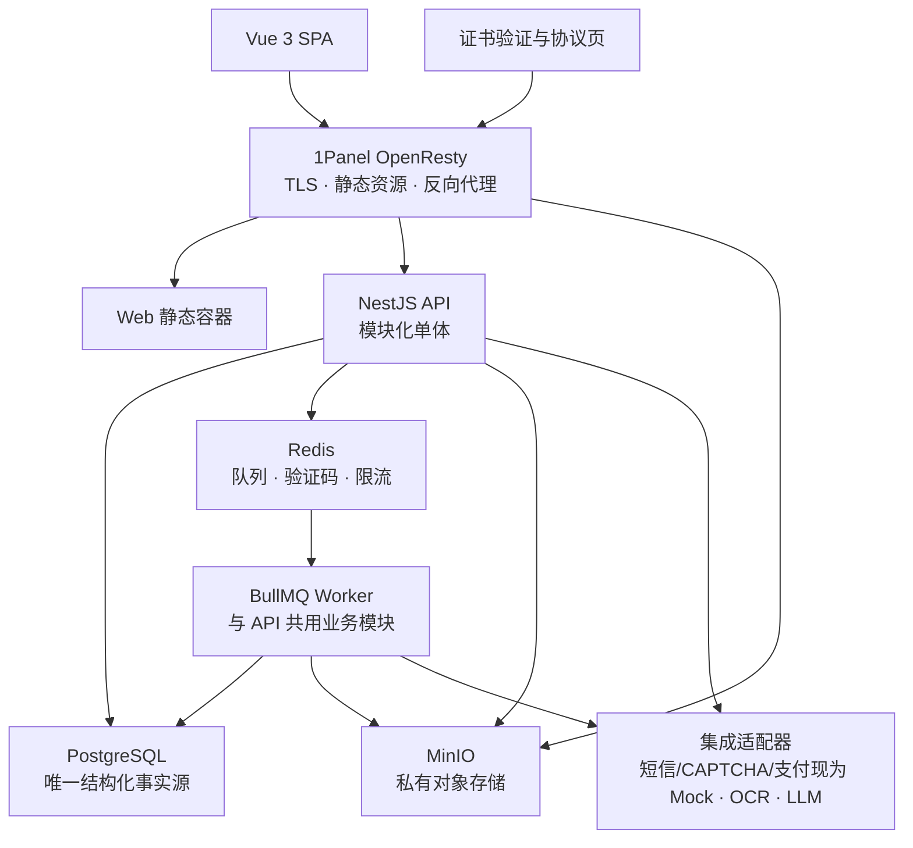
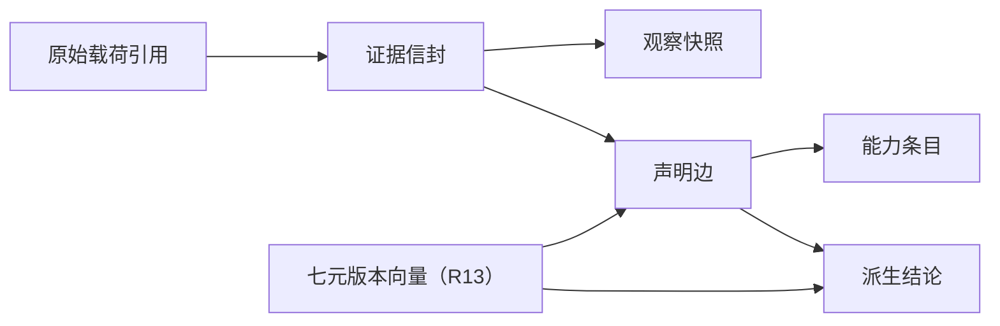

# 11 技术架构

**文档体系 v1.0 · 技术实现规范 · 读者：研发团队、技术负责人、运维人员**

本文档定义知行工坊的技术实现边界：前后端栈、代码组织、数据与异步任务、认证授权、文件与外部集成、部署运维和测试策略。

**边界纪律**：业务规则与设计纪律以《00》—《08》为准，页面、可见性与布局基线以《09》为准（0.4 布局原型），视觉输出红线以《04》第 4.3 节为准，视觉令牌以本册第 4 节与 `apps/web/src/styles/tokens.css` 为事实源（《10》已废止）。本文档只说明“如何实现”，不得以技术便利为由改写业务规则。遇到冲突时，以被引业务条款为准并修正实现。

---

## 1. 目标与第一原则

### 1.1 容量目标

按试点后可预见的规模设计，不为尚不存在的规模预付复杂度：

- 10 万级注册用户；
- 万级日活；
- 峰值数百并发请求；
- 单机可稳定运行；应用层保持可增加 API / Worker 实例的边界；
- 附件、成绩单、证书与报告等大文件不经过 API 进程转发。

### 1.2 第一原则：小团队可长期维护

采用**模块化单体 + 独立异步 Worker**，不采用微服务。

1. PostgreSQL 是唯一结构化事实源；Redis、队列、搜索索引与文件派生物都不得成为唯一事实；
2. 核心事实同步、事务性落库，派生数据允许重建；
3. 一个横切能力只有一个公共实现：租户作用域、权限与授权裁剪、文件授权、通知、审计、外部服务调用不得在业务模块中重复实现；
4. 业务模块之间在同一进程内调用公开应用服务，不为“解耦”引入网络边界或消息总线；
5. 只在真实负载或故障证据出现时扩展基础设施，不按想象中的超大规模设计；
6. 技术方案优先保证《02》的确定性计量与《08》的状态机正确，再追求开发便利与局部性能。

### 1.3 明确不采用

- React、KUMO-UI，以及另造一套完整基础组件库；
- 微服务、服务网格、Kubernetes、Serverless 业务拆分；
- CQRS、事件溯源、通用事件总线、通用插件平台；
- 全库 PostgreSQL RLS、图数据库、Elasticsearch；
- 每个业务对象一个独立长期定时器；
- 通用缓存层、“所有查询都缓存”与 Redis 长期事实；
- WebSocket 通知、通用 IM、实时协同编辑；
- 完整 Prometheus / Grafana / OpenTelemetry 平台；
- 自建 OCR、模型推理集群或多模型编排平台；
- 试点期自动机构报告与独立“行业研判引擎”服务。

---

## 2. 技术栈

| 层 | 选型 | 用途与边界 |
|----|------|-----------|
| Web | Vue 3 + Vite + TypeScript | 一个 SPA 承载公共入口、五端工作台与规范中心 |
| 路由与状态 | Vue Router + TanStack Vue Query + Pinia | 路由分区、服务端状态；Pinia 只放少量客户端 UI 状态 |
| 基础控件 | Naive UI | 表单、表格、树、弹层等成熟基础控件；不直接决定业务组件语义 |
| 样式 | Tailwind CSS v4 + CSS 语义变量 | 双皮肤语义令牌（tokens.css 为事实源）；组件内不得写死品牌色 |
| 图表 | ECharts（按需引入） | 同侪直方图、看板与数据产品图表——平台图表密集、长期必需；遵守《04》第 4.3、4.13 节输出克制红线与图形口径：覆盖率雷达（轴 = 对目标标准覆盖 n/m）、覆盖率环、星值仪表盘与星点进度形态可用，能力等级 / 星值雷达、无清单支撑的合成分数及“到下一等级”的进度形态禁止 |
| API | NestJS + TypeScript | REST API、认证授权、业务事务、OpenAPI |
| 数据访问 | Prisma | PostgreSQL 类型安全访问与迁移；必要锁场景允许集中使用参数化原生 SQL |
| 数据库 | PostgreSQL | 唯一结构化事实源、筛选、模糊检索、聚合 |
| 队列与短期状态 | Redis + BullMQ | 异步任务、验证码、限流、短期锁与少量可丢缓存 |
| 对象存储 | MinIO | 私有附件、证据原件、证书 PDF 与导出文件 |
| 接口契约 | OpenAPI | 生成 Web 客户端；未来 App 复用同一业务接口 |
| 网关 | 1Panel 管理的 OpenResty | TLS、静态资源、反向代理、请求体上限、基础限流 |
| 部署 | Docker Compose + 1Panel（Debian） | 单机容器编排、发布、监控与备份入口 |

依赖使用实施时的稳定版本并由 `pnpm-lock.yaml` 锁定；本文档不写死软件小版本。新增依赖须能减少明确工作量或风险，禁止只为“技术完整”引入。

---

## 3. 总体拓扑



API 与 Worker 使用同一套领域模块、应用服务与 Prisma Schema，仅启动入口不同：

- API 负责短请求、权限与授权校验、同步事务和任务登记；
- Worker 负责耗时、可重试、可延后的任务；
- 两者使用同一镜像的不同启动命令，不拆仓库、不复制业务规则；
- 队列丢失或 Redis 清空不得造成业务事实丢失，周期扫描从 PostgreSQL 恢复应执行任务。

---

## 4. 仓库与代码组织

采用 `pnpm workspace`，不引入额外 Monorepo 编排器。

```text
zhixing-hub/
├── apps/
│   ├── web/                    # Vue 3 SPA
│   ├── api/                    # NestJS HTTP 装配与启动
│   └── worker/                 # BullMQ 处理器与周期扫描入口
├── packages/
│   ├── server-core/            # 领域模块、应用服务、仓储与集成适配器
│   ├── api-client/             # 由 OpenAPI 生成，禁止手写 DTO 镜像
│   └── shared/                 # 极少量纯常量、纯类型与无副作用工具
├── prisma/
│   ├── schema.prisma
│   └── migrations/
├── deploy/
│   ├── docker-compose.yml
│   ├── openresty/
│   └── scripts/                # 备份、恢复、部署与对账脚本
├── docs/
└── pnpm-workspace.yaml
```

约束：

- `apps/api` 与 `apps/worker` 只负责装配和启动，不放业务规则；
- `packages/server-core` 不依赖 Vue 或具体 HTTP 页面表达；
- `packages/shared` 不接纳有业务归属的“万能工具”；
- 不建立独立 UI package；业务组件先在 Web 内维护，只有出现第二个真实消费者时再评估抽取；
- Web 不手写后端 DTO，统一消费生成客户端。

### 4.1 Web：一个应用、多路由分区

```text
/                         公共介绍首页
/auth/*                   登录、注册、激活与协议门禁
/verify/*                 证书验证、简历分享链接
/platform/*               平台工作台
/student/*                学员工作台
/university/*             高校工作台
/enterprise/*             企业工作台
/government/*             政务工作台
/docs/*                   规范中心
```

- 各端按路由懒加载，避免首屏加载全部端代码；
- 同一端按固定角色与身份态裁剪导航；前端守卫只改善体验，后端才是最终裁决；
- 规范中心是同一 SPA 的独立外壳，不另建 VitePress 项目；协议与政策页允许公开，其余按《09》第 8 节要求登录；
- 工程文档《11》不进入面向用户的规范中心；
- 未来 App 复用 OpenAPI，不复用 Web 页面代码。

建议的 Web 内部结构：

```text
src/
├── app/                        # 启动、路由、主题、权限门禁
├── features/                   # 按业务域组织页面与组合逻辑
├── components/business/        # 跨页面业务组件（职责以《09》页面区块定义为准）
├── styles/                     # 语义令牌、双皮肤、Tailwind 映射
├── api/                        # 生成客户端装配与统一错误处理
└── stores/                     # 仅主题、导航折叠、全局搜索等 UI 状态
```

### 4.2 UI 实现边界

- Naive UI 直接承载按钮、输入、选择器、表格、树、模态、抽屉等基础能力；除非补充平台统一行为，不为每个基础控件再包一层；
- CSS 语义变量是颜色唯一取值处（tokens.css 为事实源），Tailwind 通过变量映射，Naive UI `themeOverrides` 引用同一变量；
- C1–C18 是跨页面唯一实现的业务组件，特别是 `AuditTree`、`AuthGate`、`MatchTable`、`RatingBar` 不得退化为页面内临时代码；
- 视觉语言按 R11 拍板对齐 QwenCloud 令牌体系与两层布局、品牌主色为蓝（令牌取值已固化于 tokens.css）；不引入其商标、插画、字体文件、源码或组件 API；
- 图表按需注册 ECharts 模块，不引入第二套图表库；
- 服务端状态放 Vue Query；Pinia 不复制接口列表与详情数据。

### 4.3 NestJS 业务模块

模块是代码职责边界，不是网络服务：

| 模块 | 主要职责 |
|------|---------|
| Identity | 登录、会话、协议同意、短信验证码、TOTP 与账户安全 |
| Organization | 租户、组织树、成员与固定角色、学生生命周期 |
| Ontology | 能力词表、知识域、岗位族标准、字典、版本与迁移 |
| Learning | 课程目录、企业项目、共建课程、引入、报名录取、支付与过程域 |
| Evidence | 观察、证据信封、声明、等级判定、画像、重算、证书与审计链 |
| Talent | 岗位模型与发布、匹配、人才库、申请单、去向 |
| Content | 学习资源、行业题库、规范中心已发布内容 |
| Governance | 统一审核队列、举报、客服、公告、运营配置与治理留痕 |
| Notification | 站内信、短信与封闭事件目录分发 |
| File | MinIO 元数据、上传确认、授权下载、配额与生命周期 |
| Integration | CAPTCHA、支付、短信、OCR 与 LLM 适配器 |
| Analytics | 试点六项最小计数器；试点后再承载已定口径的数据产品指标计算与看板（报告成文为线下交付，13.2） |

跨模块调用优先使用公开应用服务；禁止通过共享数据库表“偷调”其他模块规则。`Analytics` 首期只实现《06》第 3 节最小计数器，不实现自动机构报告。

---

## 5. API 与契约

### 5.1 REST + OpenAPI

- REST 是 Web 与未来客户端的唯一业务接口；
- NestJS DTO 生成 OpenAPI；CI 重新生成并校验 `packages/api-client`，防止契约漂移；
- 接口使用 `/api/v1` 兼容版本前缀；这里的 `v1` 与产品功能分期无关；
- 只有破坏性兼容变更才提升接口版本，新增字段保持向后兼容；
- 外部回调使用独立端点和验签，不依赖用户会话；
- 不建设通用第三方开放平台。

### 5.2 统一约定

- 时间戳存 `timestamptz`，数据库与进程内部统一 UTC；自然日规则使用 `date`，边界统一按 `Asia/Shanghai` 计算；
- 行政区划只存平台受控代码，详细地址另存自由文本，匹配不解析详细地址；
- 金额存人民币分的整数，不使用浮点；
- 管理表格可用页码分页，时间线、通知和动态流使用游标分页；
- 错误响应采用 Problem Details：稳定错误码、用户可读信息、请求 ID、字段错误与可执行下一步；
- 支付回调、证书颁发、结束日作业、状态迁移、通知分发等关键写操作必须带业务幂等键；
- API 只返回文件 ID 与短效授权 URL，不返回 MinIO 桶名、对象 Key 或服务器路径。

### 5.3 契约事实源（不另开编号文档）

接口目录与字段以生成物为准，不手写第二份 Markdown 清单，也不新增《12》《13》之类编号文档：

- **路径、请求 / 响应字段、错误形态**：`apps/api` 的 NestJS DTO → 导出的 `packages/api-client/openapi.json` → 生成客户端。开发环境可浏览 `/api/v1/docs`；
- **表、枚举、迁移**：`prisma/schema.prisma` 与 `prisma/migrations/`。PostgreSQL 是唯一结构化事实源；
- **不变量与实现决策**：写在本文第 5–8 节及被引业务条款，不把 OpenAPI / Prisma 再抄一遍。

当前已装配的业务前缀（索引，非完整清单）：`/api/v1/auth`、`/api/v1/account/security`、`/api/v1/platform/accounts`、`/api/v1/university/students`、`/api/v1/organizations`、`/api/v1/governance/legal-documents`；运维探活为 `/health/live` 与 `/health/ready`，不进版本前缀。

---

## 6. PostgreSQL 与数据模型

### 6.1 建模原则

- 规范化关系表承载业务事实，高频筛选字段必须是独立列；
- JSONB 只用于弱结构配置、外部响应归档和暂未稳定的扩展字段，不保存核心关联；
- 能力、任务、证据、课程、岗位要求、授权关系均使用关联表；
- 停用不删的字典项使用状态与替代关系，普通临时数据不滥用软删除；
- 发布快照、证据、评价、证书、申请单和季度指标保留产生时的规则版本与语境；
- 内部 ID 使用不可猜测的唯一标识；面向用户的证书编号、课程代码等继续遵守各业务册格式。

高校组织结构按《07》第 2.2 节实现：高校 → 学院 → 专业 → 班级；校区是独立地域锚点，通过关联表与学院形成多对多，年级是班级属性而非树节点。班级持有唯一辅导员关联。

岗位族标准中的工作任务与项目过程域任务同名不同物，分别建模为 `job_task` 与 `project_task`；二者不共表、不共享状态机，只通过各自的能力条目关联进入比较。

### 6.2 证据图与可重算结论

证据链不使用图数据库，使用关系表表达多对多图：



- `evidence_envelope` 是活动整体的不可变信封；
- `evidence_claim` 是信封与能力条目之间的声明边，记录等级、强度档、抽取方式与版本；
- 冲销与替代使用追加记录，不原地覆盖原声明与原始载荷；
- 过程观察活表在项目期间按业务窗口覆盖写；结束日生成不可变快照后整体只读；
- 结论、D1-C1 上卷、角色等级、匹配结果与推荐排序都是派生数据，必须能由事实与版本向量重建；
- 审计链是反向连接查询视图，不存成线性字符串或第二份角色专用数据。

### 6.3 版本向量与重算

每条结论携带固定顺序的七元版本向量：

```text
(词表, 含金量字典, 观察聚合规则, 门槛表, 时效参数, 抽取模板, 星级规则)
```

- 新证据入库触发该生增量重算（即时执行，读写当前活动版本向量）；
- 任一版本发布触发全量重算，默认随下一重算槽生效，发布方可加开即时槽（同一机制）；
- 每周一 02:00（北京时间）为默认重算槽：时间推进滚动重算与到期的全量重算合并为**一次同步执行（单槽制，定案）**——槽内结论只读并显示“校准中”、采集与审核照常入库，槽按执行时刻事实快照一次性重算并切换版本向量，**不建新旧代次双读与代次表**；
- 槽内新入库证据由该生增量重算兜底、下一槽自然对齐；单执行者串行，无并队与混读问题；
- **升级触发器**：单槽实测时长持续超过 30 分钟（v1 初值，登记《06》第 3 节）或学生规模使只读窗口不可容忍时，再引入结果代次双读与原子代次切换；升级不改变确定性要求；
- 重算不重新调用大模型；只有抽取模板升级才执行全量重抽与规定比例人工抽检；
- 同输入、同版本向量必须得到同输出，计算路径禁止随机数与当前模型调用。

### 6.4 搜索与聚合

不使用 Elasticsearch：

- 精确值、状态、租户、地域与时间筛选使用 B-Tree / 组合索引；
- 名称、简介、JD 等模糊检索使用 `pg_trgm` + GIN；
- 条目与标签筛选使用规范化关联表与索引；
- 排序严格执行《02》的确定性业务键，不使用文本相关性黑箱替代；
- 试点期看板直接使用索引查询或小型聚合表；只有查询证据表明必要时才引入物化视图。

### 6.5 并发与约束

以下事实必须由数据库事务、唯一约束、检查约束或行锁保证，不能依赖前端：

- 手机号全平台唯一、学号本校终身不复用；
- 一名学生当前至多一条有效去向；
- 一个班级只有一个辅导员；
- 学生在同一项目严格一人一团队；
- 直录支付锁位、筛选制录取与名额占用不得超额；
- 支付平台交易号、商户订单号与证书编号唯一；
- 正常结项按“学生 × 项目 × 结束日”保证至多一个项目信封与一张正常资格证书；中止信封使用独立的“学生 × 项目 × 中止批准记录”唯一键；
- 状态机只允许从合法前态迁移；
- 同一企业对同一学生的人才库请求满足滚动 30 天限制；
- 单个项目任务的条目关联不得超过 20，项目发布条目与全部任务条目并集不得超过 40；应用服务在写入事务内校验并由测试覆盖。

Prisma 无法直接表达的 `SELECT ... FOR UPDATE` 等锁定逻辑，集中在对应领域仓储的参数化 SQL 中，不散落到控制器。

### 6.6 Identity / Organization 已落地的库级不变量

以下约束已由 CHECK、部分唯一索引、外键或既有身份边界触发器保证，用来挡住并发写入和唯一性竞态，不是把应用规则再抄一遍：

- `account` 凭据形态：`PLATFORM_ADMIN` 必须有唯一用户名且手机号为空；`END_USER` 必须有符合大陆 11 位格式的手机号且用户名为空；`kind` 与租户 `type` 更新时不可变；
- 全平台至多一名 `ACTIVE` 的 `SUPER_ADMIN`；至多一所 `is_public_academy = true` 的高校；
- 成员角色必须落在对应主体：平台四角色只属于 `PLATFORM_ADMIN` × `PLATFORM` 租户，高校 / 企业 / 政务角色只属于 `END_USER` × 对应租户类型；
- 高校认证学员必须有学号与班级、不得带注册城市；平台学员必须有注册城市与常住城市、不得有学号与班级；本校学号终身唯一且不回收；
- 学籍停用态注销（《07》6.4）在删除学生档案的事务内先把学号写入 `retired_student_number` 保留行（租户内唯一），与 `student_profile` 唯一约束共同保证学号终身不回收；手机号随账户删除即时释放；
- 法务文本仅 `USER_AGREEMENT` 与 `PRIVACY_POLICY` 两类（Cookie 提示不是第三类版本对象）；每种类型至多一份 `PUBLISHED`，且已发布记录必须带 `published_at`。成对发布是应用事务规则，见第 8.4 节；
- 同一学生至多一件未决转班申请（`PENDING_OUTGOING` / `PENDING_INCOMING` 部分唯一索引）。

院辖角色是否挂学院、班级辅导员是否为本院辅导员，由 Organization 应用服务校验并由测试覆盖。行政区划字典首批种子为北京市与宁夏各市；完整全国地级市由运营后续扩展，业务模块不写字典。

### 6.7 教师岗位移交、教职工停用与同学院转班

- 辅导员停用前须把全部班级（含已毕业年级）的 `counselorMembershipId` 改配本院其他在岗辅导员；无管辖班级时可直接停用。专业负责人停用前须完成 `staff_post_handover`（可改继任）；课程目录 / 引入审批 / 项目内负责老师随 Learning 落地后再由同一移交接口搬数据，不另造影子表。
- 辅导员通道未结案审核以班级当前辅导员为准，Evidence 队列未建时移交与转班生效都不改额外行。
- 停用与平台账户同构：账号 `SUSPENDED`、成员 `DISABLED`、撤销全部会话。校管可停用院管 / 校级看板 / 专业负责人 / 辅导员；院管可停用本院专业负责人与辅导员。不可停用自己，也不可经此接口停用校级管理员。
- 转班两步同意绑定当时班级辅导员（不冻结 membership id），无时限、悬挂不自动通过；同一人兼任转出与转入辅导员时，转出同意即生效。

### 6.8 跨端组织收口

- 组织管理员可追加企业管理员、政务带管理权限看板账户，并整体替换政务可见高校名单；租户列表与企业性质 / 行业字典只读接口供开通工作台使用。
- 入驻线索单独落表，介绍首页提交须过 CAPTCHA；组织管理员只改 `NEW / IN_PROGRESS / OPENED / CLOSED`，不由此开通租户、不进审核队列。
- 企业管理员维护部门（不套部门）、所在地（≥1 个地级市）以及 HR / 项目负责人 / 导师 / 看板账户；停用同构于高校教职工，不可停用自己或企业管理员。政务带管理权限账户只能创建 / 停用本机关不带管理权限的看板账户。
- 公开学院校区由运营专员停用 / 恢复：有该市注册城市的平台学员则拒绝停用；停用同时关掉对应学院，注册入口按校区状态拒绝新注册。
- 学员入企（《07》6.2）仍属主体转换，随去向写入与在途申请关闭一并交付，本阶段不搬 Talent 表。

---

## 7. 多租户与授权

### 7.1 租户模型

- 租户根为高校、企业与政府机关；平台是全局运营主体；
- 学院、校区、专业、班级、企业部门是租户内组织单元，不另建租户；
- 知行公开学院按《07》第 2.5 节建模为平台运营的特殊高校主体；
- 账号标识、行政区划、能力词表与平台字典是全局数据；
- 课程、组织成员、岗位模型等是租户数据；
- 项目投放与引入、人才库授权、申请单等跨租户数据必须有显式业务关系。

### 7.2 应用层统一作用域

不启用全库 RLS：

1. 会话解析得到 `actorId`、主体、租户与固定角色；
2. NestJS 使用 Node.js `AsyncLocalStorage` 建立只读 `RequestContext`；
3. 租户数据只经统一仓储访问，仓储自动附加 `tenant_id`；
4. 可行处使用包含 `tenant_id` 的复合唯一键与外键，阻止错误跨租户关联；
5. 跨租户查询只进入显式命名的协作仓储；
6. 平台全局查询与政务聚合使用专门应用服务，不提供任意“切换租户”接口；
7. 原始 Prisma Client 只允许基础设施层持有。

### 7.3 固定角色与数据裁剪

- 角色与权限是代码内固定映射，不建设可配置 RBAC 编辑器；
- 全局认证 Guard 校验身份与会话，角色 Guard 校验固定能力，领域服务校验“是否入项、是否管辖、授权是否有效”等对象级关系；
- 学生汇总层、画像明细、证据链、L0、困难群体、匿名聚合等可见性统一经 `DataVisibilityService` 裁剪；
- 求职可见、有效报名 / 申请与人才库三条授权通道在后端统一判定，前端不得自行拼接；
- 项目报名授权自提交起生效，正常参与到项目归档后保留 90 天；撤回、拒绝、落选、流标、清退、开始前 / 中途退出等提前终态立即关闭。共建课程（报名制与名单导入）入项即产生画像授权，寿命同项目报名；简历分享链接为免登录的对外展示机制，不经授权闸，视图过滤 L0 / N/A 并服从“结论对外”开关；
- 人才库授权与困难群体披露分别建模，后者必须有学生独立开关；人才库请求按"同一企业 × 同一学生滚动 30 天 1 次"、岗位邀约按"同一企业 × 同一学生滚动 7 天 1 次"限流（企业黑名单机制不建，定案，《04》第 4.4.3、4.4.4 节）；
- 求职状态为“暂不找”的学生默认从候选与人才搜索排除，只有人才搜索显式勾选时纳入；在途申请与既有人才库不受该筛选影响；
- “结论对外”开关存数据库并记录操作者与决策依据。关闭时，企业候选 / 人才搜索 / 报名筛选、简历导出与简历分享链接均隐藏等级、覆盖率、角色等级与同侪分布，只保留经历事实与证书；学生本人、高校、审核队列与内部审计链仍见完整结论，公共证书验证不受影响；
- 政务聚合查询只能读取平台为该机关配置的高校租户白名单，不按所在地或地图半径自行扩展；
- 全局搜索复用同一权限与授权谓词，不能成为越权旁路。

---

## 8. 认证、会话与账户安全

### 8.1 不透明服务端会话

首期不使用 JWT 双令牌轮换。浏览器使用随机、不透明、可撤销的服务端会话：

1. 登录成功后生成至少 256 bit 的安全随机令牌；
2. 浏览器只保存 `Secure + HttpOnly + SameSite=Lax` Cookie；
3. PostgreSQL `auth_session` 只保存令牌哈希、账号、创建与到期时间、最近使用时间和设备摘要；
4. 请求按令牌哈希查有效会话，并实时校验账号、主体与角色状态；
5. 注销、密码修改、TOTP 停用、账号停用与主体转换按业务要求撤销相关或全部会话；
6. 最近使用时间采用节流更新，避免每个请求都写数据库。

同源 SPA 的状态写请求同时校验允许的 `Origin` 与会话绑定的 CSRF Token。未来原生 App 若启动，可将同类不透明会话令牌放在系统安全存储并通过 Bearer Header 发送，无需现在预建刷新令牌体系。

### 8.2 密码、短信与风控

- 密码使用 Argon2id 哈希；
- 短信验证码使用 6 位数字，以服务端 pepper 加盐哈希存 Redis，5 分钟失效、连续输错 5 次作废；激活码与登录码键空间隔离；
- 频控遵守《06》第 3 节初值：激活与登录按手机号共享 60 秒发送冷却和滚动 1 小时最多 5 条；连续登录失败 5 次锁定 15 分钟；
- CAPTCHA 只用于注册、短信发送与异常登录，不给普通业务请求增加摩擦；
- 手机号唯一由数据库约束保证（仅非平台管理账户持有手机号），日志仅记录脱敏值。

### 8.3 TOTP 与平台管理入口

- 所有账号可绑定 TOTP；平台管理账号强制启用且不可停用；
- 平台登录在同一次认证事务中校验用户名、密码与 TOTP / 一次性恢复码，无需为分步界面另建 Redis 登录挑战；普通账号启用 TOTP 后，**密码与短信两条第一步登录都必须提交第二因素**，任一路径缺失均不得签发会话；
- TOTP 密钥使用 AES-256-GCM 加密保存；动态码记录最近成功时间步、防止重放，恢复码只存 Argon2id 哈希并逐枚一次性消费；
- 普通账号绑定 TOTP 使用“已登录会话 + 当前密码 → 生成密钥 → 首枚动态码确认 → 一次性展示恢复码”的短流程，不另建长期 enrollment 表；重绑 = 停用后再走同一绑定流程，不另做“只换恢复码、保留原密钥”接口；修改密码与停用 TOTP 均在事务中撤销该账号全部会话，当前 Cookie 同步清除；
- 全部平台管理账户（超管、组织管理员、运营专员、平台看板）不绑定手机号、不走短信通道，凭据 = 唯一用户名 + 密码 + 强制 TOTP，仅经不在普通登录页展示的独立入口登录；隐藏地址不是安全控制，真实边界是凭据、TOTP、限流与审计；
- 非超管平台账户 TOTP 与恢复码双丢：超管重置后目标回到 `PENDING_ACTIVATION`，清空 TOTP、恢复码与未完成引导记录并撤销全部会话，**保留现有密码**（不再签发第二份初始密码）；本人用该密码走三步重新激活，确认阶段必须改密并绑定新 TOTP。已停用账户、超管自身不可走此接口；超管凭据丢失仍走线下多人见证书面重置，不作为产品功能；
- 高校认证、在读、且属于本人管辖班级的学员，辅导员可关闭其 TOTP（撤销该生全部会话、留审计，不进审核队列）；平台学员、毕业态、非本班学生一律拒绝。学生按班级 CSV 导入与学生管理 / 生命周期 API 已随 Organization 交付（CSV 导入 `POST /university/classes/:classId/students/import`、单个创建与班级学生列表 `/university/classes/:classId/students`、批量毕业 `…/graduate`、学籍停用 / 恢复 / 注销 `/university/students/:accountId/{suspend,restore,deregister}`、姓名性别更正 `PATCH …/identity`，迁移全部走第 4.2 节状态机唯一迁移表）；教师岗位移交、教职工停用与同学院转班见第 6.7 节。本接口只承接《07》第 5.4 节已写明的救济；
- 唯一超管由部署引导命令创建；非超管平台账户由超管创建，系统生成的初始密码仅返回一次。首登依次完成初始密码校验、改密并绑定 TOTP、恢复码保存确认，最终确认前账户保持待激活且不签发会话。

### 8.4 协议版本

- 用户协议与隐私政策独立版本化；
- 同意记录追加保存版本、时间与来源，不覆盖历史；
- 法务正文以小体量 Markdown 文本随版本记录存 PostgreSQL，运营专员在平台“运营配置 → 法务版本”维护草稿；Cookie 提示不是第三类版本对象，不进本表；发布接口必须同时接收一份用户协议草稿和一份隐私政策草稿，在单事务内退役旧版本并成对发布新版本，避免产生半发布状态；
- 登录 / 激活请求提交当前两份版本 ID，后端只接受与已发布版本集合完全一致的组合；法务文本尚未首次发布时仅允许完成部署引导，一旦开始发布，两类文本必须同时存在有效版本；
- 版本更新**不逐请求查询并即时踢掉既有会话**：已签发会话继续遵守原到期、退出与撤销规则；用户下一次登录时必须同意当前版本。该口径符合《07》第 1 节，也避免每请求增加协议查询与全员瞬时下线。

## 9. 状态机、时间与关键作业

### 9.1 时间模型

- 所有时间戳按 UTC 存储，业务日期边界由统一 `BusinessClock` 按北京时间计算；
- 报名开始、项目开始取当日 00:00；报名截止、日评冻结、项目结束与评价期届满取当日 24:00；
- 精确 24h / 30 分钟等窗口保存绝对到期时间，不按定时器启动时刻重新推算；
- 所有状态迁移由领域状态机校验，数据库更新携带期望前态，避免并发回退；
- 时间只能往后改，且只在对应时点尚未触发时允许：报名截止触发后锁报名窗，开始日触发后锁报名窗与开始日，结束日 24:00 触发后锁结束日；状态机永不回退。

### 9.2 扫描式调度

不为每个项目、支付单、申请单创建独立长期定时器。Worker 周期扫描：

- 已到报名截止但未结算的项目；
- 报名截止时仍未通过的学院引入申请及其求引入信号；
- 直录支付锁定 30 分钟、企业拒绝 24 小时、平台审核 24 小时与筛选制 48 小时筛选 / 48 小时支付确认窗口；
- 直录企业 24 小时不动作按接受收敛，报名拒绝与清退审核 24 小时不处理按同意收敛；其余审核只标逾期、不自动通过；
- 已到录取结算条件的项目：直录须报名截止且全部支付锁定完结，筛选制须到 `min(筛选窗 + 支付窗, 项目开始)` 且在途支付完结；
- 到开始日应转进行中或流标的项目；
- 到结束日应切断评价并生成快照的项目；
- 到评价期固定终点 `T + 14 个自然日 24:00` 应归档的项目；归档读取固定终点，不读取失败补跑时刻；
- 停滞 30 天应关闭的申请单；
- 毕业满 2 年应转纯只读态的学生；
- 每周应执行时效重算的结论。

扫描使用“到期时间 + 处理状态”索引和游标批次；同一记录可被重复扫描，但幂等键保证只生效一次。

中止 / 撤项审核悬挂期间不冻结项目与过程域；批准动作在事务提交后立即登记对应收口任务，周期扫描只负责发现漏登记，不提前改变业务状态。

### 9.3 结束日 24:00 两段作业

严格执行《08》第 2 节：

1. **第一段不可重做**：到 T 时原子切断企业评价写入，固化过程观察不可变截止副本，并把活表整体置只读；
2. **第二段可重跑**：基于同一副本聚合 claims、创建项目信封、按资格创建证书事实并登记通知；
3. 第二段任何步骤失败只重跑失败步骤，禁止重新读取或重拍活表；
4. 信封与证书使用“学生 × 项目 × 结束日”和统一作业 ID 做幂等；
5. 未定稿总评按规则封顶但不阻止信封与资格证书产生；
6. 流标与撤项不建信封、不发证；清退和中途退出学生不建信封、不发证；中止走 9.4 的独立收口。

### 9.4 中止收口

项目中止申请获批时立即执行独立幂等作业：

1. 只对批准时仍在项、未清退、未中途退出的学生固化当时过程观察快照；
2. 每人创建一条中止证据信封，`claims` 固定为空，仅供轨迹与审计，不进入等级判定；
3. 不生成结项证书、不采集结项满意度；
4. 使用“学生 × 项目 × 中止批准记录”做唯一键，失败补跑只读取首次固化的中止快照；
5. 流标与撤项因项目未实际完成，不复用本作业且不建信封。

---

## 10. Redis、队列与 Worker

### 10.1 Redis 的限定职责

Redis 只用于：

- BullMQ；
- 短信验证码、登录挑战、发送冷却与接口限流；
- 短期幂等锁；
- 极少量可丢、可重建的公共字典缓存。

会话、证书、支付、评价、授权与结论的唯一事实都在 PostgreSQL。Redis 清空最多导致任务重新登记、缓存重建或用户重新获取验证码。

### 10.2 四类队列

| 队列 | 任务 |
|------|------|
| lifecycle | 项目、报名、支付、申请单、学生生命周期与结束日作业 |
| notification | 站内信、短信与提醒 |
| document | 证书 PDF、档案导出及试点后报告文件 |
| compute | OCR / LLM 抽取、画像重算、字典重抽、聚合快照 |

首期由一个 Worker 进程承载四类处理器，通过每类并发数隔离；只有真实积压出现时才增加 Worker 实例或拆启动命令，不拆服务仓库。

### 10.3 实现纪律

- 核心状态先写 PostgreSQL，再登记任务；关键业务另有周期扫描对账，队列不是事实源；
- 通知意图、待生成文档等需要“不漏”的事项在业务事务中写入明确待处理记录，不建设通用 Outbox 框架；
- 每个任务使用稳定业务幂等键，重复执行不重复发证、扣名额、创建信封或通知；
- 有副作用的外部调用保存请求标识与结果，重试前先检查本地事实和供应商幂等能力；
- 重试采用有限次数与指数退避，超过上限进入平台任务面板人工重试；
- 批处理按游标分批，不一次加载全量学生、证据或文件。

---

## 11. 计量引擎实现

《02》的计量规则实现为无外部副作用的确定性领域函数：

```text
不可变证据 + 冻结抽取结果 + 七元版本向量
  → 有效声明与时效强度
  → 条目等级结论 + 星级派生（星点 / 星级，《02》第 14 节）
  → D1-C1 上卷 / 角色等级
  → 匹配、缺口与推荐排序
```

- 观察聚合、门槛判定、时效降档、上卷、角色等级、星级派生、匹配和推荐各自为独立纯函数，输入输出使用显式类型；
- L0、N/A、失活声明、冲销、强度档和可证上限在类型层分开表达，不用魔法数字；
- 比例排序使用整数对交叉相乘，推荐与并列键使用稳定字典序，不使用浮点综合分；
- 大模型、自由文本评语、随机数和当前系统负载不得进入判定；
- 每条结论持有可反查的输入声明 ID、规则版本与计算批次；
- 规则测试使用业务文档中的边界样例和固定黄金夹具，版本升级必须保留旧版本回放测试。

---

## 12. 文件与 MinIO

### 12.1 上传与下载

1. 客户端向 API 申请上传；
2. API 校验业务用途、权限、扩展名、MIME、大小和项目配额，创建待确认文件记录；
3. API 返回短效预签名 URL，客户端经 OpenResty 直传 MinIO；
4. 客户端调用确认接口；API 校验对象存在、大小、MIME，并计算或核对 SHA-256；
5. 文件进入可用状态，业务对象只引用文件 ID；
6. 下载前由 API 重新校验当前角色、授权和业务关系，再签发短效 URL。

全部桶私有。对象 Key 使用随机 ID，不含姓名、手机号、学号或原文件名；对象一经成为证据载荷不得覆盖，更新必须产生新对象与新记录。

上传申请同时校验项目阶段：草稿与合规预审中禁止占用文件空间；企业只可在项目通过预审进入引入阶段后上传章节、资料与任务附件；学生只可在进行中上传个人任务提交和讨论区附件。阶段门禁由 API 执行，预签名 URL 不能绕过。

### 12.2 类型、大小与配额

- 文件白名单取《06》第 3 节：`pdf / zip / png / jpg / mp4 / docx / pptx / txt / csv`；
- 单文件上限 100MB；
- 单项目默认配额 20GB，平台可逐项目调整；
- 配额耗尽只阻止新上传，不影响已有文件读取；
- 不建设独立杀毒集群；MinIO 不执行用户内容，配合白名单、MIME 校验、私有桶与安全下载头降低风险。

### 12.3 生命周期

- 待确认上传超时由 Worker 清理；
- 项目进入结项归档、流标、中止或撤项终态后空间立即只读，并从该时刻计算保留期；
- D+30 提醒导出，D+90 释放普通过程文件；永久保留项目跳过自动释放；
- 取消永久保留且原期限已过时，给予 7 天缓冲；
- 证据信封自动引用集为封闭算法：该生每个存在任一日评或任务评观察的任务取**最后一次提交**（含逾期），再加任务评表原件与结项总评表原件；评价人不可手工排除。引用集转为证据保留对象，不计普通项目配额、不随空间释放；
- 未被上述算法引用的章节附件、资料、讨论附件与历史提交均按 D+90 释放，不允许页面临时勾选把普通过程文件升格为永久证据；
- 业务引用中的文件只允许隔离，不允许运营手工硬删；对象删除必须经 File 应用服务并留审计；
- 注销时的平台官方结项信封与证书按《07》第 5.5、6.3 节脱离账户留存，其余个人文件按业务规则删除。

---

## 13. 外部服务、OCR 与大模型

### 13.1 轻量适配层

`Integration` 只隔离当前使用的供应商 SDK：

- CAPTCHA；
- 短信；
- 微信与支付宝支付；
- OCR；
- LLM。

**现阶段技术决议**：短信、CAPTCHA、微信支付与支付宝支付全部使用确定性 Mock，不接真实供应商、不发真实短信、不产生真实资金流水。开发环境的短信 Mock 可在响应中返回 `debugCode` 供联调；`NODE_ENV=production` 时 Mock 调用必须直接拒绝，禁止静默当作正式服务。正式适配器只保留接口边界与契约测试，不进入当前交付范围。

每类能力只定义一个适配接口；通过依赖注入选择 Mock 或未来正式适配器，不建设运行时插件市场、多供应商路由或自动降级编排。Mock 必须复用正式接口、状态机、签名校验入口与回调语义，业务代码中不得散布 `if mock` 临时分支；切换正式服务时只替换适配器与配置。

### 13.2 大模型能力分组

大模型只承担《02》第 8 节允许的翻译与抽取：

1. **文档抽取**：成绩单、简历、证书、论文、实习评价等材料转结构化候选；
2. **语义对齐与起草**：JD 对齐岗位族、课程大纲映射、条目挂载、字典与标准草案、项目条目勾选建议（任务拆分建议不做，定案）；
3. **叙事生成**：简历、画像摘要与行动建议文案（机构报告初稿不做，定案——报告由平台团队线下分析交付专业级 PDF）。

硬约束：

- 模型输出永远是候选或文案，不产生等级、匹配度、排序和审核结论；
- 结构化结果在确认入库时冻结，记录供应商、模型、模板版本、输入摘要、输出与人工修正；
- 重算读取冻结结果，不重新调用模型；
- 外部文本按不可信数据处理，不能成为系统指令；
- Prompt 只发送完成任务所需的最少数据；普通日志不记录成绩单全文、手机号、学号、困难群体或完整评价原文；
- OCR / LLM 失败时允许手工录入，不阻断业务主线；
- 试点期不自动生成机构报告；**线上永不提供机构报告自动生成（定案）**——机构报告由平台团队线下分析数据、交付专业级 PDF，`Analytics` 只承载指标计算与看板；大模型能力按《02》第 8 节清单**全量交付、不设分期（定案）**。

---

## 14. 支付

支付只服务项目报名，订单与名额事实均在 PostgreSQL；现阶段支付适配器为 Mock，但必须完整执行正式状态机、并发与回调语义。

```text
创建 → 锁定中
  ├─ 支付成功且占位成功 → 已占位
  ├─ 超时 / 业务取消 → 已释放
  └─ 支付成功但席位不可兑现 → 退款中 → 已退款
```

- 创建支付单时固定学生、项目、金额、失效时间和业务幂等键，不信任客户端回传金额；
- 直录锁位与筛选制占位在数据库事务中使用行锁 / 条件更新，Redis 不承担席位；
- 唯一余量公式为：`名额 − 已占位 − 锁定中 − 筛选制支付确认窗占用`；直录锁座与筛选录取均原子校验，禁止超录；
- 回调端点不依赖用户会话，必须验签并校验商户、订单和金额；Mock 通过同一入口生成可验证的模拟签名；
- 支付平台交易号与商户订单号唯一，重复、迟到和乱序回调幂等收敛；
- 退款原因使用与《08》第 4.6 节七类触发器一一对应的封闭枚举：直录被拒、锁定释放后迟到回调、流标 / 撤项、中止、开始前推迟无责退出、支付成功但占位事务失败、开始前退出；不得创建“其他”退款类型；
- 支付成功但占位失败、锁定释放后的迟到回调只创建退款工单，不自动占位；
- 录取结算完成：直录制须报名截止且全部在途支付锁定完结；筛选制须到 `min(48h 筛选窗 + 48h 支付窗, 项目开始)` 且在途支付完结；
- 平台不实现线上退款，支付事实不删除；线下处理后把支付单收敛到“退款中 / 已退款”并留操作者与凭证。

---

## 15. 通知、证书与导出

### 15.1 通知

- 《04》第 4.10 节事件目录是唯一允许发送的系统通知清单；
- 业务事务同步写站内信 / 待分发记录，Worker 异步发送短信；
- Web 用未读数量接口、页面刷新和低频短轮询，不引入 WebSocket；
- 去重键由“事件 + 接收人 + 业务对象 + 触发批次”组成；
- 短信失败最多重试 3 次并留痕，站内信成功即视为通知完成；
- 平台不设邮件通道（定案，《07》第 5.2 节）；通知仅短信 + 站内信，证书 PDF 由学员端下载。

### 15.2 证书与 PDF

- 证书事实与编号在同步事务 / 结束日作业中创建，PDF 是可重建派生文件；
- 使用受控 HTML/CSS 模板，由 document Worker 中的 Chromium 渲染 PDF；模板版本随文件记录；
- PDF 生成失败不影响证书事实、站内查看与公共验证，任务可重试；
- 证书编号按《06》第 3 节生成 `ZX-` + 年份 + 10 位不可连续枚举的安全随机数字，并由数据库唯一约束兜底；
- 公共验证按 IP、手机号与证书编号限流，短信验证后只返回《07》第 3.5 节证面冻结字段，不返回等级；简历分享落地按 IP 与访问密钥限流，访问密钥为不可枚举的安全随机值、随重新生成轮换，落地视图经 `DataVisibilityService` 过滤 L0 / N/A 并服从“结论对外”开关；
- 试点期不做自动 PPT 与机构报告排版。

---

## 16. 部署、发布与备份

### 16.1 单机生产环境

Debian 主机由 1Panel 管理，1Panel OpenResty 是公网唯一入口。Docker Compose 运行：

| 容器 | 说明 |
|------|------|
| web | 构建后的 Vue 静态站点 |
| api | NestJS HTTP API |
| worker | 与 API 同镜像、不同启动命令 |
| postgres | PostgreSQL |
| redis | Redis；持久化只改善恢复体验，不作为事实源 |
| minio | 私有对象存储；管理端不暴露公网 |

OpenResty 负责 TLS、安全响应头、静态缓存、反向代理、请求体上限与基础限流；应用仍负责身份、租户、对象级权限和业务频控。

### 16.2 配置与密钥

- 配置通过环境变量与 1Panel 密钥能力注入，不提交仓库；
- 开发、测试、生产使用独立数据库、Redis 命名空间与 MinIO 桶；
- 第三方密钥按用途分离并支持轮换；
- 日志、错误响应、前端构建产物和备份脚本不得包含密钥；
- MinIO、PostgreSQL、Redis 只开放给主机内网络与必要运维入口。

### 16.3 发布

1. CI 执行 Markdown / 链接检查、lint、类型检查、测试、构建与 OpenAPI 客户端差异检查；
2. 构建固定摘要的 API/Worker 镜像与 Web 产物；
3. 发布前完成 PostgreSQL 与 MinIO 备份；
4. 执行已审核的 Prisma 迁移；
5. 在可控维护窗口更新 Compose 并运行健康检查；
6. 失败时回退应用镜像；数据库迁移优先保持向后兼容，破坏性迁移单独安排。

不承诺零停机发布。小团队下，可通知的短维护窗口优于蓝绿、双集群等复杂设施。

### 16.4 备份与恢复

接受单机部署边界：不做高可用，目标是最多损失 24 小时数据，不虚构尚未验证的 RTO。

- PostgreSQL 每日 `pg_dump` 自定义格式备份；
- MinIO 每日增量镜像到异地对象存储；
- 备份加密，异地凭据与生产 MinIO 凭据分离；
- 默认保留 7 份日备、4 份周备、6 份月备，可按成本调整；
- 备份完成校验存在性、大小与校验和，失败产生高优先级站内运维待办；
- 每季度在隔离环境完成一次真实恢复演练；
- PostgreSQL 与 MinIO 恢复点轻微不一致时，以数据库元数据为准，运行孤儿对象与缺失对象对账。

---

## 17. 可观测性与业务审计

### 17.1 足够的运行观测

- API 与 Worker 使用 Pino 输出结构化 JSON 日志；
- 每个请求、任务与外部调用携带 request ID / job ID；
- 日志记录错误码、耗时、模块与对象 ID，不记录密码、Token、验证码、完整手机号、原始成绩单和困难群体信息；
- `/health/live` 检查进程存活；`/health/ready` 按已启用消费方检查依赖——Identity 基座阶段检查 PostgreSQL 与 Redis，File 模块接入后再加入 MinIO，不为尚未消费的依赖制造虚假门禁；
- 平台内部任务面板展示队列积压、失败任务、周期扫描最近成功时间与人工重试；
- 1Panel / Docker 负责 CPU、内存、容器状态与磁盘容量告警；
- 慢查询记录 SQL 指纹与耗时，不打印敏感参数。

先保证错误可定位、任务可重试、磁盘将满能发现，不建设完整指标平台。

### 17.2 业务审计

运行日志与业务审计分离。以下高风险操作写入普通业务角色不可修改的审计表：

- 账号、TOTP、手机号、主体与租户管理；
- 学生数据授权、完整档案与困难群体读取；
- 审核、异议、举报、企业档位与治理裁决；
- 证书更正、支付、退款工单、文件隔离与数据导出；
- “结论对外”开关、规则版本发布、重算槽切换；
- 平台全局与政务聚合访问。

审计记录含操作者、对象、动作、前后摘要、理由、时间、请求 ID 与来源；保留期按各业务册要求配置，不把敏感载荷复制进审计表。

---

## 18. 测试策略

测试资源集中到“出错代价高”的规则，不追求形式化覆盖率数字：

1. **领域单元测试**：观察聚合、门槛、时效、上卷、角色等级、匹配、推荐字典序、状态机和时间边界；
2. **数据库集成测试**：租户作用域、复合外键、手机号 / 学号 / 证书 / 交易号唯一、支付与名额并发、一人一团队；
3. **接口与权限测试**：固定角色 × 核心接口允许 / 拒绝矩阵，授权闸与“结论对外”裁剪；
4. **外部集成测试**：支付验签与幂等、短信 / OCR / LLM 失败、超时和重试，正式适配器与 Mock 跑同一契约测试；
5. **少量端到端测试**：注册激活、成绩单审核、项目报名支付、任务评价到结项发证、岗位申请、人才库授权、证书验证；
6. **恢复演练**：真实恢复 PostgreSQL 与 MinIO，不以备份脚本退出码代替。

TypeScript 单元与组件测试统一使用 Vitest；API 集成测试使用 Nest 测试容器 + 独立 PostgreSQL 测试库；浏览器关键流使用 Playwright。普通 CRUD 不设机械覆盖率门槛。

---

## 19. 实施顺序与扩展触发

### 19.1 对齐试点的实施顺序

| 阶段 | 技术交付 |
|------|---------|
| 基座 | Workspace、Compose、Identity、Organization、租户作用域、短信 / CAPTCHA Mock、Vue 外壳、语义令牌、OpenAPI 客户端 |
| 标准与课程 | Ontology、课程目录、已发布标准读取、规范中心 |
| 项目闭环 | Learning 状态机、报名与支付 Mock、过程域、移动评价台、结束日两段作业 |
| 证据与画像 | 审核队列、信封 / claims、计量引擎、证书、增量与滚动重算、审计链 |
| 就业闭环 | 岗位模型与发布、匹配、人才库、申请单、去向、通知 |
| 首轮校准 | 重算槽全量执行、字典 v2、差异审计；数据产品仍按已定口径逐项启用 |

基础设施可以先搭好，业务模块按上述顺序启用；不得为了“模块齐全”在试点前实现没有明确消费者的报告、外部引擎或扩展平台。

### 19.2 只在证据出现时扩展

- API CPU / 延迟持续成为瓶颈时，在同机或新机增加无状态副本；
- 某类任务持续积压时，增加该队列 Worker 并发或独立启动实例；
- PostgreSQL 先做索引、慢查询治理、批处理与聚合表；只有实测无法满足后才评估托管数据库或读副本；
- PostgreSQL 模糊搜索在真实数据上无法满足质量或吞吐时，再评估外部搜索引擎；
- MinIO 容量、备份窗口或单机故障风险超过可接受边界时，再迁移云对象存储；
- 只有组织、发布节奏与独立扩缩容都形成真实边界时，才评估拆服务。

扩展不得改变 PostgreSQL 事实源、确定性计量、证据不可变、学生授权与审计链纪律。

---

## 20. 与其他文档的接口

| 技术主题 | 业务与产品依据 |
|---------|---------------|
| 总体价值、四大闭环与五条设计纪律 | 《00 总纲与价值主张》 |
| 能力条目、分级模板、关系集 | 《01 能力语义空间规范》 |
| 证据信封、计量、匹配、重算与大模型边界 | 《02 证据与等级判定规范》 |
| 岗位族、岗位模型与培养标准编制约束 | 《03 标准编制指南》 |
| 产品形态、授权闸、审核队列、通知目录 | 《04 平台产品需求》 |
| 版本发布、数据合规与治理 | 《05 治理与合规章程》 |
| 试点范围、冻结初值与降级边界 | 《06 试点实施计划》 |
| 组织、角色、生命周期、认证与账户 | 《07 组织与账户》 |
| 项目状态机、支付、时间、过程域与文件 | 《08 课程与项目》 |
| 页面、导航与角色可见性 | 《09 网站地图与页面功能清单》 |
| 输出红线 | 《04》第 4.3、4.13 节 |
| 布局基线 | 《09》第 0.4 节 |
| 前端装配与语义令牌 | 本册第 4 节及 `apps/web/src/styles/tokens.css` |
